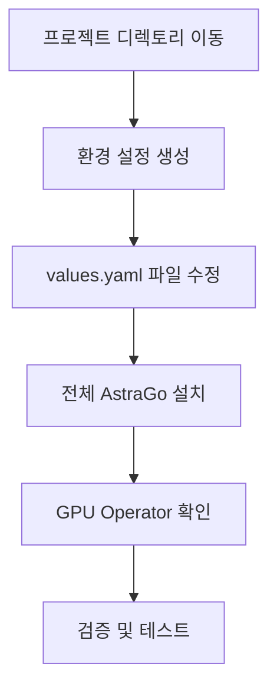

# GPU Operator 설치 완전 가이드

## 📋 목차
1. [실행 절차 요약](#1-실행-절차-요약)
2. [파일 구조와 역할](#2-파일-구조와-역할)
3. [버전 및 설정 위치](#3-버전-및-설정-위치)
4. [환경별 설정 변경](#4-환경별-설정-변경)
5. [DNS 및 네트워크 설정](#5-dns-및-네트워크-설정)
6. [문제 해결](#6-문제-해결)

---

## 1. 실행 절차 요약

### 🚀 전체 설치 프로세스



### 📝 단계별 실행 명령

```bash
# 1. 프로젝트 디렉토리로 이동
cd /Users/xiilab/Desktop/git_hub/astrago/astrago-deployment

# 2. 환경 설정 생성 (최초 1회만)
./deploy_astrago.sh env
# - 연결 URL 입력 (예: 10.61.3.12)
# - NFS 서버 IP 입력
# - NFS 기본 경로 입력

# 3. 환경 설정 파일 수정 (필요시)
vi environments/astrago/values.yaml

# 4. 전체 AstraGo 설치 (GPU Operator 포함)
./deploy_astrago.sh sync

# 또는 GPU Operator만 설치
./deploy_astrago.sh sync gpu-operator

# 5. 설치 상태 확인
kubectl get pods -n gpu-operator
kubectl get nodes -l nvidia.com/gpu.present=true

# 6. GPU 리소스 확인
kubectl describe node <gpu-node-name> | grep nvidia.com/gpu
```

### 🎯 주요 스크립트 명령어

```bash
# 사용법 확인
./deploy_astrago.sh --help

# 환경 설정
./deploy_astrago.sh env

# 전체 설치
./deploy_astrago.sh sync

# 특정 앱만 설치
./deploy_astrago.sh sync gpu-operator

# 전체 제거
./deploy_astrago.sh destroy

# 특정 앱만 제거  
./deploy_astrago.sh destroy gpu-operator
```

### 📋 설치 가능한 앱 목록

- `nfs-provisioner`
- `gpu-operator` 🎯
- `gpu-process-exporter`
- `loki-stack`
- `prometheus`
- `event-exporter`
- `keycloak`
- `mpi-operator`
- `astrago`

---

## 2. 파일 구조와 역할

### 📁 주요 디렉토리 구조

```
astrago-deployment/
├── applications/gpu-operator/          # GPU Operator 설정
│   ├── helmfile.yaml                  # Helm 배포 설정
│   ├── values.yaml.gotmpl             # 메인 설정 템플릿
│   ├── custom_values.yaml             # 커스텀 설정
│   └── custom-gpu-operator/           # 커스텀 차트
│       └── charts/gpu-operator/
│           ├── Chart.yaml             # 차트 메타데이터 (버전 정의)
│           └── values.yaml            # 기본값
├── environments/                       # 환경별 설정
│   ├── common/values.yaml             # 공통 설정
│   ├── dev/values.yaml                # 개발 환경
│   ├── stage/values.yaml              # 스테이징 환경
│   └── prod/values.yaml               # 프로덕션 환경
├── helmfile.yaml                      # 전체 애플리케이션 배포 설정
└── monochart/                         # 생성된 매니페스트
    ├── develop/gpu-operator/
    ├── stage/gpu-operator/
    └── prod/gpu-operator/
```

### 🔧 핵심 파일별 역할

#### **applications/gpu-operator/helmfile.yaml**
```yaml
# 역할: GPU Operator Helm 차트 배포 정의
releases:
  - name: gpu-operator
    namespace: gpu-operator
    chart: custom-gpu-operator      # 커스텀 차트 사용
    wait: true
    values:
    - values.yaml.gotmpl            # 메인 설정 파일
```

#### **applications/gpu-operator/values.yaml.gotmpl**
```yaml
# 역할: GPU Operator의 메인 설정 (Go 템플릿)
gpu-operator:
  driver:
    enabled: true
    repository: {{ .Values.offline.registry | default "nvcr.io" }}/nvidia
    image: driver
    version: "550.144.03"           # 🎯 드라이버 버전 설정
    
  toolkit:
    enabled: true
    repository: {{ .Values.offline.registry | default "nvcr.io" }}/nvidia/k8s
    version: v1.17.4-ubuntu20.04    # 🎯 Container Toolkit 버전
    
  dcgmExporter:
    version: 3.3.9-3.6.1-ubuntu22.04  # 🎯 DCGM Exporter 버전
```

#### **applications/gpu-operator/custom-gpu-operator/charts/gpu-operator/Chart.yaml**
```yaml
# 역할: GPU Operator 차트의 핵심 버전 정의
apiVersion: v2
appVersion: v24.9.2                 # 🎯 GPU Operator 애플리케이션 버전
version: v24.9.2                    # 🎯 Helm 차트 버전
name: gpu-operator
```

---

## 3. 버전 및 설정 위치

### 🎯 주요 버전 설정 위치

#### **GPU Operator 버전**
```bash
# 파일: applications/gpu-operator/custom-gpu-operator/charts/gpu-operator/Chart.yaml
appVersion: v24.9.2
version: v24.9.2
```

#### **NVIDIA 드라이버 버전**
```bash
# 파일: applications/gpu-operator/values.yaml.gotmpl
driver:
  version: "550.144.03"             # 변경 가능
```

#### **컨테이너 이미지 레지스트리**
```bash
# 파일: applications/gpu-operator/values.yaml.gotmpl
driver:
  repository: {{ .Values.offline.registry | default "nvcr.io" }}/nvidia

# offline.registry 설정 위치: environments/{환경}/values.yaml
offline:
  registry: "your-private-registry.com"  # 프라이빗 레지스트리 사용시
```

#### **주요 컴포넌트 버전**
```yaml
# 파일: applications/gpu-operator/values.yaml.gotmpl
gpu-operator:
  dcgmExporter:
    version: 3.3.9-3.6.1-ubuntu22.04    # DCGM Exporter
  toolkit:
    version: v1.17.4-ubuntu20.04         # Container Toolkit
  devicePlugin:
    version: v0.17.0                     # Device Plugin
  migManager:
    version: v0.10.0-ubuntu20.04         # MIG Manager
```

### 🔧 사용자가 변경해야 하는 주요 설정

#### **1. 드라이버 버전 변경**
```bash
# 파일: applications/gpu-operator/values.yaml.gotmpl
driver:
  version: "535.129.03"              # 다른 지원 버전으로 변경 가능
```

#### **2. 프라이빗 레지스트리 사용**
```bash
# 파일: environments/prod/values.yaml (예시)
offline:
  registry: "harbor.company.com"     # 회사 프라이빗 레지스트리
  httpServer: "http://mirror.company.com"  # HTTP 미러 서버
```

#### **3. GPU 드라이버 비활성화 (사전 설치된 경우)**
```bash
# 파일: applications/gpu-operator/custom_values.yaml
driver:
  enabled: false                     # 사전 설치된 드라이버 사용시
```

#### **4. MIG 설정**
```bash
# 파일: applications/gpu-operator/values.yaml.gotmpl
migManager:
  config:
    name: "custom-mig-parted-config"
    default: "all-disabled"           # MIG 기본 설정
```

---

## 4. 환경별 설정 변경

### 🌍 환경 설정 구조

#### **고정 환경명: "astrago"**
```
environments/
├── common/values.yaml              # 모든 환경 공통 설정
├── astrago/values.yaml            # 🎯 실제 사용 환경 (deploy_astrago.sh가 생성/사용)
├── dev/values.yaml                # 개발 환경 템플릿
├── stage/values.yaml              # 스테이징 환경 템플릿  
└── prod/values.yaml               # 프로덕션 환경 템플릿 (기본값)
```

> **중요**: `deploy_astrago.sh`는 환경명이 "astrago"로 고정되어 있어서 `environments/astrago/` 디렉토리만 사용합니다.

#### **환경 설정 생성 과정**

**1단계: 환경 설정 파일 생성**
```bash
./deploy_astrago.sh env
```

**입력 프롬프트:**
```
Enter the connection URL (e.g. 10.61.3.12): 192.168.1.100
Enter the NFS server IP address: 192.168.1.200  
Enter the base path of NFS: /nfs/data
```

**2단계: 자동 생성되는 설정**
```bash
# environments/astrago/ 디렉토리 생성
# environments/prod/* 파일들을 astrago/로 복사
# values.yaml에 입력한 값들 자동 설정:
# - externalIP: "192.168.1.100"
# - nfs.server: "192.168.1.200"  
# - nfs.basePath: "/nfs/data"
```

#### **생성된 설정 파일 예시 (environments/astrago/values.yaml)**
```yaml
# 자동 생성된 기본 설정
externalIP: "192.168.1.100"        # 연결 URL
connectUrl: "http://192.168.1.100"

# NFS 설정
nfs:
  server: "192.168.1.200"          # NFS 서버 IP
  basePath: "/nfs/data"            # NFS 기본 경로

# GPU Operator 설정
gpu:
  enabled: true
  
# 오프라인 설정 (필요시 수정)
offline:
  registry: ""                     # 프라이빗 레지스트리 URL
  httpServer: ""                   # HTTP 미러 서버

# AstraGo 관련 설정
astrago:
  proxyUrl: ""                     # 프록시 URL (필요시)
  keycloak:
    externalKeycloakUrl: ""        # 외부 Keycloak URL
```

### 🔄 배포 방법

```bash
# 전체 AstraGo 스택 배포 (GPU Operator 포함)
./deploy_astrago.sh sync

# GPU Operator만 배포
./deploy_astrago.sh sync gpu-operator

# 내부적으로 실행되는 실제 명령어:
# helmfile -e astrago -l app=gpu-operator sync
```

---

## 5. DNS 및 네트워크 설정

### 🌐 DNS 정보 변경이 필요한 경우

#### **시나리오: 새로운 IP/도메인으로 환경 설정**

**방법 1: 최초 설정시 올바른 정보 입력**
```bash
./deploy_astrago.sh env

# 프롬프트에서 올바른 정보 입력:
Enter the connection URL (e.g. 10.61.3.12): astrago.company.com
Enter the NFS server IP address: 10.61.3.2
Enter the base path of NFS: /kube_storage/your-env-astrago

# 현재 사용 중인 실제 경로들:
# - dev 환경: /kube_storage/develop-astrago
# - stage 환경: /kube_storage/stage-astrago
# - 새 환경: /kube_storage/{환경명}-astrago
```

**방법 2: 기존 설정 수동 변경**
```bash
# 설정 파일 직접 수정
vi environments/astrago/values.yaml
```

**수정해야 할 DNS 관련 설정 위치:**

**1. 기본 연결 정보**
```yaml
# 파일: environments/astrago/values.yaml

# 기본 IP/도메인 (스크립트로 자동 설정)
externalIP: "astrago.company.com"        # 새로운 도메인
connectUrl: "https://astrago.company.com"

# NFS 서버 정보 (실제 프로젝트 기준)
nfs:
  server: "10.61.3.2"                    # 실제 NFS 서버 IP
  basePath: "/kube_storage/your-env-astrago"  # 실제 사용하는 경로 패턴
```

**2. 프록시 및 외부 서비스 URL**
```yaml
# 파일: environments/astrago/values.yaml

astrago:
  proxyUrl: "https://astrago.company.com"          # 외부 접근 URL
  keycloak:
    externalKeycloakUrl: "https://auth.company.com" # 외부 Keycloak

# 레지스트리 설정 (프라이빗 레지스트리 사용시)
offline:
  registry: "registry.company.com"        # 프라이빗 레지스트리
  httpServer: "http://mirror.company.com" # HTTP 미러
```

**3. GPU Operator 레지스트리 설정**
```yaml
# 파일: applications/gpu-operator/values.yaml.gotmpl

# 프라이빗 레지스트리 사용시 템플릿 활용
driver:
  repository: {{ .Values.offline.registry | default "nvcr.io" }}/nvidia

toolkit:
  repository: {{ .Values.offline.registry | default "nvcr.io" }}/nvidia/k8s
```

#### **DNS 변경 후 재배포**

```bash
# 설정 변경 후 재배포
./deploy_astrago.sh sync

# 또는 GPU Operator만 재배포
./deploy_astrago.sh sync gpu-operator
```

#### **환경 설정 재생성 (완전 초기화)**

```bash
# 기존 환경 삭제
rm -rf environments/astrago/

# 새로운 환경 설정 생성
./deploy_astrago.sh env
# 새로운 IP/도메인 정보 입력

# 재배포
./deploy_astrago.sh sync
```

### 🔐 보안 설정

#### **프라이빗 레지스트리 인증**
```bash
# 1. 레지스트리 시크릿 생성
kubectl create secret docker-registry registry-secret \
  --docker-server=registry.company.com \
  --docker-username=username \
  --docker-password=password \
  --docker-email=email@company.com \
  -n gpu-operator

# 2. values.yaml에 시크릿 이름 추가
imagePullSecrets:
  - name: "registry-secret"
```

#### **네트워크 정책 설정 (고급)**
```yaml
# applications/gpu-operator/values.yaml.gotmpl
# GPU Operator는 일반적으로 TLS 설정이 불필요
# 대신 네트워크 보안이 필요한 경우 네트워크 정책 설정

networkPolicy:
  enabled: false  # 기본값: 비활성화
  ingress: []     # 필요시 인그레스 규칙 추가
```

#### **TLS 인증서가 실제로 필요한 컴포넌트들**

**1. AstraGo 웹 애플리케이션 (HTTPS 접근시)**
```yaml
# environments/astrago/values.yaml
astrago:
  proxyUrl: "https://astrago.company.com"  # HTTPS 사용시 별도 인그레스 생성 또는 외부 로드밸런서 필요
```

**2. Keycloak 인증 서버**
```yaml
# applications/keycloak/values.yaml.gotmpl
keycloak:
  production: true
  proxy: edge                              # 프록시 뒤에서 TLS 종료
```

**3. Harbor 컨테이너 레지스트리 (프라이빗 레지스트리 사용시)**
```yaml
# applications/harbor/values.yaml.gotmpl
harbor:
  expose:
    tls:
      enabled: true                        # Harbor HTTPS 활성화
      secretName: "harbor-tls"
```

> **참고**: GPU Operator 자체는 TLS 설정이 불필요하며, 위 컴포넌트들의 TLS 설정은 별도 가이드를 참조하세요.

---

## 6. 문제 해결

### 🔍 설치 상태 확인 명령어

```bash
# GPU Operator 파드 상태 확인
kubectl get pods -n gpu-operator

# GPU 노드 확인
kubectl get nodes -l nvidia.com/gpu.present=true

# GPU 리소스 확인
kubectl describe node <gpu-node> | grep nvidia.com/gpu

# 드라이버 설치 로그 확인
kubectl logs -n gpu-operator -l app=nvidia-driver-daemonset

# GPU Operator 이벤트 확인
kubectl get events -n gpu-operator --sort-by='.lastTimestamp'
```

### ⚠️ 자주 발생하는 문제들

#### **1. 이미지 풀 실패**
```bash
# 문제: ImagePullBackOff
# 원인: 레지스트리 접근 불가 또는 인증 실패

# 해결: 레지스트리 설정 확인
grep -r "registry" environments/

# 해결: 인증 시크릿 확인
kubectl get secrets -n gpu-operator | grep registry
```

#### **2. 드라이버 설치 실패**
```bash
# 문제: 드라이버 파드가 CrashLoopBackOff
# 원인: 커널 호환성 문제

# 해결: 커널 버전 확인
uname -r

# 해결: 지원 드라이버 버전으로 변경
# applications/gpu-operator/values.yaml.gotmpl에서 드라이버 버전 수정
```

#### **3. GPU 리소스 인식 실패**
```bash
# 문제: nvidia.com/gpu 리소스가 0
# 원인: Device Plugin 문제

# 해결: Device Plugin 재시작
kubectl delete pod -n gpu-operator -l app=nvidia-device-plugin-daemonset
```

### 🚀 성능 최적화

#### **MIG 활성화 (A100/H100)**
```bash
# 노드에 MIG 설정 라벨 추가
kubectl label node <gpu-node> nvidia.com/mig.config=all-1g.10gb
```

#### **Time-Slicing 설정**
```yaml
# applications/gpu-operator/values.yaml.gotmpl
devicePlugin:
  config:
    name: "time-slicing-config"
    data:
      tesla-t4: "4"  # T4 GPU를 4개로 분할
```

---

## 📚 참고 자료

- [NVIDIA GPU Operator 공식 문서](https://docs.nvidia.com/datacenter/cloud-native/gpu-operator/)
- [지원 드라이버 매트릭스](https://docs.nvidia.com/datacenter/cloud-native/gpu-operator/latest/platform-support.html)
- [문제 해결 가이드](https://docs.nvidia.com/datacenter/cloud-native/gpu-operator/latest/troubleshooting.html)

---

## 📝 체크리스트

### 🚀 설치 전 확인사항
- [ ] Kubernetes 클러스터 준비 (1.26+)
- [ ] GPU 하드웨어 설치 및 확인
- [ ] NFS 서버 준비 (IP 및 경로 확인)
- [ ] 네트워크 연결 확인 (외부 IP/도메인)
- [ ] kubectl, helm, helmfile 도구 설치
- [ ] 필요한 권한 확인 (cluster-admin)

### 🔧 deploy_astrago.sh 실행 과정
- [ ] 프로젝트 디렉토리로 이동
  ```bash
  cd /Users/xiilab/Desktop/git_hub/astrago/astrago-deployment
  ```
- [ ] 환경 설정 생성
  ```bash
  ./deploy_astrago.sh env
  ```
- [ ] 연결 URL 입력 (IP 또는 도메인)
- [ ] NFS 서버 IP 및 경로 입력  
- [ ] 생성된 설정 파일 확인
  ```bash
  cat environments/astrago/values.yaml
  ```
- [ ] 필요시 추가 설정 수정 (오프라인 레지스트리 등)
- [ ] 전체 설치 실행
  ```bash
  ./deploy_astrago.sh sync
  ```

### 📋 설치 중 확인사항  
- [ ] `environments/astrago/` 디렉토리 생성 확인
- [ ] externalIP, NFS 설정 자동 적용 확인
- [ ] 레지스트리 접근 가능 여부 (프라이빗 사용시)
- [ ] DNS 설정 올바른지 확인
- [ ] Helm 차트 배포 진행 상황 모니터링

### ✅ 설치 후 확인사항
- [ ] GPU Operator 네임스페이스 확인
  ```bash
  kubectl get ns gpu-operator
  ```
- [ ] 모든 GPU Operator 파드가 Running 상태
  ```bash
  kubectl get pods -n gpu-operator
  ```
- [ ] GPU 노드 라벨링 확인
  ```bash
  kubectl get nodes -l nvidia.com/gpu.present=true
  ```
- [ ] GPU 리소스 정상 인식 확인
  ```bash
  kubectl describe node <gpu-node> | grep nvidia.com/gpu
  ```
- [ ] 테스트 워크로드 실행 및 GPU 사용 확인
- [ ] 전체 AstraGo 스택 상태 확인
- [ ] 모니터링 및 로깅 설정 확인

### 🛠️ 개별 앱 설치/관리
- [ ] GPU Operator만 설치
  ```bash
  ./deploy_astrago.sh sync gpu-operator
  ```
- [ ] 특정 앱 상태 확인
  ```bash
  kubectl get pods -n <namespace> -l app=<app-name>
  ```
- [ ] 문제 발생시 특정 앱 재설치
  ```bash
  ./deploy_astrago.sh destroy <app-name>
  ./deploy_astrago.sh sync <app-name>
  ```

---

*이 가이드는 astrago-deployment 프로젝트 기반으로 작성되었습니다.*