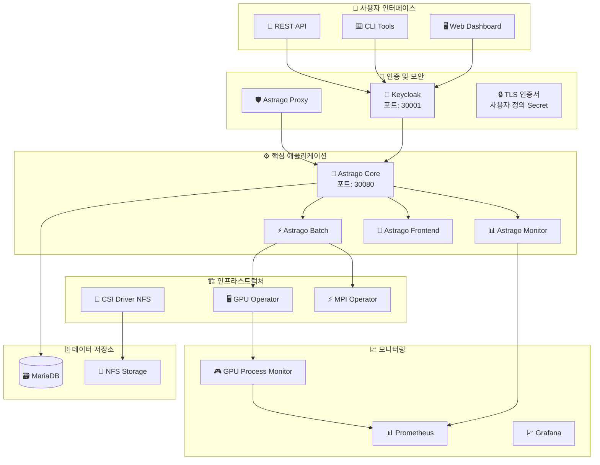

# 🚀 Astrago 배포 및 관리 시스템

<div align="center">


**엔터프라이즈급 AI/ML 플랫폼을 위한 완전 자동화된 Kubernetes 배포 솔루션**

[](https://github.com/your-org/astrago-deployment/issues)
[](https://github.com/your-org/astrago-deployment/stargazers)
[](LICENSE)

</div>

---

## 📚 완전한 문서 가이드

> 🎯 **목적별로 문서를 선택하여 빠르게 시작하세요!**

<table>
<tr>
<td align="center" width="33%">

### 🚀 **빠른 시작**

처음 사용자를 위한 필수 가이드

---

📖 **[설치 가이드](docs/installation-guide.md)**  
*단계별 설치 과정 안내*

🖥️ **[GUI 인스톨러](docs/gui-installer.md)**  
*그래픽 인터페이스로 쉬운 설치*

⚡ **[빠른 시작 가이드](#빠른-시작)**  
*5분만에 설치 완료*

🎯 **[GPU 프로세스 모니터링](docs/GPU-Process-Monitoring-QuickStart.md)**  
*GPU 프로세스 실시간 추적*

</td>
<td align="center" width="33%">

### 🏗️ **시스템 이해**

아키텍처와 구성요소 학습

---

🏛️ **[아키텍처 가이드](docs/architecture.md)**  
*시스템 구조와 설계 원리*

📦 **[애플리케이션 구성](docs/applications.md)**  
*각 구성요소 상세 설명*

🌍 **[환경 설정](docs/deployment-environments.md)**  
*다중 환경 관리 방법*

🎮 **[GPU 프로세스 모니터링 상세](docs/GPU-Process-Monitoring-Guide.md)**  
*GPU 프로세스 추적 완전 가이드*

</td>
<td align="center" width="33%">

### 🔧 **고급 운영**

전문가를 위한 심화 가이드

---

🔒 **[오프라인 배포](docs/offline-deployment.md)**  
*폐쇄망 환경 설치 가이드*

🛠️ **[문제 해결](docs/troubleshooting.md)**  
*일반적인 문제와 해결책*

📋 **[종합 가이드](docs/comprehensive-guide.md)**  
*모든 내용을 담은 완전 가이드*

🔗 **[Prometheus ↔ Loki 자동 연동](docs/prometheus-loki-integration.md)**  
*설치 시 자동으로 모니터링 통합 환경 구축*

</td>
</tr>
</table>

---

## 📋 개요

Astrago 배포 시스템은 **AI/ML 작업 관리 플랫폼**을 Kubernetes 환경에 쉽고 안정적으로 배포할 수 있도록 설계된 종합적인 배포 도구입니다.

### ✨ 주요 특징

<div align="center">

| 특징 | 설명 | 지원 환경 |
|:---:|:---|:---:|
| 🌐 **다중 배포 방식** | 온라인/오프라인 모두 지원 | ✅ 완전 지원 |
| 🎯 **환경별 관리** | 개발/스테이징/프로덕션 분리 | ✅ 8개 환경 |
| 🖥️ **GUI 인스톨러** | 직관적인 설치 인터페이스 | ✅ TUI 제공 |
| 🔧 **완전 자동화** | 원클릭 배포 시스템 | ✅ 스크립트 지원 |
| 📦 **Helm 기반** | 클라우드 네이티브 패키지 관리 | ✅ Helmfile 활용 |
| 🔒 **에어갭 지원** | 완전 격리된 환경 배포 | ✅ 폐쇄망 대응 |
| 🎮 **GPU 프로세스 모니터링** | 실시간 GPU 프로세스 추적 및 MIG 지원 | ✅ nvidia-smi 연동 |

</div>

---

## 🏗️ 시스템 아키텍처



---

## ⚡ 빠른 시작

### 🔧 사전 준비

<details>
<summary><b>📋 시스템 요구사항 확인</b></summary>

#### 최소 사양

- **CPU**: 4 cores 이상
- **메모리**: 8GB RAM 이상  
- **스토리지**: 100GB 이상
- **OS**: CentOS 7/8, Ubuntu 18.04/20.04/22.04, RHEL 7/8

#### 필수 소프트웨어

- **Kubernetes**: v1.21 이상
- **Container Runtime**: Docker v20.10+ 또는 containerd v1.4+
- **Helm**: v3.7 이상

</details>

### 🚀 설치 방법 선택

<div align="center">

| 방법 | 난이도 | 소요시간 | 적합한 대상 |
|:---:|:---:|:---:|:---|
| 🖥️ **[GUI 인스톨러](docs/gui-installer.md)** | ⭐⭐ | 30분 | 🔰 초보자, 테스트 환경 |
| ⚡ **스크립트 자동화** | ⭐⭐⭐ | 20분 | 👨‍💻 프로덕션 환경 |
| 🔧 **[수동 설치](docs/installation-guide.md)** | ⭐⭐⭐⭐⭐ | 60분+ | 🎯 커스터마이징 필요 |
| 🔒 **[오프라인 배포](docs/offline-deployment.md)** | ⭐⭐⭐⭐ | 45분 | 🏢 폐쇄망 환경 |

</div>

### 📋 1분 설치 (권장)

```bash
# 1️⃣ 환경 설정
./deploy_astrago.sh env

# 2️⃣ 전체 배포
./deploy_astrago.sh sync

# ✅ 완료! 브라우저에서 접속
echo "🎉 Astrago 설치 완료!"
echo "🌐 웹 접속: http://<YOUR-IP>:30080"
echo "🔐 Keycloak: http://<YOUR-IP>:30001"
```

---

## 🔒 TLS 인증서 관리

### 사용자 정의 TLS Secret 설정

Astrago는 **환경별 TLS Secret 이름 지정**을 지원하여 유연한 인증서 관리가 가능합니다.

#### 📋 기본 설정

```yaml
# environments/dev/values.yaml
astrago:
  tls:
    secretName: "astrago-tls-secret"  # 원하는 Secret 이름 설정
  
  ingress:
    enabled: true
    tls:
      enabled: true  # TLS 활성화
  
  truststore:
    enabled: true  # Java Truststore 설정
```

#### 🔧 인증서 생성 및 적용

```bash
# 1️⃣ TLS Secret 생성 (기본 이름)
kubectl create secret tls astrago-tls-secret \
  --cert=/path/to/cert.pem \
  --key=/path/to/key.pem \
  -n astrago

# 2️⃣ 사용자 정의 Secret 이름으로 생성
kubectl create secret tls my-custom-secret \
  --cert=/path/to/cert.pem \
  --key=/path/to/key.pem \
  -n astrago

# 3️⃣ values.yaml에서 해당 Secret 이름 설정
# astrago.tls.secretName: "my-custom-secret"

# 4️⃣ 배포
./deploy_astrago.sh sync astrago
```

#### ✨ 주요 특징

<div align="center">

| 기능 | 설명 | 지원 여부 |
|:---:|:---|:---:|
| 🎯 **환경별 Secret 이름** | dev/stage/prod 각각 다른 Secret 사용 가능 | ✅ |
| 🔄 **자동 적용** | Ingress TLS + Java Truststore 동시 설정 | ✅ |
| 🛡️ **Manual Secret 관리** | values.yaml에 인증서 내용 노출 방지 | ✅ |
| 📦 **단일 Secret 방식** | 하나의 Secret으로 모든 TLS 요구사항 충족 | ✅ |
| 🔧 **하위 호환성** | 기본값 제공으로 기존 설정 유지 | ✅ |

</div>

#### 🌍 환경별 설정 예시

```bash
# 개발 환경
environments/dev/values.yaml:
  tls.secretName: "dev-tls-secret"

# 스테이징 환경  
environments/stage/values.yaml:
  tls.secretName: "stage-tls-secret"

# 프로덕션 환경
environments/prod/values.yaml:
  tls.secretName: "prod-tls-secret"
```

---

## 🛠️ 주요 구성요소

<div align="center">

### 📦 애플리케이션 스택

| 구성요소 | 역할 | 포트 | 상태 | 문서 |
|:---:|:---|:---:|:---:|:---:|
| 🎯 **Astrago Core** | 메인 AI/ML 플랫폼 | `30080` | ✅ | [상세보기](docs/applications.md#astrago-core) |
| 🔐 **Keycloak** | 인증/인가 서비스 | `30080/auth` | ✅ | [상세보기](docs/applications.md#keycloak) |
| 📊 **Prometheus** | 모니터링 시스템 | `30090` | ✅ | [상세보기](docs/applications.md#prometheus) |
| 📝 **Loki Stack** | 로그 수집/분석 | `3100` | ✅ | [상세보기](docs/applications.md#loki-stack) |
| 💾 **CSI Driver NFS** | 스토리지 프로비저닝 | `-` | ✅ | [상세보기](docs/applications.md#csi-driver-nfs) |
| 🖥️ **GPU Operator** | GPU 리소스 관리 | `-` | ✅ | [상세보기](docs/applications.md#gpu-operator) |
| ⚡ **MPI Operator** | 분산 컴퓨팅 | `-` | ✅ | [상세보기](docs/applications.md#mpi-operator) |
| 🚢 **Harbor** | 컨테이너 레지스트리 | `30002` | ⚠️ | [상세보기](docs/applications.md#harbor) |

</div>

---

## 📚 사용법

### 🎯 배포 옵션

```bash
./deploy_astrago.sh [env|sync|destroy]
```

<details>
<summary><b>🔧 env - 환경 설정</b></summary>

새로운 환경 디렉토리를 생성하고 설정 파일을 구성합니다.

```bash
./deploy_astrago.sh env
```

**입력 정보:**

- 🌐 외부 접속 IP 주소
- 📁 NFS 서버 IP 주소  
- 📂 NFS 기본 경로

</details>

<details>
<summary><b>🔄 sync - 배포/업데이트</b></summary>

설정된 환경에 애플리케이션을 배포하거나 업데이트합니다.

```bash
# 전체 애플리케이션 배포
./deploy_astrago.sh sync

# 특정 애플리케이션만 배포
./deploy_astrago.sh sync prometheus
```

</details>

<details>
<summary><b>🗑️ destroy - 삭제</b></summary>

배포된 애플리케이션을 삭제합니다.

```bash
# 전체 삭제
./deploy_astrago.sh destroy

# 특정 애플리케이션만 삭제
./deploy_astrago.sh destroy keycloak
```

</details>

---

## 🎮 GPU 세션 모니터링

### 실시간 GPU 리소스 추적

Astrago는 **GPU 세션 모니터링 시스템**을 내장하여 prometheus에서 조회가 불가한 메트릭들을 실시간으로 추적합니다.

<div align="center">

| 기능 | 설명 | 지원 여부 |
|:---:|:---|:---:|
| 🎯 **정확한 PID 매핑** | nvidia-smi와 Prometheus PID 완전 일치 | ✅ |
| 🔧 **MIG 지원** | Multi-Instance GPU 자동 감지 | ✅ |
| 📊 **실시간 메트릭** | GPU별 세션 수, 메모리 사용량 | ✅ |
| 🏷️ **Pod 연결** | Kubernetes Pod와 GPU 프로세스 매핑 | ✅ |
| 🔄 **동적 감지** | GPU 개수 자동 인식 | ✅ |

</div>

### 빠른 시작

```bash
# GPU 모니터링 활성화
./deploy_astrago.sh sync gpu-process-exporter

# 메트릭 확인
curl http://prometheus:9090/api/v1/query?query=gpu_process_count

# Grafana 대시보드에서 시각화
# - GPU 사용률 현황
# - Pod별 GPU 할당 상태
# - 유휴 GPU 감지
```

자세한 내용은 **[GPU 프로세스 모니터링 가이드](docs/GPU-Process-Monitoring-Guide.md)**를 참조하세요.

---

## 🌍 지원 환경

<div align="center">

| 환경 | 용도 | 설정 파일 | 특징 |
|:---:|:---|:---:|:---|
| 🛠️ **dev** | 개발 환경 | `environments/dev/` | 낮은 리소스, 디버그 모드 |
| 🛠️ **dev2** | 개발 환경 2 | `environments/dev2/` | 추가 개발 브랜치 |
| 🧪 **stage** | 스테이징 환경 | `environments/stage/` | 프로덕션 유사 환경 |
| 🏭 **prod** | 프로덕션 환경 | `environments/prod/` | 고가용성, 보안 강화 |
| 🎓 **seoultech** | 서울과기대 환경 | `environments/seoultech/` | 교육기관 특화 |

</div>

더 자세한 환경 설정은 **[환경 설정 가이드](docs/deployment-environments.md)**를 참조하세요.

---

## 💡 사용 예시

### 🆕 새로운 환경 구축

```bash
# 환경 설정
./deploy_astrago.sh env
> Enter the connection URL: 192.168.1.100
> Enter the NFS server IP address: 192.168.1.200  
> Enter the base path of NFS: /nfs-data/astrago

# 전체 배포
./deploy_astrago.sh sync
```

### 🎯 특정 서비스 관리

```bash
# Prometheus 모니터링 시스템 배포
./deploy_astrago.sh sync prometheus

# Keycloak 인증 서비스 재시작
./deploy_astrago.sh destroy keycloak
./deploy_astrago.sh sync keycloak

# GPU Operator 설치 (GPU 환경)
./deploy_astrago.sh sync gpu-operator

# GPU 세션 모니터링 활성화
./deploy_astrago.sh sync gpu-process-exporter

# 로그 수집 시스템 배포
./deploy_astrago.sh sync loki-stack
```

### 🔄 업데이트 및 관리

```bash
# 전체 시스템 업데이트
./deploy_astrago.sh sync

# 설정 변경 후 특정 앱 업데이트
vi environments/astrago/values.yaml
./deploy_astrago.sh sync astrago
```

---

## 🚨 문제 해결

### 📞 빠른 도움말

문제가 발생했을 때 **단계별 해결 방법**:

1. **🔍 [문제 해결 가이드](docs/troubleshooting.md)** - 일반적인 문제들
2. **📋 [설치 가이드](docs/installation-guide.md)** - 설치 관련 문제  
3. **🔒 [오프라인 가이드](docs/offline-deployment.md)** - 폐쇄망 환경 문제
4. **💬 [GitHub Issues](https://github.com/your-org/astrago-deployment/issues)** - 커뮤니티 지원

### 🆘 긴급 상황

```bash
# 전체 시스템 상태 확인
kubectl get pods -A
kubectl get nodes
kubectl get svc -A

# 로그 확인
kubectl logs -n astrago deployment/astrago-core
kubectl logs -n astrago deployment/keycloak

# 도움 요청
./deploy_astrago.sh --help
```

---

## 🤝 커뮤니티 및 지원

<div align="center">

### 📞 지움 채널

| 채널 | 용도 | 응답 시간 |
|:---:|:---|:---:|
| 📧 **[기술 지원](mailto:technical-support@your-company.com)** | 긴급 기술 문제 | 24시간 |
| 🐛 **[GitHub Issues](https://github.com/your-org/astrago-deployment/issues)** | 버그 리포트, 기능 요청 | 48시간 |
| 💬 **Slack** | 일반적인 질문 | 실시간 |
| 📚 **[Wiki](https://github.com/your-org/astrago-deployment/wiki)** | 추가 문서, FAQ | - |

</div>

### 🎯 기여하기

프로젝트에 기여하고 싶으시다면:

1. 🍴 **Fork** this repository
2. 🌿 Create your **feature branch** (`git checkout -b feature/amazing-feature`)
3. 💾 **Commit** your changes (`git commit -m 'Add amazing feature'`)
4. 📤 **Push** to the branch (`git push origin feature/amazing-feature`)
5. 🔃 Open a **Pull Request**

---

## 📜 라이선스 및 버전

<div align="center">


**Copyright © 2024 Astrago Team. All rights reserved.**

</div>

### 🔖 릴리스 노트

- **v1.0.80** - 현재 안정 버전
  - ✅ Kubernetes 1.28 지원
  - ✅ GPU Operator 통합
  - ✅ 오프라인 배포 개선
  - ✅ 보안 강화
  - 🆕 **GPU 세션 모니터링 시스템** - nvidia-smi와 PID 정확 매핑, MIG 지원

### 📋 로드맵

- 🚀 **v1.1.0** - Multi-cluster 지원
- 🔐 **v1.2.0** - Advanced 보안 기능
- ☁️ **v2.0.0** - Cloud-native 리팩토링

---

<div align="center">

### 🌟 Star History

[](https://star-history.com/#your-org/astrago-deployment&Date)

**⭐ 도움이 되셨다면 Star를 눌러주세요!**

---

**Made with ❤️ by the Astrago Team**

</div>
