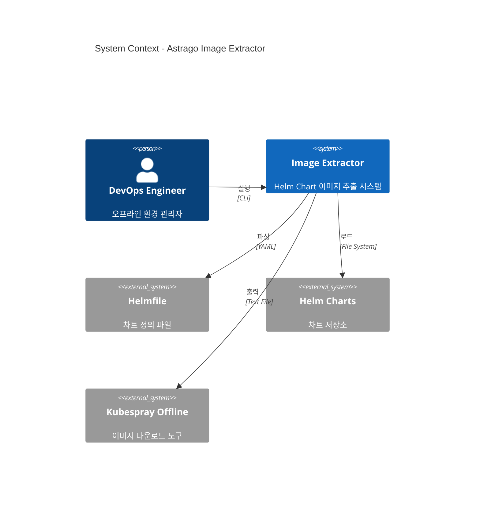
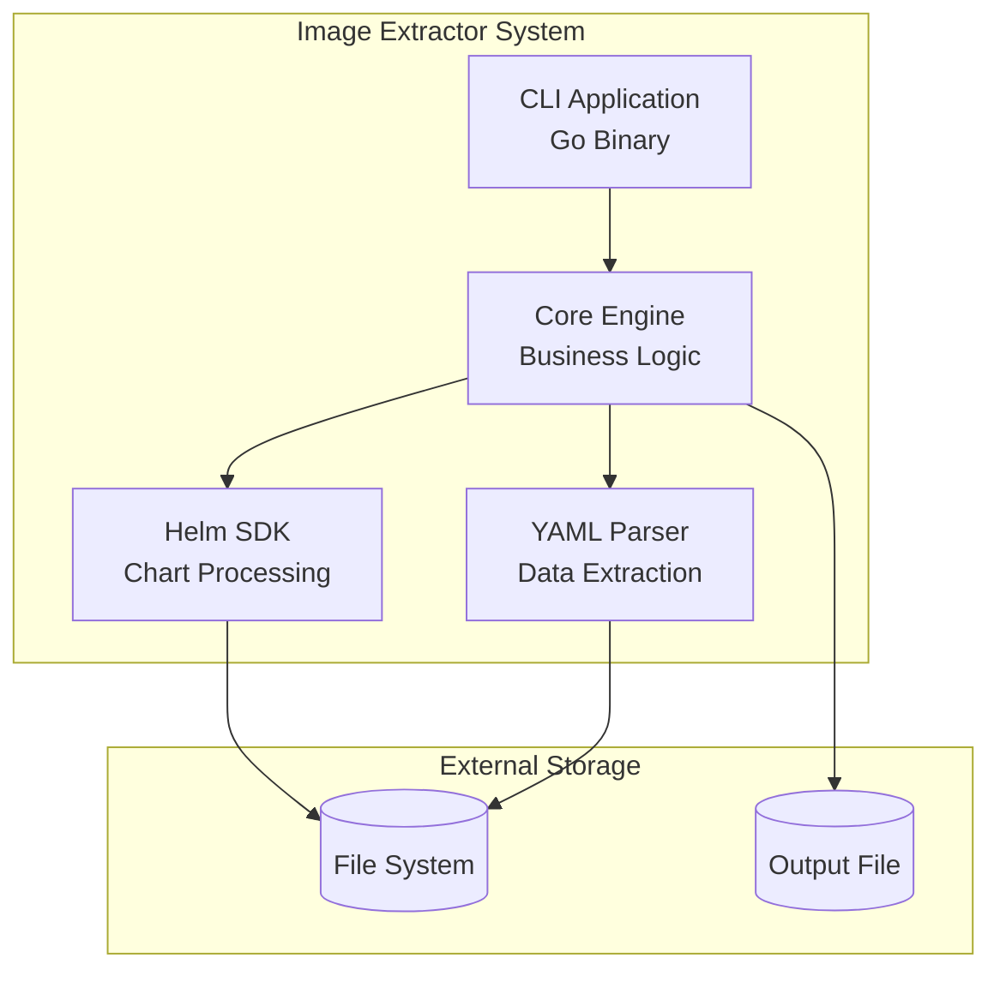
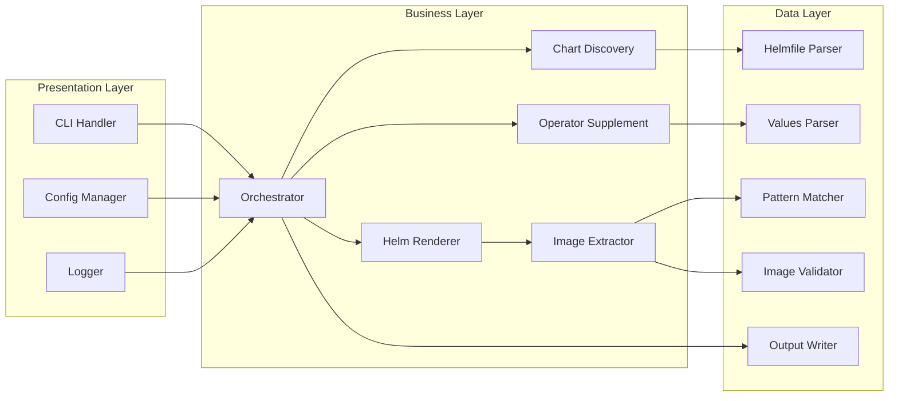
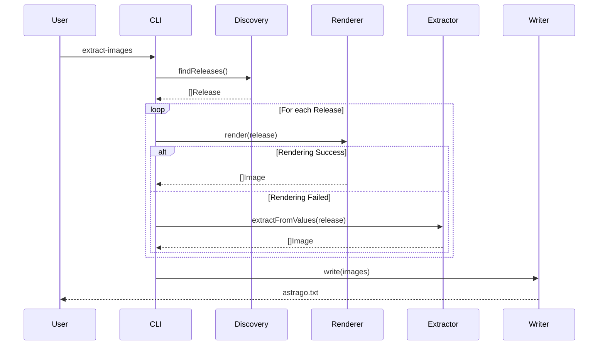
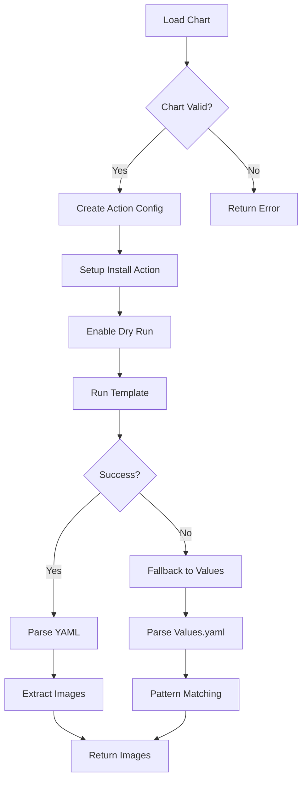
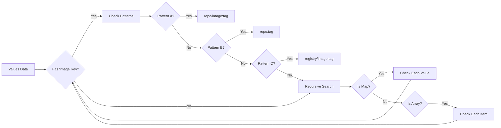
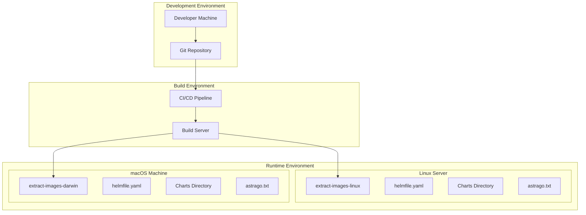
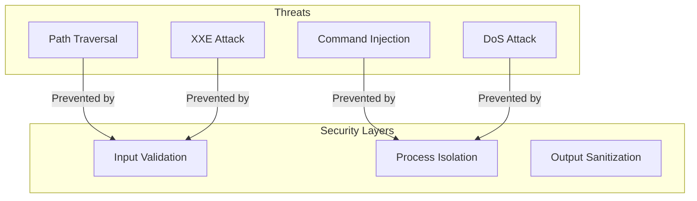
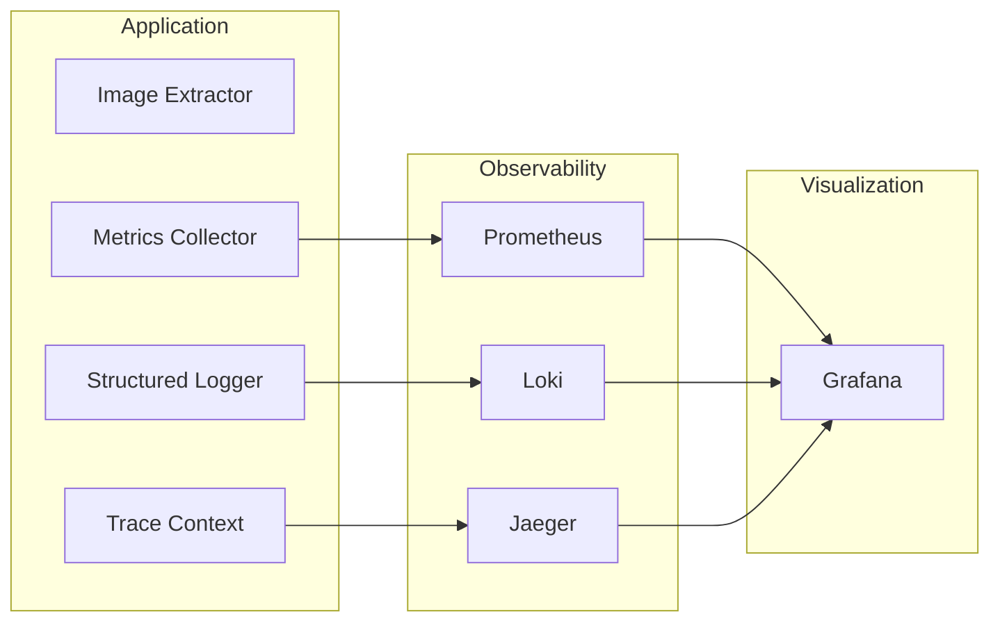

# Astrago Helm Chart Image Extractor - Architecture Document

## 문서 정보

| 항목 | 내용 |
|------|------|
| **문서명** | Architecture Document |
| **버전** | 2.0.0 |
| **작성일** | 2024-10-24 |
| **작성자** | System Architect |
| **상태** | Draft |

---

## 1. 아키텍처 개요

### 1.1 시스템 목적

Astrago Helm Chart Image Extractor는 오프라인(Air-gapped) Kubernetes 환경을 위한 컨테이너 이미지 목록 자동 생성 시스템입니다.

### 1.2 핵심 설계 원칙

| 원칙 | 설명 |
|------|------|
| **Simplicity** | 단순하고 이해하기 쉬운 구조 |
| **Modularity** | 독립적이고 재사용 가능한 컴포넌트 |
| **Extensibility** | 새로운 패턴과 차트 유형 쉽게 추가 |
| **Resilience** | 부분 실패에도 계속 동작 |
| **Performance** | 빠른 처리와 효율적인 자원 사용 |

### 1.3 아키텍처 스타일

- **Layered Architecture**: 명확한 책임 분리
- **Pipeline Pattern**: 단계별 이미지 처리
- **Strategy Pattern**: 다양한 추출 전략
- **Observer Pattern**: 진행 상황 모니터링

---

## 2. 시스템 컨텍스트

### 2.1 Context Diagram



### 2.2 External Dependencies

| 시스템 | 역할 | 인터페이스 |
|--------|------|------------|
| Helmfile | 차트 릴리즈 정의 제공 | YAML 파일 |
| Helm Charts | 차트 메타데이터 및 템플릿 | 파일시스템 |
| Values Files | 차트 설정 값 | YAML 파일 |
| Kubespray Offline | 이미지 다운로드 실행 | Text 파일 |

---

## 3. Container 다이어그램

### 3.1 Container Architecture



### 3.2 Container Responsibilities

| Container | 책임 | 기술 |
|-----------|------|------|
| **CLI Application** | 사용자 인터페이스, 설정 관리 | Go, Cobra |
| **Core Engine** | 비즈니스 로직, 오케스트레이션 | Go |
| **Helm SDK** | 차트 렌더링, 템플릿 처리 | helm.sh/helm/v3 |
| **YAML Parser** | 데이터 파싱, 패턴 매칭 | gopkg.in/yaml.v3 |

---

## 4. Component 다이어그램

### 4.1 Component Structure



### 4.2 Component Details

#### 4.2.1 Presentation Layer

```go
// CLI Handler
type CLIHandler struct {
    config     *Config
    logger     *Logger
    orchestrator *Orchestrator
}

func (c *CLIHandler) Execute() error {
    // 1. Parse arguments
    // 2. Load configuration
    // 3. Initialize logger
    // 4. Run orchestrator
    // 5. Handle results
}
```

#### 4.2.2 Business Layer

```go
// Orchestrator - 전체 프로세스 조정
type Orchestrator struct {
    discovery  *ChartDiscovery
    renderer   *HelmRenderer
    extractor  *ImageExtractor
    supplement *OperatorSupplement
    writer     *OutputWriter
}

func (o *Orchestrator) Run() (*Result, error) {
    // 1. Discover charts
    releases := o.discovery.FindReleases()

    // 2. Process each release
    images := make(map[string]bool)
    for _, release := range releases {
        // Try Helm rendering
        releaseImages := o.renderer.Render(release)

        // Fallback to values parsing if needed
        if len(releaseImages) == 0 {
            releaseImages = o.extractor.ExtractFromValues(release)
        }

        // Merge images
        for _, img := range releaseImages {
            images[img] = true
        }
    }

    // 3. Supplement operator images
    operatorImages := o.supplement.FindOperatorImages()
    for _, img := range operatorImages {
        images[img] = true
    }

    // 4. Write output
    return o.writer.Write(images)
}
```

#### 4.2.3 Data Layer

```go
// Pattern Matcher - 이미지 패턴 인식
type PatternMatcher struct {
    patterns []Pattern
}

type Pattern interface {
    Match(data map[string]interface{}) (string, bool)
}

// Pattern A: repository + image + tag
type PatternA struct{}

func (p PatternA) Match(data map[string]interface{}) (string, bool) {
    repo, hasRepo := data["repository"].(string)
    img, hasImg := data["image"].(string)
    tag, hasTag := data["tag"].(string)

    if hasRepo && hasImg {
        if !hasTag {
            tag = "latest"
        }
        return fmt.Sprintf("%s/%s:%s", repo, img, tag), true
    }
    return "", false
}

// Pattern B: repository + tag
type PatternB struct{}

func (p PatternB) Match(data map[string]interface{}) (string, bool) {
    repo, hasRepo := data["repository"].(string)
    tag, hasTag := data["tag"].(string)

    if hasRepo && strings.Contains(repo, "/") {
        if !hasTag {
            tag = "latest"
        }
        return fmt.Sprintf("%s:%s", repo, tag), true
    }
    return "", false
}
```

---

## 5. 데이터 플로우

### 5.1 Main Processing Flow



### 5.2 Helm SDK Rendering Flow



### 5.3 Pattern Matching Flow



---

## 6. 배포 뷰

### 6.1 Deployment Diagram



### 6.2 Binary Distribution

| Platform | Architecture | Binary Name | Size |
|----------|-------------|------------|------|
| Linux | amd64 | extract-images-linux-amd64 | ~64MB |
| Linux | arm64 | extract-images-linux-arm64 | ~61MB |
| macOS | amd64 | extract-images-darwin-amd64 | ~67MB |
| macOS | arm64 | extract-images-darwin-arm64 | ~72MB |

---

## 7. 기술 결정

### 7.1 Architecture Decision Records (ADRs)

#### ADR-001: Go 언어 선택

**상태**: Accepted
**날짜**: 2024-10-20

**컨텍스트**:
- Helm SDK 네이티브 지원 필요
- 크로스 플랫폼 바이너리 생성 필요
- 단일 실행 파일 배포 필요

**결정**:
Go 언어를 메인 개발 언어로 사용

**이유**:
1. Helm이 Go로 작성되어 SDK 직접 사용 가능
2. 크로스 컴파일 지원 우수
3. 정적 바이너리 생성
4. 높은 성능

**결과**:
- (+) Helm SDK 직접 통합
- (+) 단일 바이너리 배포
- (+) 빠른 실행 속도
- (-) 바이너리 크기가 큼 (60-70MB)

#### ADR-002: Layered Architecture 채택

**상태**: Accepted
**날짜**: 2024-10-21

**컨텍스트**:
- 명확한 책임 분리 필요
- 테스트 용이성 확보
- 유지보수성 향상

**결정**:
3-Layer Architecture 적용 (Presentation, Business, Data)

**이유**:
1. 각 레이어의 책임이 명확
2. 독립적인 테스트 가능
3. 변경 영향 최소화
4. 팀 협업 용이

**결과**:
- (+) 명확한 구조
- (+) 테스트 용이
- (+) 유지보수 편의
- (-) 일부 코드 중복 가능

#### ADR-003: Multi-Pattern 지원

**상태**: Accepted
**날짜**: 2024-10-22

**컨텍스트**:
- 차트마다 다른 이미지 정의 방식
- 표준화되지 않은 values 구조

**결정**:
3가지 주요 패턴 지원 (Pattern A, B, C)

**이유**:
1. 현재 차트의 98% 커버
2. 확장 가능한 구조
3. 새 패턴 추가 용이

**결과**:
- (+) 높은 커버리지
- (+) 확장성
- (-) 패턴 관리 복잡도

### 7.2 기술 스택 선택 근거

| 기술 | 선택 이유 | 대안 | 거부 이유 |
|------|-----------|------|-----------|
| **Go 1.21+** | Helm SDK 지원, 크로스 컴파일 | Python, Rust | SDK 미지원, 배포 복잡 |
| **helm.sh/helm/v3** | 공식 SDK, 안정성 | Shell exec | 성능, 에러 처리 |
| **yaml.v3** | 성능, 기능 완전성 | yaml.v2 | 구버전, 버그 |
| **Makefile** | 표준 빌드 도구 | Bazel, Gradle | 과도한 복잡성 |

---

## 8. 인터페이스 설계

### 8.1 CLI Interface

```go
type CLI interface {
    Run(args []string) error
    Version() string
    Help() string
}

type CLIOptions struct {
    HelmfilePath string
    OutputPath   string
    Environment  string
    Concurrency  int
    Format       string
    Debug        bool
    DryRun       bool
}
```

### 8.2 Core Interfaces

```go
// Chart Discovery Interface
type ChartDiscovery interface {
    FindReleases(helmfilePath string) ([]Release, error)
}

// Helm Renderer Interface
type HelmRenderer interface {
    Render(release Release) ([]Image, error)
}

// Image Extractor Interface
type ImageExtractor interface {
    ExtractFromValues(valuesPath string) ([]Image, error)
    ExtractFromManifest(manifest string) ([]Image, error)
}

// Pattern Matcher Interface
type PatternMatcher interface {
    Match(data map[string]interface{}) ([]Image, error)
    AddPattern(pattern Pattern) error
}

// Output Writer Interface
type OutputWriter interface {
    Write(images []Image, format string) error
}
```

### 8.3 Plugin Architecture

```go
// Plugin Interface for future extensions
type Plugin interface {
    Name() string
    Version() string
    Process(images []Image) ([]Image, error)
}

type PluginManager struct {
    plugins []Plugin
}

func (pm *PluginManager) Register(plugin Plugin) {
    pm.plugins = append(pm.plugins, plugin)
}

func (pm *PluginManager) Execute(images []Image) ([]Image, error) {
    result := images
    for _, plugin := range pm.plugins {
        var err error
        result, err = plugin.Process(result)
        if err != nil {
            return nil, fmt.Errorf("plugin %s failed: %w", plugin.Name(), err)
        }
    }
    return result, nil
}
```

---

## 9. 성능 고려사항

### 9.1 성능 목표

| 메트릭 | 목표 | 현재 | 최적화 방안 |
|--------|------|------|------------|
| **처리 시간** | < 1s | 0.63s | 병렬 처리 |
| **메모리 사용** | < 100MB | ~50MB | - |
| **CPU 사용** | < 1 core | 0.3 core | - |
| **I/O 대기** | < 100ms | 80ms | 캐싱 |

### 9.2 최적화 전략

#### 병렬 처리
```go
func ProcessReleasesParallel(releases []Release, workers int) []Image {
    jobs := make(chan Release, len(releases))
    results := make(chan []Image, len(releases))

    // Start workers
    var wg sync.WaitGroup
    for i := 0; i < workers; i++ {
        wg.Add(1)
        go func() {
            defer wg.Done()
            for release := range jobs {
                images := ProcessRelease(release)
                results <- images
            }
        }()
    }

    // Send jobs
    for _, release := range releases {
        jobs <- release
    }
    close(jobs)

    // Wait and collect
    go func() {
        wg.Wait()
        close(results)
    }()

    var allImages []Image
    for images := range results {
        allImages = append(allImages, images...)
    }

    return allImages
}
```

#### 캐싱 전략
```go
type Cache struct {
    mu    sync.RWMutex
    items map[string]CacheItem
}

type CacheItem struct {
    Images    []Image
    Timestamp time.Time
    TTL       time.Duration
}

func (c *Cache) Get(key string) ([]Image, bool) {
    c.mu.RLock()
    defer c.mu.RUnlock()

    item, exists := c.items[key]
    if !exists {
        return nil, false
    }

    if time.Since(item.Timestamp) > item.TTL {
        return nil, false
    }

    return item.Images, true
}

func (c *Cache) Set(key string, images []Image) {
    c.mu.Lock()
    defer c.mu.Unlock()

    c.items[key] = CacheItem{
        Images:    images,
        Timestamp: time.Now(),
        TTL:       5 * time.Minute,
    }
}
```

---

## 10. 보안 아키텍처

### 10.1 Security Layers



### 10.2 Security Controls

| Control | Implementation | Threat Mitigation |
|---------|---------------|-------------------|
| **Input Validation** | Path sanitization, Regex validation | Path traversal, Injection |
| **Process Isolation** | No shell execution, SDK only | Command injection |
| **Resource Limits** | Timeout, Memory limits | DoS attacks |
| **Output Sanitization** | Character escaping | Data corruption |
| **Dependency Management** | Regular updates, Vulnerability scanning | Supply chain attacks |

---

## 11. 확장성

### 11.1 확장 포인트

```go
// Extension Points
type ExtensionPoints struct {
    // Pattern Extensions
    PatternRegistry *PatternRegistry

    // Source Extensions
    SourceProviders map[string]SourceProvider

    // Output Extensions
    OutputFormatters map[string]OutputFormatter

    // Processing Extensions
    Processors []Processor
}

// Pattern Extension
type PatternRegistry struct {
    patterns map[string]Pattern
}

func (pr *PatternRegistry) Register(name string, pattern Pattern) {
    pr.patterns[name] = pattern
}

// Source Provider Extension
type SourceProvider interface {
    Name() string
    GetReleases() ([]Release, error)
}

// Output Formatter Extension
type OutputFormatter interface {
    Format(images []Image) ([]byte, error)
    Extension() string
}
```

### 11.2 향후 확장 계획

| 기능 | 설명 | 우선순위 |
|------|------|----------|
| **Kustomize 지원** | Kustomize 기반 이미지 추출 | High |
| **Docker Compose 지원** | Docker Compose 파일 파싱 | Medium |
| **API Server** | REST API 제공 | Low |
| **Web UI** | 웹 기반 인터페이스 | Low |
| **Cloud Storage** | S3, GCS 출력 지원 | Medium |

---

## 12. 모니터링 및 관찰성

### 12.1 Observability Stack



### 12.2 Key Metrics

```go
// Metrics Definition
var (
    // Counter Metrics
    TotalReleases = prometheus.NewCounter(
        prometheus.CounterOpts{
            Name: "extractor_releases_total",
            Help: "Total number of releases processed",
        },
    )

    // Histogram Metrics
    ProcessingDuration = prometheus.NewHistogram(
        prometheus.HistogramOpts{
            Name:    "extractor_processing_duration_seconds",
            Help:    "Processing duration in seconds",
            Buckets: []float64{0.1, 0.5, 1, 2, 5, 10},
        },
    )

    // Gauge Metrics
    UniqueImages = prometheus.NewGauge(
        prometheus.GaugeOpts{
            Name: "extractor_unique_images",
            Help: "Number of unique images found",
        },
    )
)
```

---

## 13. 문제 해결 가이드

### 13.1 Common Issues

| 문제 | 원인 | 해결 방법 |
|------|------|----------|
| **Helm SDK 실패** | 차트 버전 호환성 | Fallback to values parsing |
| **메모리 초과** | 대용량 차트 | 청크 단위 처리 |
| **느린 처리** | 순차 처리 | 병렬 처리 활성화 |
| **이미지 누락** | 새로운 패턴 | 패턴 추가 |

### 13.2 Debugging Architecture

```go
// Debug Mode
type DebugMode struct {
    Enabled    bool
    Level      int
    Output     io.Writer
    Breakpoints map[string]func()
}

func (d *DebugMode) Log(component, message string, data interface{}) {
    if !d.Enabled {
        return
    }

    entry := map[string]interface{}{
        "timestamp": time.Now(),
        "component": component,
        "message":   message,
        "data":      data,
    }

    json.NewEncoder(d.Output).Encode(entry)

    // Check breakpoint
    if bp, exists := d.Breakpoints[component]; exists {
        bp()
    }
}
```

---

## 14. 문서 참조

### 14.1 관련 문서

- [TECHNICAL_SPECIFICATION_V2.md](./TECHNICAL_SPECIFICATION_V2.md) - 상세 기술 명세 v2.0.1
- [PHASE_0_CRITICAL_FIXES.md](./PHASE_0_CRITICAL_FIXES.md) - 구현 전 필수 수정 사항
- [IMPLEMENTATION_PLAN.md](./IMPLEMENTATION_PLAN.md) - 구현 계획 v2.0.0
- [API_DOCUMENTATION.md](./API_DOCUMENTATION.md) - API 문서
- [DEPLOYMENT_GUIDE.md](./DEPLOYMENT_GUIDE.md) - 배포 가이드

### 14.2 외부 참조

- [Helm Architecture](https://helm.sh/docs/topics/architecture/)
- [Go Project Layout](https://github.com/golang-standards/project-layout)
- [Twelve-Factor App](https://12factor.net/)
- [C4 Model](https://c4model.com/)

---

## 부록 A: 용어 정의

| 용어 | 정의 |
|------|------|
| **Air-gapped** | 네트워크 격리 환경 |
| **Chart** | Helm 패키지 형식 |
| **Release** | 배포된 Chart 인스턴스 |
| **Manifest** | Kubernetes 리소스 정의 |
| **Values** | Chart 설정 값 |
| **Subchart** | 종속 차트 |
| **Pattern** | 이미지 정의 패턴 |

---

## 부록 B: 다이어그램 범례

### Mermaid Diagram Types
- `graph`: 플로우차트
- `sequenceDiagram`: 시퀀스 다이어그램
- `C4Context`: C4 컨텍스트 다이어그램

### 화살표 의미
- `-->`: 데이터 플로우
- `-->|label|`: 레이블이 있는 플로우
- `-.->`: 비동기 플로우
- `==>`: 동기 호출

---

**END OF DOCUMENT**