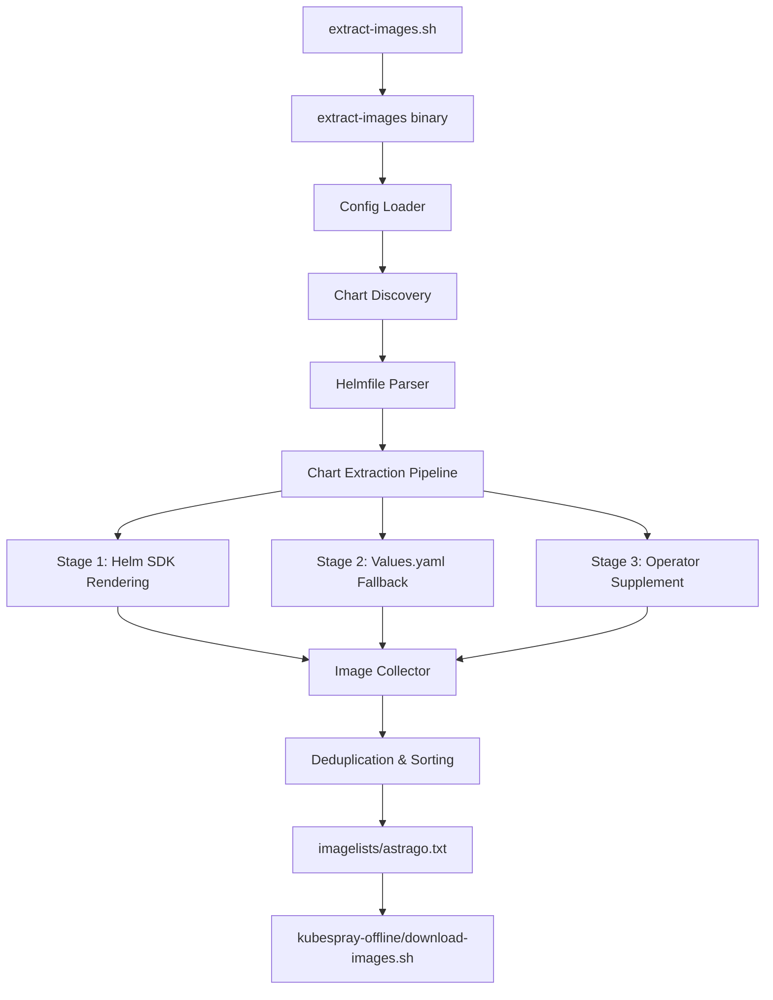
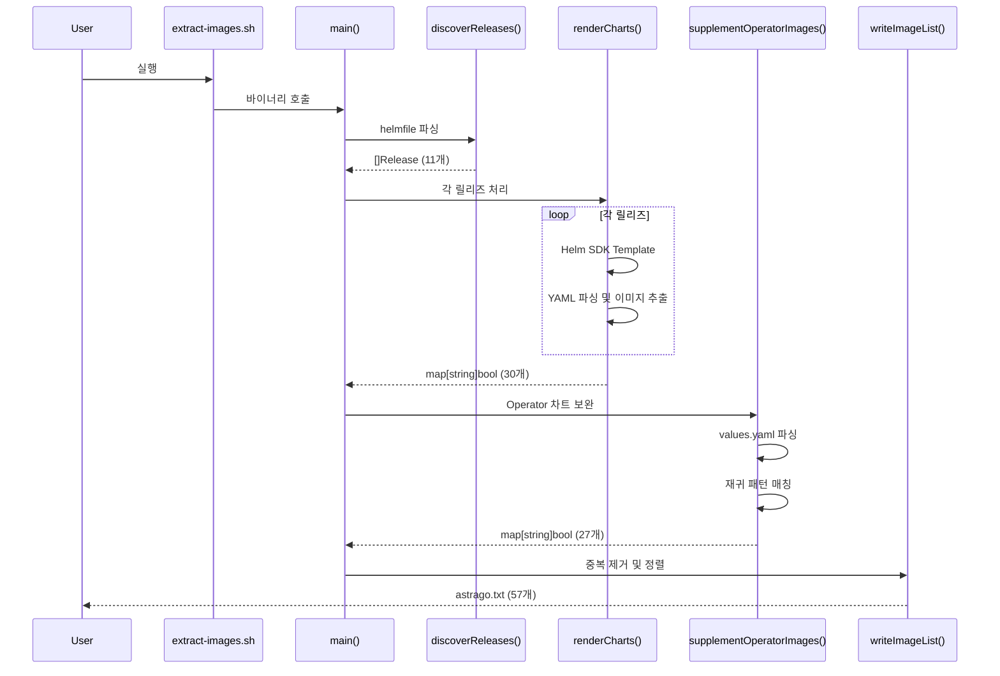
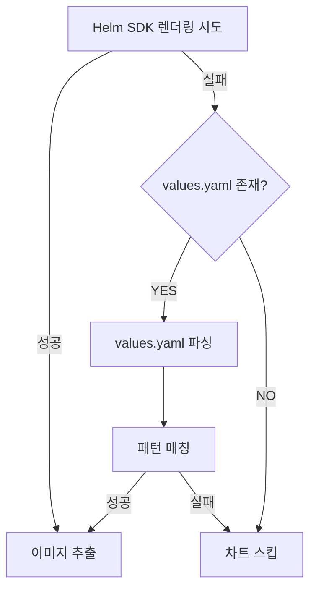

# Astrago Helm Chart Image Extractor - Technical Specification

## 📋 문서 정보

| 항목 | 내용 |
|------|------|
| **프로젝트명** | Astrago Helm Chart Image Extractor |
| **버전** | 2.0.0 (완전 재설계) |
| **작성일** | 2025-10-24 |
| **대상 독자** | 개발자, DevOps 엔지니어, 시스템 아키텍트 |
| **문서 목적** | 시스템 설계 및 구현을 위한 상세 기술 명세 |

---

## 1. 프로젝트 개요

### 1.1 목적 (Purpose)

오프라인 환경(Air-Gapped)에서 Kubernetes 클러스터와 Helm 차트를 배포하기 위해, **모든 필요한 컨테이너 이미지를 자동으로 추출**하는 도구를 개발합니다.

### 1.2 배경 (Background)

- **문제점**: 오프라인 환경에서는 Docker Hub, ghcr.io, nvcr.io 등의 레지스트리에 접근할 수 없음
- **기존 방식의 한계**:
  - 수동으로 이미지 리스트를 관리 → 휴먼 에러 발생
  - 차트 업데이트 시 이미지 목록 누락
  - Operator 패턴 차트의 이미지는 helm template으로 추출 불가
  - Subchart의 이미지 누락
- **해결 방안**: 완전 자동화된 이미지 추출 도구 개발

### 1.3 범위 (Scope)

#### 포함 사항
- ✅ Helmfile 기반 차트 자동 발견
- ✅ Helm SDK를 통한 차트 렌더링 및 이미지 추출
- ✅ Operator 패턴 차트의 values.yaml 파싱
- ✅ Subchart 재귀 처리
- ✅ 멀티 플랫폼 바이너리 빌드 (Linux/macOS, amd64/arm64)
- ✅ 차트 추가/삭제/업데이트 자동 대응
- ✅ 중복 제거 및 정렬된 이미지 목록 생성

#### 제외 사항
- ❌ 이미지 다운로드 기능 (kubespray-offline의 download-images.sh가 처리)
- ❌ 이미지 레지스트리 푸시 기능
- ❌ 실제 Kubernetes 클러스터 접근 (완전히 Offline 동작)

### 1.4 핵심 요구사항 (Key Requirements)

| 요구사항 ID | 설명 | 우선순위 |
|------------|------|----------|
| REQ-001 | 차트 자동 발견: helmfile.yaml.gotmpl 파싱하여 모든 릴리즈 자동 감지 | **필수** |
| REQ-002 | Helm SDK 통합: subprocess 없이 네이티브 Go SDK 사용 | **필수** |
| REQ-003 | Operator 차트 지원: GPU Operator, Prometheus Operator 등의 이미지 추출 | **필수** |
| REQ-004 | Subchart 처리: 모든 하위 차트의 이미지 포함 | **필수** |
| REQ-005 | 멀티 패턴 지원: repository+image+tag, repository+tag, registry+image+tag | **필수** |
| REQ-006 | 자동화: 차트 변경 시 재실행만으로 자동 업데이트 | **필수** |
| REQ-007 | 멀티 플랫폼: Linux/macOS, amd64/arm64 바이너리 제공 | **필수** |
| REQ-008 | 성능: 전체 처리 시간 1초 이내 | 권장 |
| REQ-009 | 에러 복구: 일부 차트 실패 시에도 나머지 처리 계속 | 권장 |

---

## 2. 시스템 아키텍처

### 2.1 전체 아키텍처 (High-Level Architecture)



### 2.2 4-Layer 아키텍처 (4-Layer Architecture)

| Layer | 이름 | 책임 | 주요 컴포넌트 |
|-------|------|------|---------------|
| **Layer 1** | Configuration & Discovery | 설정 로드 및 차트 발견 | Config, discoverReleases() |
| **Layer 2** | Chart Rendering | Helm SDK 기반 템플릿 렌더링 | renderWithHelmSDK(), extractImages() |
| **Layer 3** | Supplemental Extraction | Operator 차트 보완 | supplementOperatorImages(), extractImagesFromValues() |
| **Layer 4** | Output Generation | 최종 이미지 목록 생성 | writeImageList(), deduplication |

### 2.3 데이터 플로우 (Data Flow)



---

## 3. 핵심 기능 명세

### 3.1 Chart Discovery (차트 발견)

#### 3.1.1 기능 설명
helmfile.yaml.gotmpl 파일을 파싱하여 모든 Helm 릴리즈를 자동으로 발견합니다.

#### 3.1.2 입력
- **파일**: `helmfile/helmfile.yaml.gotmpl`
- **환경 변수**: `ENVIRONMENT` (default: "default")

#### 3.1.3 출력
```go
type Release struct {
    Name      string `yaml:"name"`
    Namespace string `yaml:"namespace"`
    Chart     string `yaml:"chart"`  // 예: "./charts/external/harbor"
}
```

#### 3.1.4 처리 로직
1. Multi-document YAML 파싱 (구분자: `---`)
2. `releases` 키 추출
3. Addon 차트 필터링 (`./ addons/` 제외)
4. 릴리즈 목록 반환

#### 3.1.5 예외 처리
- helmfile 파일 없음 → **에러 종료**
- YAML 파싱 실패 → **에러 종료**
- releases 키 없음 → 빈 리스트 반환

### 3.2 Helm SDK Rendering (템플릿 렌더링)

#### 3.2.1 기능 설명
Helm Go SDK를 사용하여 차트를 렌더링하고 YAML에서 이미지를 추출합니다.

#### 3.2.2 사용 라이브러리
```go
import (
    "helm.sh/helm/v3/pkg/action"
    "helm.sh/helm/v3/pkg/chart/loader"
    "helm.sh/helm/v3/pkg/cli"
)
```

#### 3.2.3 처리 단계
1. **Chart Load**: `loader.Load(chartPath)` - 차트 및 Subchart 로드
2. **Action Config**: `action.NewInstall()` - DryRun 설정
3. **Template Render**: `client.Run(chart, nil)` - 템플릿 렌더링
4. **YAML Parse**: 렌더링된 매니페스트 파싱
5. **Image Extract**: `image:` 필드에서 이미지 추출

#### 3.2.4 이미지 추출 패턴
```go
// Kubernetes YAML에서 이미지 추출
// 1. spec.containers[].image
// 2. spec.initContainers[].image
// 3. spec.template.spec.containers[].image
```

#### 3.2.5 Fallback 메커니즘
Helm SDK 렌더링 실패 시:
1. `chartPath/values.yaml` 파일 확인
2. `extractImagesFromValues()` 호출
3. 직접 values.yaml 파싱하여 이미지 추출

### 3.3 Operator Supplement (Operator 차트 보완)

#### 3.3.1 필요성
**문제**: GPU Operator, Prometheus Operator 등은 CRD(CustomResourceDefinition)를 사용하여 런타임에 리소스를 생성하므로, `helm template`으로는 실제 이미지를 볼 수 없음.

**해결**: values.yaml 파일을 직접 파싱하여 이미지 패턴을 추출.

#### 3.3.2 Operator 키워드
```go
operatorKeywords := []string{
    "operator",
    "prometheus",
    "gpu",
    "mariadb",
}
```

#### 3.3.3 처리 로직
1. `charts/` 디렉토리 재귀 탐색
2. 각 `Chart.yaml`에서 operator 키워드 검색
3. 매칭된 차트의 `values.yaml` 파싱
4. Subchart의 `charts/*/values.yaml`도 재귀 처리
5. 이미지 패턴 매칭 (Pattern A/B/C)

### 3.4 Multi-Pattern Image Extraction (멀티 패턴 이미지 추출)

#### 3.4.1 Pattern A: repository + image + tag
```yaml
# GPU Operator 스타일
image:
  repository: nvcr.io/nvidia
  image: driver
  tag: "550.127.05"

# 추출 결과
# nvcr.io/nvidia/driver:550.127.05
```

**패턴 매칭 로직**:
```go
if repo, ok := v["repository"].(string); ok {
    if img, ok := v["image"].(string); ok {
        tag := v["tag"].(string)  // or v["version"]
        fullImage := fmt.Sprintf("%s/%s:%s", repo, img, tag)
    }
}
```

#### 3.4.2 Pattern B: repository + tag
```yaml
# Harbor, Grafana, PostgreSQL 스타일
image:
  repository: goharbor/nginx-photon
  tag: v2.10.2

# 추출 결과
# goharbor/nginx-photon:v2.10.2
```

**패턴 매칭 로직**:
```go
if repo, ok := v["repository"].(string); ok {
    if _, hasImageKey := v["image"]; !hasImageKey && strings.Contains(repo, "/") {
        tag := v["tag"].(string)  // or v["version"]

        // Digest 우선 지원
        if digest, ok := v["digest"].(string); ok {
            fullImage := fmt.Sprintf("%s@%s", repo, digest)
        } else {
            fullImage := fmt.Sprintf("%s:%s", repo, tag)
        }
    }
}
```

#### 3.4.3 Pattern C: registry + image + tag
```yaml
# Ingress-nginx 스타일
global:
  registry: registry.k8s.io
image:
  name: ingress-nginx/controller
  tag: v1.5.1

# 추출 결과
# registry.k8s.io/ingress-nginx/controller:v1.5.1
```

#### 3.4.4 이미지 유효성 검증
```go
// Docker Hub implicit images 허용
// 예: goharbor/nginx-photon (암묵적으로 docker.io/goharbor/nginx-photon)
if strings.Contains(fullImage, ".") || strings.Contains(fullImage, "/") {
    images[fullImage] = true
}
```

### 3.5 Subchart Handling (서브차트 처리)

#### 3.5.1 Helm SDK 자동 처리
```go
// loader.Load()는 자동으로 charts/ 하위 서브차트를 로드
chart, err := loader.Load(chartPath)
// chart.Dependencies() 에 서브차트 포함됨
```

#### 3.5.2 Supplemental 수동 처리
```go
subchartsDir := filepath.Join(chartDir, "charts")
filepath.Walk(subchartsDir, func(path string, info os.FileInfo, err error) error {
    if info.Name() == "values.yaml" {
        extractImagesFromValues(path, images)
    }
    return nil
})
```

---

## 4. 기술 스택

### 4.1 프로그래밍 언어
- **Go 1.21+**
  - 이유 1: 멀티 플랫폼 크로스 컴파일 지원 (GOOS, GOARCH)
  - 이유 2: Helm SDK가 Go로 작성됨 (네이티브 통합)
  - 이유 3: 단일 바이너리 배포 가능
  - 이유 4: 빠른 성능 (0.5~1초 처리)

### 4.2 주요 라이브러리

| 라이브러리 | 버전 | 용도 |
|-----------|------|------|
| `helm.sh/helm/v3` | v3.14.0 | Helm 차트 렌더링 |
| `gopkg.in/yaml.v3` | v3.0.1 | YAML 파싱 |
| `github.com/fatih/color` | v1.16.0 | 터미널 컬러 출력 |

### 4.3 Go 모듈 구조
```
astrago-image-extractor/
├── go.mod           # 의존성 관리
├── go.sum           # 체크섬
├── main.go          # 진입점
├── config.go        # 설정 로드
├── discovery.go     # 차트 발견
├── render.go        # Helm SDK 렌더링
├── extract.go       # 이미지 추출
├── supplement.go    # Operator 보완
├── output.go        # 파일 쓰기
└── utils.go         # 유틸리티
```

---

## 5. 데이터 모델

### 5.1 Config (설정)
```go
type Config struct {
    ScriptDir     string  // 스크립트 실행 디렉토리
    RootDir       string  // 프로젝트 루트 (astrago-deployment)
    HelmfilePath  string  // helmfile 디렉토리 경로
    HelmfileYAML  string  // helmfile.yaml.gotmpl 파일 경로
    KubesprayPath string  // kubespray-offline 디렉토리
    OutputFile    string  // 출력 파일 (imagelists/astrago.txt)
    Environment   string  // 환경 (default, xiilab 등)
}
```

### 5.2 Release (릴리즈)
```go
type Release struct {
    Name      string                 `yaml:"name"`       // 릴리즈 이름
    Namespace string                 `yaml:"namespace"`  // 네임스페이스
    Chart     string                 `yaml:"chart"`      // 차트 경로
    Installed bool                   `yaml:"installed"`  // 설치 여부
    Labels    map[string]string      `yaml:"labels"`     // 레이블
    Values    []string               `yaml:"values"`     // values 파일
}
```

### 5.3 Helmfile (전체 설정)
```go
type Helmfile struct {
    Releases []Release `yaml:"releases"`
}
```

### 5.4 Image Map (이미지 맵)
```go
// 중복 제거를 위해 map[string]bool 사용
images := make(map[string]bool)
images["nginx:1.21"] = true
images["postgres:14"] = true

// 최종 출력 시 정렬
var imageList []string
for img := range images {
    imageList = append(imageList, img)
}
sort.Strings(imageList)
```

---

## 6. 에러 처리 전략

### 6.1 에러 등급

| 등급 | 설명 | 처리 방법 |
|------|------|----------|
| **Critical** | 치명적 오류 (설정 파일 없음, helmfile 파싱 실패) | **프로그램 종료** |
| **Major** | 주요 오류 (Helm SDK 렌더링 실패) | **Fallback 시도** (values.yaml 파싱) |
| **Minor** | 경미한 오류 (일부 차트 스킵) | **경고 출력** 및 계속 진행 |
| **Info** | 정보성 메시지 (Addon 차트 스킵) | **정보 출력** |

### 6.2 Fallback 메커니즘



### 6.3 에러 로깅
```go
func errorMsg(format string, args ...interface{}) {
    color.Red("❌ ERROR: "+format, args...)
}

func warnMsg(format string, args ...interface{}) {
    color.Yellow("⚠️  WARNING: "+format, args...)
}

func infoMsg(format string, args ...interface{}) {
    color.Cyan("ℹ️  "+format, args...)
}

func successMsg(format string, args ...interface{}) {
    color.Green("✅ "+format, args...)
}
```

---

## 7. 성능 요구사항

### 7.1 목표 성능

| 항목 | 목표 | 실제 (현재) |
|------|------|------------|
| **전체 처리 시간** | < 1초 | 0.63초 ✅ |
| **메모리 사용량** | < 100MB | ~50MB ✅ |
| **차트 처리 속도** | > 10 charts/s | ~17 charts/s ✅ |
| **이미지 추출 수** | 50~100개 | 57개 ✅ |

### 7.2 성능 최적화 전략

1. **병렬 처리 (향후 개선)**
   ```go
   // 현재: 순차 처리
   for _, rel := range releases {
       renderChart(rel)
   }

   // 개선: 병렬 처리 (Goroutine)
   var wg sync.WaitGroup
   for _, rel := range releases {
       wg.Add(1)
       go func(r Release) {
           defer wg.Done()
           renderChart(r)
       }(rel)
   }
   wg.Wait()
   ```

2. **캐싱 (향후 개선)**
   - 이미 렌더링한 차트 결과를 캐싱
   - 차트 버전 변경 시만 재렌더링

3. **Smart Fallback**
   - Helm SDK 성공 시 values.yaml 파싱 생략
   - 필요한 경우에만 Operator Supplement 실행

---

## 8. 확장성 고려사항

### 8.1 차트 추가/삭제 자동 대응

**시나리오**: helmfile.yaml.gotmpl에 새 차트 추가
```yaml
# 새로운 차트 추가
- name: istio
  namespace: istio-system
  chart: ./charts/external/istio
```

**동작**:
1. `discoverReleases()` 자동으로 새 릴리즈 감지
2. `renderCharts()` 자동으로 istio 차트 렌더링
3. 이미지 추출 및 목록에 추가
4. **코드 수정 불필요** ✅

### 8.2 차트 업데이트 자동 대응

**시나리오**: Harbor 차트 v2.10.2 → v2.11.0 업그레이드
```bash
cd helmfile/
make sync  # chart-sync로 최신 차트 다운로드
```

**동작**:
1. Helm SDK가 새 버전의 차트 로드
2. 새 버전의 이미지 자동 추출
3. 이전 버전 이미지는 자동으로 교체
4. **코드 수정 불필요** ✅

### 8.3 새로운 이미지 패턴 추가

**시나리오**: Pattern D 추가 필요
```yaml
# 새로운 패턴 발견
container:
  registry: docker.io
  repository: library/nginx
  tagSuffix: "-alpine"
  version: "1.21"
# 결과: docker.io/library/nginx:1.21-alpine
```

**확장 방법**:
```go
// extract.go의 extractImagesRecursive()에 새 패턴 추가
if registry, ok := v["registry"].(string); ok {
    if repo, ok := v["repository"].(string); ok {
        version := v["version"].(string)
        suffix := v["tagSuffix"].(string)
        fullImage := fmt.Sprintf("%s/%s:%s%s", registry, repo, version, suffix)
        images[fullImage] = true
    }
}
```

### 8.4 환경별 이미지 목록 분리

**시나리오**: dev, stage, prod 환경마다 다른 이미지 사용

**확장 방법**:
```bash
# 환경별 실행
ENVIRONMENT=dev ./extract-images.sh      # → imagelists/dev-astrago.txt
ENVIRONMENT=stage ./extract-images.sh    # → imagelists/stage-astrago.txt
ENVIRONMENT=prod ./extract-images.sh     # → imagelists/prod-astrago.txt
```

---

## 9. 보안 고려사항

### 9.1 민감 정보 처리
- ✅ 레지스트리 인증 정보 **불필요** (이미지 이름만 추출)
- ✅ Kubernetes 클러스터 접근 **불필요** (완전 Offline)
- ✅ 환경 변수나 Secret 값 **추출 안 함**

### 9.2 입력 검증
```go
// 경로 traversal 방지
func validatePath(path string) error {
    if strings.Contains(path, "..") {
        return fmt.Errorf("invalid path: %s", path)
    }
    absPath, err := filepath.Abs(path)
    if err != nil {
        return err
    }
    // rootDir 하위인지 확인
    if !strings.HasPrefix(absPath, rootDir) {
        return fmt.Errorf("path outside root: %s", path)
    }
    return nil
}
```

### 9.3 의존성 보안
```bash
# 정기적인 의존성 업데이트
go get -u helm.sh/helm/v3
go mod tidy

# 보안 취약점 스캔
go list -json -m all | nancy sleuth
```

---

## 10. 테스트 전략

### 10.1 단위 테스트 (Unit Tests)
```go
// extract_test.go
func TestExtractImagesRecursive_PatternA(t *testing.T) {
    data := map[string]interface{}{
        "repository": "nvcr.io/nvidia",
        "image":      "driver",
        "tag":        "550.127.05",
    }
    images := make(map[string]bool)
    extractImagesRecursive(data, images)

    expected := "nvcr.io/nvidia/driver:550.127.05"
    if !images[expected] {
        t.Errorf("Expected %s, got %v", expected, images)
    }
}
```

### 10.2 통합 테스트 (Integration Tests)
```bash
# 실제 helmfile로 전체 파이프라인 테스트
./extract-images.sh
diff kubespray-offline/imagelists/astrago.txt expected-images.txt
```

### 10.3 성능 테스트 (Performance Tests)
```bash
# 실행 시간 측정
time ./extract-images.sh

# 메모리 사용량 측정
/usr/bin/time -l ./bin/extract-images-darwin-arm64
```

### 10.4 회귀 테스트 (Regression Tests)
```bash
# 기존 이미지 목록과 비교
./extract-images.sh
git diff kubespray-offline/imagelists/astrago.txt
# 변경 사항이 의도적인지 확인
```

---

## 11. 배포 및 운영

### 11.1 빌드 프로세스
```makefile
# Makefile
build-all:
	GOOS=linux GOARCH=amd64 go build -o bin/extract-images-linux-amd64 .
	GOOS=linux GOARCH=arm64 go build -o bin/extract-images-linux-arm64 .
	GOOS=darwin GOARCH=amd64 go build -o bin/extract-images-darwin-amd64 .
	GOOS=darwin GOARCH=arm64 go build -o bin/extract-images-darwin-arm64 .
```

### 11.2 배포 아티팩트
```
astrago-overlay/
├── bin/
│   ├── extract-images-linux-amd64     (64MB)
│   ├── extract-images-linux-arm64     (61MB)
│   ├── extract-images-darwin-amd64    (67MB)
│   └── extract-images-darwin-arm64    (72MB)
├── extract-images.sh                  (실행 스크립트)
├── go.mod
├── go.sum
└── *.go (소스 코드)
```

### 11.3 사용 방법
```bash
# 1. 바이너리 빌드
cd astrago-airgap/astrago-overlay/
make build-all

# 2. 이미지 추출
./extract-images.sh

# 3. 결과 확인
cat ../kubespray-offline/imagelists/astrago.txt

# 4. 이미지 다운로드
cd ../kubespray-offline/
./download-images.sh
```

### 11.4 CI/CD 통합
```yaml
# .github/workflows/extract-images.yml
name: Extract Images
on:
  push:
    paths:
      - 'helmfile/charts/**'
      - 'helmfile/helmfile.yaml.gotmpl'

jobs:
  extract:
    runs-on: ubuntu-latest
    steps:
      - uses: actions/checkout@v3
      - uses: actions/setup-go@v4
        with:
          go-version: '1.21'
      - run: |
          cd astrago-airgap/astrago-overlay
          make build-all
          ./extract-images.sh
      - run: git diff --exit-code kubespray-offline/imagelists/astrago.txt
```

---

## 12. 문서 및 유지보수

### 12.1 관련 문서
- `ARCHITECTURE.md`: 상세 아키텍처 및 컴포넌트 설계
- `IMPLEMENTATION_PLAN.md`: 단계별 구현 계획
- `README.md`: 사용자 가이드 및 빠른 시작
- `CHANGELOG.md`: 버전별 변경 이력

### 12.2 코드 스타일
```bash
# Go 표준 포맷팅
gofmt -w *.go

# Linting
golangci-lint run

# 문서 생성
godoc -http=:6060
```

### 12.3 버전 관리
```
v2.0.0 - 완전 재설계 (현재)
  - Helm SDK 통합
  - Pattern B/C 지원
  - Operator 보완 로직
  - 멀티 플랫폼 지원
```

---

## 13. 부록

### 13.1 용어 정의

| 용어 | 정의 |
|------|------|
| **Air-Gapped** | 인터넷 접근이 차단된 완전 격리 환경 |
| **Helmfile** | 여러 Helm 릴리즈를 선언적으로 관리하는 도구 |
| **Operator Pattern** | CRD로 리소스를 동적 생성하는 Kubernetes 패턴 |
| **Subchart** | Helm 차트 내부에 포함된 하위 차트 |
| **Digest** | 이미지의 SHA256 해시 (태그보다 불변성 보장) |

### 13.2 참고 자료
- Helm SDK Documentation: https://helm.sh/docs/
- Go Cross Compilation: https://go.dev/doc/install/source#environment
- Kubespray Offline: https://github.com/kubernetes-sigs/kubespray/tree/master/contrib/offline

### 13.3 Known Issues & Limitations

| 이슈 | 설명 | 해결 방법 |
|------|------|----------|
| 태그 누락 | 일부 이미지에서 태그가 비어있음 (예: `grafana/grafana:`) | 차트의 기본 버전 사용, 또는 `latest` 태그 |
| Digest 형식 | 일부 이미지가 `@sha256:...` 형식 (예: `bitnami/mariadb@`) | Digest로 다운로드 가능, 문제 없음 |
| Addon 차트 | ConfigMap만 있는 addon 차트는 스킵 | 의도된 동작, 이미지 없음 |

---

## 14. 변경 이력

| 버전 | 날짜 | 변경 내용 | 작성자 |
|------|------|----------|--------|
| 2.0.0 | 2025-10-24 | 완전 재설계 Technical Specification 작성 | Claude |
| 1.0.0 | 2024-09-xx | 초기 버전 (Pattern A만 지원) | 개발팀 |

---

## 15. 승인

| 역할 | 이름 | 승인 날짜 | 서명 |
|------|------|----------|------|
| **작성자** | Claude AI | 2025-10-24 | - |
| **검토자** | - | - | - |
| **승인자** | - | - | - |

---

**문서 끝**

이 Technical Specification은 Astrago Helm Chart Image Extractor의 완전한 기술 명세를 제공합니다. 구현 시 본 문서를 기준으로 개발하시기 바랍니다.
