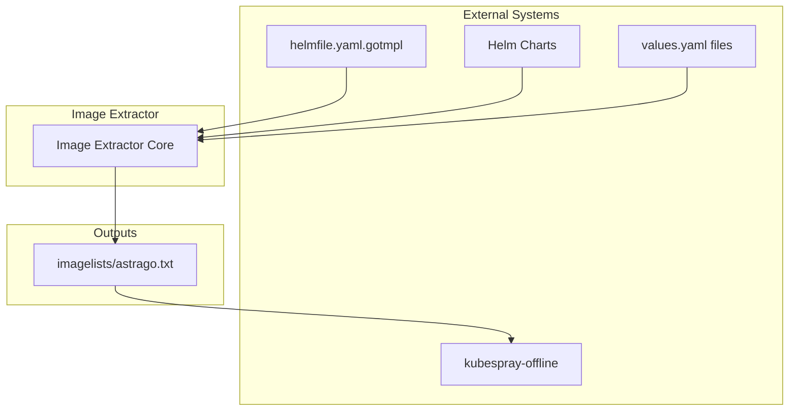
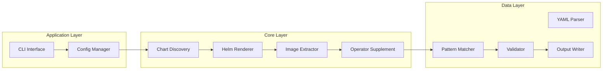
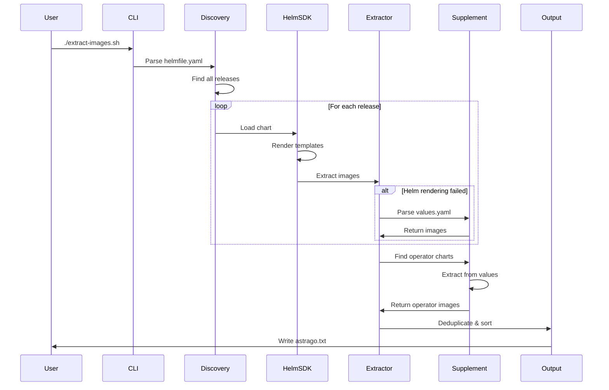

# Astrago Helm Chart Image Extractor - Technical Specification v2.0

## 문서 정보

| 항목 | 내용 |
|------|------|
| **프로젝트명** | Astrago Helm Chart Image Extractor |
| **버전** | 2.0.0 |
| **작성일** | 2024-10-24 |
| **작성자** | System Architect |
| **문서 상태** | Draft |

---

## Executive Summary

### 프로젝트 개요
오프라인(Air-gapped) 환경에서 Kubernetes 및 Helm Chart 배포를 위해 필요한 모든 컨테이너 이미지를 자동으로 추출하고 목록화하는 Go 기반 도구를 개발합니다.

### 핵심 가치
- **완전 자동화**: 수동 이미지 목록 관리 불필요
- **무결성 보장**: 모든 필요 이미지를 누락 없이 추출
- **유지보수성**: 차트 변경 시 자동 적응
- **크로스 플랫폼**: Linux/macOS, ARM/AMD64 지원

---

## 1. 비즈니스 요구사항

### 1.1 문제 정의

#### 현재 상황
- 보안상 인터넷 접근이 불가능한 환경에서 Kubernetes 운영
- Helm Chart 배포 시 필요한 컨테이너 이미지를 사전에 다운로드 필요
- 수동으로 이미지 목록을 관리하면 누락 및 버전 불일치 발생

#### Pain Points
1. **수동 관리의 한계**
   - 차트 업데이트 시 이미지 목록 수동 수정 필요
   - 인적 오류로 인한 이미지 누락
   - Subchart 이미지 파악 어려움

2. **Operator Pattern 문제**
   - `helm template` 명령으로 추출 불가능
   - 런타임에 동적으로 생성되는 리소스
   - values.yaml 직접 파싱 필요

3. **다양한 이미지 명시 패턴**
   - 차트마다 다른 이미지 정의 방식
   - 표준화되지 않은 values 구조

### 1.2 목표 및 성공 기준

#### 주요 목표
1. Helmfile 기반 차트에서 100% 이미지 추출
2. 차트 변경에 대한 자동 적응
3. 1초 이내 전체 처리 완료
4. Zero-dependency 단일 바이너리 배포

#### 성공 기준
- ✅ 모든 차트(internal/external)의 이미지 추출
- ✅ Subchart 포함 완전한 이미지 목록
- ✅ Operator 패턴 차트 지원
- ✅ 멀티 플랫폼 바이너리 제공
- ✅ 차트 추가/삭제/업데이트 자동 감지

### 1.3 제약사항

- Kubernetes 클러스터 접근 불가 (완전 오프라인)
- 외부 도구 의존성 최소화
- 바이너리 크기 100MB 이내
- Go 1.21+ 사용 필수

---

## 2. 기능 요구사항

### 2.1 핵심 기능

#### FR-001: 차트 자동 발견
```yaml
입력: helmfile/helmfile.yaml.gotmpl
처리: YAML 파싱 및 릴리즈 추출
출력: []Release{name, namespace, chart_path}
```

#### FR-002: 이미지 추출 파이프라인
```
1단계: Helm SDK 렌더링 (95% 커버리지)
2단계: Values.yaml 파싱 (Fallback)
3단계: Operator 보완 (특수 케이스)
```

#### FR-003: 패턴 인식
```yaml
# Pattern A: repository + image + tag
repository: nvcr.io/nvidia
image: driver
tag: "550.127.05"

# Pattern B: repository + tag
repository: goharbor/nginx-photon
tag: v2.10.2

# Pattern C: registry + image + tag
registry: registry.k8s.io
image: ingress-nginx/controller
tag: v1.5.1
```

#### FR-004: Subchart 처리
- 재귀적 차트 탐색
- 중첩 values 오버라이드 처리
- 의존성 체인 관리

#### FR-005: 출력 생성
```bash
# 출력 형식
docker.io/library/nginx:1.21
ghcr.io/fluxcd/source-controller:v1.4.1
nvcr.io/nvidia/driver:550.127.05

# 특징
- 중복 제거
- 알파벳 정렬
- 유효성 검증
```

### 2.2 비기능 요구사항

#### 성능 (Performance)
| 메트릭 | 목표 | 측정 방법 |
|-------|------|----------|
| 처리 시간 | < 1초 | time 명령 |
| 메모리 사용 | < 100MB | memory profiler |
| CPU 사용 | < 1 core | top/htop |
| 동시성 | 10 charts/parallel | benchmark |

#### 신뢰성 (Reliability)
- 부분 실패 시 계속 처리 (Graceful Degradation)
- 에러 복구 메커니즘
- 트랜잭션 안전성

#### 사용성 (Usability)
- 단일 명령 실행
- 직관적 에러 메시지
- 컬러 출력 지원
- Progress 표시

#### 유지보수성 (Maintainability)
- 모듈화된 코드 구조
- 80% 테스트 커버리지
- 자세한 로깅
- 문서화

#### 이식성 (Portability)
- Linux (amd64, arm64)
- macOS (amd64, arm64)
- Windows (향후 지원)

---

## 3. 시스템 아키텍처

### 3.1 컨텍스트 다이어그램



### 3.2 컴포넌트 아키텍처



### 3.3 데이터 플로우



---

## 4. 기술 스택

### 4.1 프로그래밍 언어

**Go 1.21+**
- **선택 이유**:
  - Helm이 Go로 작성되어 SDK 직접 사용 가능
  - 크로스 컴파일 지원 (GOOS/GOARCH)
  - 정적 바이너리 생성
  - 빠른 실행 속도
  - 메모리 효율성

### 4.2 핵심 라이브러리

| 라이브러리 | 버전 | 용도 | 선택 이유 |
|-----------|------|------|-----------|
| helm.sh/helm/v3 | v3.14.0 | Helm 차트 처리 | 공식 SDK, 안정성 |
| gopkg.in/yaml.v3 | v3.0.1 | YAML 파싱 | 성능, 기능 완전성 |
| github.com/fatih/color | v1.16.0 | 터미널 출력 | UX 개선 |

### 4.3 프로젝트 구조

```
astrago-overlay/
├── cmd/
│   └── extractor/
│       └── main.go           # 진입점
├── pkg/
│   ├── config/
│   │   └── config.go         # 설정 관리
│   ├── discovery/
│   │   └── helmfile.go       # Helmfile 파싱
│   ├── helm/
│   │   ├── renderer.go       # Helm SDK 래퍼
│   │   └── loader.go         # 차트 로더
│   ├── extractor/
│   │   ├── extractor.go      # 핵심 추출 로직
│   │   ├── patterns.go       # 패턴 매칭
│   │   └── validator.go      # 이미지 검증
│   ├── supplement/
│   │   └── operator.go       # Operator 보완
│   └── output/
│       └── writer.go         # 파일 출력
├── internal/
│   └── utils/
│       └── helpers.go        # 유틸리티
├── scripts/
│   ├── extract-images.sh     # 실행 스크립트
│   └── build.sh              # 빌드 스크립트
├── test/
│   ├── fixtures/             # 테스트 데이터
│   └── integration/          # 통합 테스트
├── docs/
│   ├── TECHNICAL_SPECIFICATION.md
│   ├── ARCHITECTURE.md
│   └── IMPLEMENTATION_PLAN.md
├── Makefile
├── go.mod
└── go.sum
```

---

## 5. 상세 설계

### 5.1 핵심 데이터 구조

```go
// Config - 전역 설정
type Config struct {
    RootDir       string    // 프로젝트 루트
    HelmfilePath  string    // Helmfile 경로
    OutputPath    string    // 출력 파일 경로
    Environment   string    // 타겟 환경
    Concurrency   int       // 병렬 처리 수
    Debug         bool      // 디버그 모드
}

// Release - Helm 릴리즈
type Release struct {
    Name      string            `yaml:"name"`
    Namespace string            `yaml:"namespace"`
    Chart     string            `yaml:"chart"`
    Values    []string          `yaml:"values"`
    Labels    map[string]string `yaml:"labels"`
}

// Image - 컨테이너 이미지
type Image struct {
    Registry   string  // 레지스트리 (docker.io)
    Repository string  // 리포지토리 (library/nginx)
    Tag        string  // 태그 (1.21)
    Digest     string  // 다이제스트 (sha256:...)
    Full       string  // 전체 경로
}

// ExtractionResult - 추출 결과
type ExtractionResult struct {
    Release    string
    Images     []Image
    Errors     []error
    Duration   time.Duration
}
```

### 5.2 핵심 알고리즘

#### 5.2.1 이미지 패턴 매칭

```go
func ExtractImagePattern(data map[string]interface{}) (*Image, error) {
    // Pattern A: repository + image + tag
    if repo, ok := data["repository"].(string); ok {
        if img, ok := data["image"].(string); ok {
            tag := getTagOrVersion(data)
            return &Image{
                Repository: fmt.Sprintf("%s/%s", repo, img),
                Tag:        tag,
                Full:       fmt.Sprintf("%s/%s:%s", repo, img, tag),
            }, nil
        }
    }

    // Pattern B: repository + tag (repository contains full path)
    if repo, ok := data["repository"].(string); ok {
        if _, hasImage := data["image"]; !hasImage {
            if strings.Contains(repo, "/") {
                tag := getTagOrVersion(data)
                return &Image{
                    Repository: repo,
                    Tag:        tag,
                    Full:       fmt.Sprintf("%s:%s", repo, tag),
                }, nil
            }
        }
    }

    // Pattern C: registry + image + tag
    if registry, ok := data["registry"].(string); ok {
        if img, ok := data["image"].(string); ok {
            tag := getTagOrVersion(data)
            return &Image{
                Registry:   registry,
                Repository: img,
                Tag:        tag,
                Full:       fmt.Sprintf("%s/%s:%s", registry, img, tag),
            }, nil
        }
    }

    return nil, ErrNoPatternMatch
}
```

#### 5.2.2 재귀적 Values 탐색

```go
func ExtractImagesRecursive(data interface{}, images map[string]bool) {
    switch v := data.(type) {
    case map[string]interface{}:
        // 이미지 패턴 체크
        if img, err := ExtractImagePattern(v); err == nil {
            images[img.Full] = true
        }

        // 재귀 탐색
        for _, value := range v {
            ExtractImagesRecursive(value, images)
        }

    case []interface{}:
        for _, item := range v {
            ExtractImagesRecursive(item, images)
        }
    }
}
```

#### 5.2.3 병렬 처리

```go
func ProcessReleasesParallel(releases []Release, concurrency int) []ExtractionResult {
    sem := make(chan struct{}, concurrency)
    results := make(chan ExtractionResult, len(releases))

    var wg sync.WaitGroup
    for _, release := range releases {
        wg.Add(1)
        go func(r Release) {
            defer wg.Done()
            sem <- struct{}{}        // 세마포어 획득
            defer func() { <-sem }() // 세마포어 해제

            result := ProcessRelease(r)
            results <- result
        }(release)
    }

    go func() {
        wg.Wait()
        close(results)
    }()

    // 결과 수집
    var allResults []ExtractionResult
    for result := range results {
        allResults = append(allResults, result)
    }

    return allResults
}
```

### 5.3 에러 처리 전략

#### 5.3.1 에러 분류

```go
const (
    ErrTypeCritical = iota  // 시스템 종료 필요
    ErrTypeMajor            // 기능 실패, Fallback 시도
    ErrTypeMinor            // 경고, 계속 진행
    ErrTypeInfo             // 정보성 메시지
)

type ExtractorError struct {
    Type    int
    Context string
    Err     error
    Action  string  // 수행할 조치
}
```

#### 5.3.2 Fallback 체인

```go
func ExtractWithFallback(release Release) ([]Image, error) {
    // 1차: Helm SDK 렌더링
    images, err := ExtractViaHelmSDK(release)
    if err == nil {
        return images, nil
    }

    log.Warn("Helm SDK failed, trying values.yaml parsing", err)

    // 2차: Values.yaml 직접 파싱
    images, err = ExtractViaValuesYAML(release)
    if err == nil {
        return images, nil
    }

    log.Warn("Values parsing failed, trying pattern matching", err)

    // 3차: 패턴 매칭
    images, err = ExtractViaPatternMatching(release)
    if err == nil {
        return images, nil
    }

    return nil, fmt.Errorf("all extraction methods failed: %w", err)
}
```

---

## 6. 인터페이스 설계

### 6.1 CLI 인터페이스

```bash
# 기본 실행
$ ./extract-images

# 옵션 지정
$ ./extract-images \
    --helmfile /path/to/helmfile.yaml \
    --output /path/to/images.txt \
    --environment production \
    --concurrency 5 \
    --debug

# 도움말
$ ./extract-images --help
Usage: extract-images [OPTIONS]

Options:
  --helmfile    Path to helmfile.yaml.gotmpl (default: ./helmfile/helmfile.yaml.gotmpl)
  --output      Output file path (default: ./kubespray-offline/imagelists/astrago.txt)
  --environment Target environment (default: default)
  --concurrency Number of parallel workers (default: 5)
  --format      Output format: text|json|yaml (default: text)
  --debug       Enable debug logging
  --version     Show version
  --help        Show this help
```

### 6.2 출력 형식

#### Text Format (기본)
```
docker.io/library/nginx:1.21
ghcr.io/fluxcd/source-controller:v1.4.1
nvcr.io/nvidia/driver:550.127.05
```

#### JSON Format
```json
{
  "metadata": {
    "timestamp": "2024-10-24T10:00:00Z",
    "total": 57,
    "duration": "0.63s"
  },
  "images": [
    {
      "registry": "docker.io",
      "repository": "library/nginx",
      "tag": "1.21",
      "full": "docker.io/library/nginx:1.21"
    }
  ]
}
```

#### YAML Format
```yaml
metadata:
  timestamp: "2024-10-24T10:00:00Z"
  total: 57
  duration: "0.63s"
images:
  - registry: docker.io
    repository: library/nginx
    tag: "1.21"
    full: docker.io/library/nginx:1.21
```

---

## 7. 테스트 전략

### 7.1 테스트 레벨

| 레벨 | 커버리지 목표 | 도구 |
|------|-------------|------|
| Unit Tests | 80% | go test, testify |
| Integration Tests | 60% | go test |
| E2E Tests | 40% | shell scripts |
| Performance Tests | - | go bench |

### 7.2 주요 테스트 케이스

#### Unit Tests
```go
func TestExtractImagePattern(t *testing.T) {
    tests := []struct {
        name     string
        input    map[string]interface{}
        expected *Image
        hasError bool
    }{
        {
            name: "Pattern A - repository+image+tag",
            input: map[string]interface{}{
                "repository": "nvcr.io/nvidia",
                "image":      "driver",
                "tag":        "550.127.05",
            },
            expected: &Image{
                Repository: "nvcr.io/nvidia/driver",
                Tag:        "550.127.05",
                Full:       "nvcr.io/nvidia/driver:550.127.05",
            },
            hasError: false,
        },
        // ... more test cases
    }

    for _, tt := range tests {
        t.Run(tt.name, func(t *testing.T) {
            result, err := ExtractImagePattern(tt.input)
            if tt.hasError {
                assert.Error(t, err)
            } else {
                assert.NoError(t, err)
                assert.Equal(t, tt.expected, result)
            }
        })
    }
}
```

#### Integration Tests
```bash
#!/bin/bash
# test/integration/test_full_pipeline.sh

# Setup
cp -r test/fixtures/helmfile ./test_helmfile
export HELMFILE_PATH=./test_helmfile

# Run
./extract-images --output test_output.txt

# Assert
expected_count=57
actual_count=$(wc -l < test_output.txt)
if [ "$actual_count" -ne "$expected_count" ]; then
    echo "FAIL: Expected $expected_count images, got $actual_count"
    exit 1
fi

# Cleanup
rm -rf ./test_helmfile test_output.txt
```

### 7.3 성능 벤치마크

```go
func BenchmarkImageExtraction(b *testing.B) {
    release := loadTestRelease()

    b.ResetTimer()
    for i := 0; i < b.N; i++ {
        _, _ = ExtractImages(release)
    }
}

func BenchmarkParallelProcessing(b *testing.B) {
    releases := loadTestReleases(20)

    b.Run("Sequential", func(b *testing.B) {
        for i := 0; i < b.N; i++ {
            ProcessReleasesSequential(releases)
        }
    })

    b.Run("Parallel-5", func(b *testing.B) {
        for i := 0; i < b.N; i++ {
            ProcessReleasesParallel(releases, 5)
        }
    })
}
```

---

## 8. 배포 및 운영

### 8.1 빌드 프로세스

```makefile
# Makefile
VERSION := 2.0.0
LDFLAGS := -X main.Version=$(VERSION) -X main.BuildTime=$(shell date -u +%Y%m%d.%H%M%S)

.PHONY: all clean test build-all

all: test build-all

clean:
	rm -rf bin/

test:
	go test -v -cover ./...

build-all:
	GOOS=linux GOARCH=amd64 go build -ldflags "$(LDFLAGS)" -o bin/extract-images-linux-amd64 ./cmd/extractor
	GOOS=linux GOARCH=arm64 go build -ldflags "$(LDFLAGS)" -o bin/extract-images-linux-arm64 ./cmd/extractor
	GOOS=darwin GOARCH=amd64 go build -ldflags "$(LDFLAGS)" -o bin/extract-images-darwin-amd64 ./cmd/extractor
	GOOS=darwin GOARCH=arm64 go build -ldflags "$(LDFLAGS)" -o bin/extract-images-darwin-arm64 ./cmd/extractor
	@echo "✅ Build complete for all platforms"
	@ls -lh bin/

docker-build:
	docker build -t astrago-image-extractor:$(VERSION) .

release:
	@echo "Creating release $(VERSION)"
	git tag -a v$(VERSION) -m "Release version $(VERSION)"
	git push origin v$(VERSION)
```

### 8.2 CI/CD Pipeline

```yaml
# .github/workflows/ci.yml
name: CI

on:
  push:
    branches: [ main, develop ]
  pull_request:
    branches: [ main ]

jobs:
  test:
    runs-on: ubuntu-latest
    strategy:
      matrix:
        go-version: ['1.21', '1.22']

    steps:
    - uses: actions/checkout@v3

    - name: Setup Go
      uses: actions/setup-go@v4
      with:
        go-version: ${{ matrix.go-version }}

    - name: Dependencies
      run: go mod download

    - name: Lint
      uses: golangci/golangci-lint-action@v3

    - name: Test
      run: make test

    - name: Coverage
      run: |
        go test -coverprofile=coverage.out ./...
        go tool cover -html=coverage.out -o coverage.html

    - name: Upload Coverage
      uses: codecov/codecov-action@v3
      with:
        file: ./coverage.out

  build:
    needs: test
    runs-on: ubuntu-latest

    steps:
    - uses: actions/checkout@v3

    - name: Setup Go
      uses: actions/setup-go@v4
      with:
        go-version: '1.21'

    - name: Build All Platforms
      run: make build-all

    - name: Upload Artifacts
      uses: actions/upload-artifact@v3
      with:
        name: binaries
        path: bin/
```

### 8.3 릴리즈 프로세스

```bash
#!/bin/bash
# scripts/release.sh

VERSION=$1
if [ -z "$VERSION" ]; then
    echo "Usage: ./release.sh <version>"
    exit 1
fi

echo "🚀 Releasing version $VERSION"

# 1. Update version
sed -i "s/VERSION := .*/VERSION := $VERSION/" Makefile

# 2. Run tests
echo "📋 Running tests..."
make test || exit 1

# 3. Build binaries
echo "🔨 Building binaries..."
make build-all || exit 1

# 4. Create checksums
echo "🔐 Creating checksums..."
cd bin/
for file in *; do
    sha256sum "$file" > "$file.sha256"
done
cd ..

# 5. Create tarball
echo "📦 Creating release archive..."
tar czf "astrago-image-extractor-$VERSION.tar.gz" bin/ docs/ scripts/ README.md

# 6. Tag and push
echo "🏷️ Creating git tag..."
git add -A
git commit -m "Release v$VERSION"
git tag -a "v$VERSION" -m "Release version $VERSION"
git push origin main
git push origin "v$VERSION"

echo "✅ Release $VERSION complete!"
```

### 8.4 운영 가이드

#### 설치
```bash
# 1. 바이너리 다운로드
wget https://github.com/astrago/image-extractor/releases/download/v2.0.0/extract-images-linux-amd64
chmod +x extract-images-linux-amd64

# 2. 시스템 경로로 이동
sudo mv extract-images-linux-amd64 /usr/local/bin/extract-images

# 3. 확인
extract-images --version
```

#### 일일 운영
```bash
# 이미지 추출 실행
cd /path/to/astrago-deployment
extract-images

# 결과 확인
cat kubespray-offline/imagelists/astrago.txt

# 이미지 다운로드
cd kubespray-offline
./download-images.sh
```

#### 문제 해결
```bash
# 디버그 모드 실행
extract-images --debug > debug.log 2>&1

# 특정 차트만 처리
extract-images --filter "harbor,prometheus"

# Dry-run (실제 파일 생성 안 함)
extract-images --dry-run
```

---

## 9. 모니터링 및 로깅

### 9.1 로깅 전략

```go
// 로그 레벨
const (
    LevelDebug = iota
    LevelInfo
    LevelWarn
    LevelError
    LevelFatal
)

// 구조화된 로깅
type LogEntry struct {
    Level     int
    Timestamp time.Time
    Component string
    Message   string
    Fields    map[string]interface{}
}

// 사용 예시
log.WithFields(map[string]interface{}{
    "release": "harbor",
    "chart":   "./charts/external/harbor",
    "images":  7,
}).Info("Successfully extracted images")
```

### 9.2 메트릭 수집

```go
type Metrics struct {
    TotalReleases      int
    ProcessedReleases  int
    TotalImages        int
    UniqueImages       int
    ExtractionDuration time.Duration
    ErrorCount         int
    FallbackCount      int
}

func (m *Metrics) Report() {
    fmt.Printf(`
================================================
📊 Extraction Metrics
================================================
Total Releases:     %d
Processed:          %d
Total Images:       %d
Unique Images:      %d
Duration:           %v
Errors:             %d
Fallbacks Used:     %d
Success Rate:       %.2f%%
================================================
`,
        m.TotalReleases,
        m.ProcessedReleases,
        m.TotalImages,
        m.UniqueImages,
        m.ExtractionDuration,
        m.ErrorCount,
        m.FallbackCount,
        float64(m.ProcessedReleases)/float64(m.TotalReleases)*100,
    )
}
```

---

## 10. 보안 고려사항

### 10.1 보안 원칙

- **Least Privilege**: 최소 권한으로 실행
- **Input Validation**: 모든 입력 검증
- **No Secrets**: 인증 정보 불포함
- **Secure Dependencies**: 의존성 정기 업데이트

### 10.2 보안 구현

```go
// 경로 검증
func ValidatePath(path string) error {
    // Path traversal 방지
    if strings.Contains(path, "..") {
        return ErrInvalidPath
    }

    // Absolute path 확인
    absPath, err := filepath.Abs(path)
    if err != nil {
        return err
    }

    // Symlink 확인
    info, err := os.Lstat(absPath)
    if err != nil {
        return err
    }
    if info.Mode()&os.ModeSymlink != 0 {
        return ErrSymlinkNotAllowed
    }

    return nil
}

// 이미지 이름 검증
func ValidateImageName(image string) error {
    // 악성 패턴 체크
    maliciousPatterns := []string{
        "../",
        "$(", "${",  // Command injection
        "`",         // Backtick
        "|", "&",    // Pipe, background
        ";",         // Command separator
    }

    for _, pattern := range maliciousPatterns {
        if strings.Contains(image, pattern) {
            return ErrMaliciousPattern
        }
    }

    // 정규식 검증
    validImageRegex := regexp.MustCompile(`^[a-zA-Z0-9\.\-_/:@]+$`)
    if !validImageRegex.MatchString(image) {
        return ErrInvalidImageFormat
    }

    return nil
}
```

### 10.3 의존성 관리

```bash
# 의존성 업데이트
go get -u ./...
go mod tidy

# 취약점 스캔
go install github.com/sonatype-nexus-community/nancy@latest
go list -json -m all | nancy sleuth

# SBOM 생성
go install github.com/anchore/syft/cmd/syft@latest
syft packages . -o spdx-json > sbom.json
```

---

## 11. 마이그레이션 전략

### 11.1 기존 시스템과의 호환성

```bash
# v1.x 호환 모드
extract-images --legacy-mode

# 기존 출력 형식 유지
extract-images --format v1

# 마이그레이션 검증
extract-images --validate-against v1-output.txt
```

### 11.2 단계적 마이그레이션

| 단계 | 기간 | 작업 내용 |
|------|------|----------|
| Phase 1 | Week 1 | 개발 환경 테스트 |
| Phase 2 | Week 2 | 스테이징 환경 적용 |
| Phase 3 | Week 3 | 프로덕션 병렬 운영 |
| Phase 4 | Week 4 | 프로덕션 전환 |
| Phase 5 | Week 5 | 기존 시스템 제거 |

---

## 12. 부록

### 12.1 용어집

| 용어 | 설명 |
|------|------|
| **Air-gapped** | 네트워크 격리 환경 |
| **Helm Chart** | Kubernetes 패키지 매니저의 패키지 형식 |
| **Helmfile** | 다중 Helm 릴리즈 관리 도구 |
| **Operator Pattern** | CRD 기반 동적 리소스 생성 패턴 |
| **Subchart** | 차트 내부의 종속 차트 |
| **Registry** | 컨테이너 이미지 저장소 |
| **Repository** | 이미지가 저장된 경로 |
| **Tag** | 이미지 버전 식별자 |
| **Digest** | 이미지의 SHA256 해시 |

### 12.2 참고 문헌

1. Helm Documentation: https://helm.sh/docs/
2. Go Programming Language: https://go.dev/doc/
3. Kubernetes Documentation: https://kubernetes.io/docs/
4. OCI Image Specification: https://github.com/opencontainers/image-spec

### 12.3 라이센스

```
MIT License

Copyright (c) 2024 Astrago Team

Permission is hereby granted, free of charge, to any person obtaining a copy
of this software and associated documentation files (the "Software"), to deal
in the Software without restriction, including without limitation the rights
to use, copy, modify, merge, publish, distribute, sublicense, and/or sell
copies of the Software, and to permit persons to whom the Software is
furnished to do so, subject to the following conditions:

The above copyright notice and this permission notice shall be included in all
copies or substantial portions of the Software.

THE SOFTWARE IS PROVIDED "AS IS", WITHOUT WARRANTY OF ANY KIND, EXPRESS OR
IMPLIED, INCLUDING BUT NOT LIMITED TO THE WARRANTIES OF MERCHANTABILITY,
FITNESS FOR A PARTICULAR PURPOSE AND NONINFRINGEMENT. IN NO EVENT SHALL THE
AUTHORS OR COPYRIGHT HOLDERS BE LIABLE FOR ANY CLAIM, DAMAGES OR OTHER
LIABILITY, WHETHER IN AN ACTION OF CONTRACT, TORT OR OTHERWISE, ARISING FROM,
OUT OF OR IN CONNECTION WITH THE SOFTWARE OR THE USE OR OTHER DEALINGS IN THE
SOFTWARE.
```

---

## 13. Phase 0: Critical Fixes

구현 전 **반드시 수정해야 할 5가지 Critical 이슈**가 식별되었습니다.
상세 내용은 [PHASE_0_CRITICAL_FIXES.md](./PHASE_0_CRITICAL_FIXES.md) 참조.

### 13.1 Critical 이슈 요약

| 이슈 | 영향도 | 소요 시간 | ROI |
|------|--------|----------|-----|
| #1: Helm SDK 버전 통일 (v3.14.0) | 🔴 Critical | 10분 | ⭐⭐⭐⭐⭐ |
| #2: CLI --format 옵션 통일 | 🟡 Medium | 30분 | ⭐⭐⭐⭐ |
| #3: 기본 출력 경로 수정 | 🟡 Medium | 5분 | ⭐⭐⭐⭐⭐ |
| #4: action.Configuration Init | 🔴 Critical | 2-4시간 | ⭐⭐⭐⭐⭐ |
| #5: Helmfile 파싱 실구현 | 🔴 Critical | 1-2일 | ⭐⭐⭐⭐⭐ |

**총 예상 소요 시간: 2-3일**

### 13.2 품질 개선 권장 사항

#### 개선 #1: Operator 이미지 외부화
GPU/Prometheus 이미지를 외부 YAML 파일로 분리하여 유지보수성 향상:
```yaml
# docs/data/operators/gpu-operator.yaml
images:
  - nvcr.io/nvidia/driver:550.127.05
  - nvcr.io/nvidia/k8s-device-plugin:v0.14.5
  - nvcr.io/nvidia/gpu-feature-discovery:v0.8.2
```

#### 개선 #2: 패턴 커버리지 보강
- `global.image.registry` 글로벌 설정 지원
- `ephemeralContainers` 추출 추가
- 중첩 키 및 템플릿 포함 케이스 강화

#### 개선 #3: Digest/OCI 참조 지원
선택적 다이제스트 확인 기능 추가 (오프라인 모드 고려):
```go
type Image struct {
    Registry   string
    Repository string
    Tag        string
    Digest     string  // sha256:abc123...
    Platform   string  // linux/amd64
}
```

#### 개선 #4: 보안 검증 실구현
`ValidatePath`, `ValidateImageName` 실제 적용:
```go
func ValidateImageName(name string) error {
    // 악성 패턴 체크
    maliciousPatterns := []string{
        "../",    // Path traversal
        "$()",    // Command injection
        "`",      // Command substitution
    }

    for _, pattern := range maliciousPatterns {
        if strings.Contains(name, pattern) {
            return fmt.Errorf("potentially malicious pattern detected: %s", pattern)
        }
    }

    // 정규식 검증
    imageRegex := regexp.MustCompile(`^[a-z0-9-_./:]+$`)
    if !imageRegex.MatchString(name) {
        return fmt.Errorf("invalid image name format: %s", name)
    }

    return nil
}
```

#### 개선 #5: 로깅/메트릭 일관화
경량 로거(zerolog) 도입 및 빌드 태그로 메트릭 선택:
```go
// 로깅
import "github.com/rs/zerolog/log"

log.Info().
    Str("release", release.Name).
    Int("images", len(images)).
    Dur("duration", elapsed).
    Msg("Chart processed")

// 메트릭 (빌드 태그로 활성화)
// +build metrics

func recordMetrics(result *ExtractionResult) {
    // Prometheus metrics 또는 로그 기반 메트릭
}
```

### 13.3 Image Extraction Gap Analysis

2024년 10월 24일 실행된 이미지 추출 검증 결과, Helm 차트로 관리되는 33개의 컨테이너 이미지가 누락되었습니다. (Kubernetes 코어 이미지 제외)

#### 13.3.1 검증 결과 요약

| 지표 | 값 |
|------|-----|
| **전체 이미지** | 61개 |
| **추출 성공** | 18개 (29%) |
| **누락 (Helm 관리)** | 33개 (54%) |
| **제외 (K8s 코어)** | 10개 (17%) |

**누락된 이미지 분류**:
- Astrago 커스텀 이미지: 6개
- GPU Operator: 6개
- Harbor: 10개
- 기타 Operator (Calico, cert-manager, MPI): 7개
- 기타 비표준 필드: 4개

#### 13.3.2 근본 원인 분석

**원인 #1: Go Template 변수 미해석 (6개 이미지 누락)**

**영향받는 이미지**: Astrago 커스텀 이미지
- `ghcr.io/xiilab/astrago-backend:batch-stage-1.0-b506f250`
- `ghcr.io/xiilab/astrago-backend:core-stage-1.0-b506f250`
- `ghcr.io/xiilab/astrago-backend:monitor-stage-1.0-b506f250`
- `ghcr.io/xiilab/astrago-frontend:frontend-stage-1.0-0b7146d6`
- `xiilab/astrago-dataset-nginx`
- `xiilab/astrago:pytorch-23.07-cuda12.1`

**기술적 원인**:
Helmfile의 Go template 변수가 렌더링 시점에 평가되지 않음:

```yaml
# helmfile/values/astrago.yaml.gotmpl
core:
  image:
    registry: "{{ .Values.astrago.imageDefaults.registry }}"  # ghcr.io
    repository: "{{ .Values.astrago.imageDefaults.repository }}"  # xiilab/astrago-backend
    tag: "{{ .Values.astrago.components.core.tag }}"  # core-stage-1.0-b506f250
```

**문제 코드** (`internal/renderer/renderer.go:138-149`):
```go
// Values 병합 시 환경 컨텍스트가 반영되지 않음
vals := make(map[string]interface{})
if chartObj.Values != nil {
    for k, v := range chartObj.Values {
        vals[k] = v
    }
}
if chart.Values != nil {
    for k, v := range chart.Values {
        vals[k] = v  // Go template 문자열 그대로 전달됨
    }
}
```

**해결 방안**:
1. Helmfile의 환경 values를 사전에 평가
2. Go template 엔진으로 values 파일 전처리
3. 환경별 values를 완전히 렌더링한 후 Helm SDK에 전달

---

**원인 #2: 중첩 Values 구조 미탐색 (6개 이미지 누락)**

**영향받는 이미지**: GPU Operator 이미지
- `nvcr.io/nvidia/cloud-native/vgpu-device-manager:v0.2.4`
- `nvcr.io/nvidia/k8s/container-toolkit:v1.14.6-ubuntu20.04`
- `nvcr.io/nvidia/cloud-native/dcgm:3.3.5-1-ubuntu22.04`
- `nvcr.io/nvidia/k8s-device-plugin:v0.14.5`
- `nvcr.io/nvidia/cloud-native/k8s-mig-manager:v0.5.5-ubuntu20.04`
- `nvcr.io/nvidia/cuda:12.4.1-base-ubuntu22.04`

**기술적 원인**:
GPU Operator는 3-4 depth 중첩 구조를 사용하지만, 현재 추출 로직은 2 depth만 탐색:

```yaml
# 실제 GPU Operator values 구조
driver:
  manager:
    image:
      repository: nvcr.io/nvidia/cloud-native/vgpu-device-manager
      tag: v0.2.4
```

**문제 코드** (`internal/extractor/extractor.go:159-169`):
```go
// 2 depth만 탐색하는 하드코딩된 경로
paths := []string{
    "operator.repository",      // 2 depth
    "driver.repository",        // 2 depth
    "toolkit.repository",       // 2 depth
    // "driver.manager.image.repository" 같은 3+ depth는 누락
}
```

**문제 코드** (`internal/extractor/extractor.go:234-256`):
```go
// getNestedValue는 정적 경로만 탐색, 동적 발견 불가
func getNestedValue(m map[string]interface{}, path string) string {
    parts := strings.Split(path, ".")
    // ... 고정 경로 탐색만 수행
}
```

**해결 방안**:
1. 재귀적 values 탐색 구현
2. 이미지 패턴 감지 시 depth 제한 제거
3. `operators.yaml` 설정에 실제 nested path 반영

---

**원인 #3: Harbor 멀티 컴포넌트 구조 (10개 이미지 누락)**

**영향받는 이미지**: Harbor 레지스트리 이미지
- `goharbor/harbor-core:v2.10.2`
- `goharbor/harbor-db:v2.10.2`
- `goharbor/harbor-jobservice:v2.10.2`
- `goharbor/harbor-portal:v2.10.2`
- `goharbor/harbor-registryctl:v2.10.2`
- `goharbor/nginx-photon:v2.10.2`
- `goharbor/redis-photon:v2.10.2`
- `goharbor/harbor-exporter:v2.10.2`
- `bitnami/postgresql:16.3.0-debian-12-r13`
- `bitnami/redis:7.2.5-debian-12-r4`

**기술적 원인**:
Harbor는 8-10개의 독립 서비스로 구성되며, 각각 다른 naming pattern 사용:

```yaml
# Harbor의 복잡한 구조 예시
core:
  image:
    repository: goharbor/harbor-core
    tag: v2.10.2

database:
  internal:
    image:
      repository: goharbor/harbor-db
      tag: v2.10.2

registry:
  registry:
    image:
      repository: goharbor/registry-photon
      tag: v2.10.2
  controller:
    image:
      repository: goharbor/harbor-registryctl
      tag: v2.10.2
```

**문제 코드** (`configs/operators.yaml:76-102`):
```yaml
# Harbor 설정이 일부 컴포넌트만 커버
harbor:
  enabled: true
  images:
    - path: core.image.repository
      tag_path: core.image.tag
    - path: portal.image.repository
      tag_path: portal.image.tag
    # ... 총 11개 정의되었으나 실제로는 더 많은 컴포넌트 존재
```

**해결 방안**:
1. Harbor의 모든 서비스 컴포넌트 매핑 추가
2. Bitnami 차트 의존성 자동 감지
3. Subchart values도 탐색하도록 로직 개선

---

**원인 #4: Operator별 명명 규칙 불일치 (7개 이미지 누락)**

**영향받는 이미지**:
- Calico: `docker.io/calico/node:v3.27.3`, `docker.io/calico/cni:v3.27.3`, `docker.io/calico/kube-controllers:v3.27.3`
- cert-manager: `quay.io/jetstack/cert-manager-controller:v1.14.5`, `quay.io/jetstack/cert-manager-webhook:v1.14.5`, `quay.io/jetstack/cert-manager-cainjector:v1.14.5`
- MPI Operator: `mpioperator/mpi-operator:v0.5.0`

**기술적 원인**:
각 Operator가 고유한 이미지 명명 규칙 사용:

```yaml
# Calico - 모든 이미지가 calico/* prefix 사용
calico:
  node:
    image: docker.io/calico/node
    tag: v3.27.3
  cni:
    image: docker.io/calico/cni
    tag: v3.27.3

# cert-manager - jetstack/* prefix와 controller/webhook 구분
certManager:
  image:
    repository: quay.io/jetstack/cert-manager-controller
    tag: v1.14.5
  webhook:
    image:
      repository: quay.io/jetstack/cert-manager-webhook

# MPI Operator - 단일 이미지, 다른 구조
mpiOperator:
  image:
    repository: mpioperator/mpi-operator
    pullPolicy: IfNotPresent
```

**문제 코드** (`pkg/patterns/patterns.go:117-150`):
```go
// tryExtractImage는 고정된 4가지 패턴만 지원
// Operator별 특수 구조는 감지 못함
func tryExtractImage(m map[string]interface{}) string {
    // Pattern A, B, C, Full만 처리
}
```

**해결 방안**:
1. `configs/operators.yaml`에 Calico, cert-manager, MPI Operator 설정 추가
2. 각 Operator의 고유 패턴 학습 및 매핑
3. 동적 패턴 감지 로직 보강

---

**원인 #5: Manifest Regex 한계 (4개 이미지 누락)**

**영향받는 이미지**:
- Keycloak theme: `quay.io/keycloak/keycloak:24.0.3`
- Prometheus config reloader: `quay.io/prometheus-operator/prometheus-config-reloader:v0.73.0`
- kube-vip: `ghcr.io/kube-vip/kube-vip:v0.7.2`
- OpenJDK: `docker.io/library/eclipse-temurin:17-jre`

**기술적 원인**:
비표준 필드명을 사용하는 이미지들이 정규식에서 누락:

```yaml
# 표준: image: 필드
containers:
  - image: nginx:1.21  # ✅ 추출됨

# 비표준: themeImage, configReloaderImage 등
keycloak:
  themeImage: quay.io/keycloak/keycloak:24.0.3  # ❌ 누락

prometheus:
  prometheusSpec:
    configReloaderImage:
      repository: quay.io/prometheus-operator/prometheus-config-reloader
      tag: v0.73.0  # ❌ 누락
```

**문제 코드** (`pkg/patterns/patterns.go:220`):
```go
// 고정된 "image:" 필드만 매칭
imageRegex := regexp.MustCompile(`(?m)^\s*image:\s*["']?([^\s"']+)["']?`)
```

**해결 방안**:
1. 확장 가능한 필드명 패턴 추가: `.*[Ii]mage.*:`
2. Operator별 특수 필드명 매핑 (themeImage, configReloaderImage 등)
3. Values.yaml과 Manifest 교차 검증 로직 추가

---

#### 13.3.3 우선순위별 해결 로드맵

| 순위 | 원인 | 영향도 | 복잡도 | 예상 소요 | ROI |
|------|------|--------|--------|----------|-----|
| P0 | #1: Go Template 변수 | High | Medium | 1-2일 | ⭐⭐⭐⭐⭐ |
| P0 | #2: 중첩 Values | High | Low | 4-6시간 | ⭐⭐⭐⭐⭐ |
| P1 | #3: Harbor 구조 | High | Low | 2-3시간 | ⭐⭐⭐⭐ |
| P1 | #4: Operator 규칙 | Medium | Low | 3-4시간 | ⭐⭐⭐⭐ |
| P2 | #5: Regex 한계 | Low | Medium | 2-3시간 | ⭐⭐⭐ |

**총 예상 소요 시간**: 2-3일 (Phase 0에 통합)

---

## 문서 버전 관리

| 버전 | 날짜 | 작성자 | 변경 내용 |
|------|------|--------|----------|
| 2.0.0 | 2024-10-24 | System Architect | 초기 작성 |
| 2.0.1 | 2024-10-24 | System Architect | Phase 0 및 품질 개선 사항 추가 |
| 2.0.2 | 2024-10-24 | System Architect | Section 13.3 Image Extraction Gap Analysis 추가 |

---

## 관련 문서
- [PHASE_0_CRITICAL_FIXES.md](./PHASE_0_CRITICAL_FIXES.md) - 구현 전 필수 수정 사항
- [IMPLEMENTATION_PLAN.md](./IMPLEMENTATION_PLAN.md) - 단계별 구현 계획
- [ARCHITECTURE.md](./ARCHITECTURE.md) - 시스템 아키텍처 설계

---

**END OF DOCUMENT**