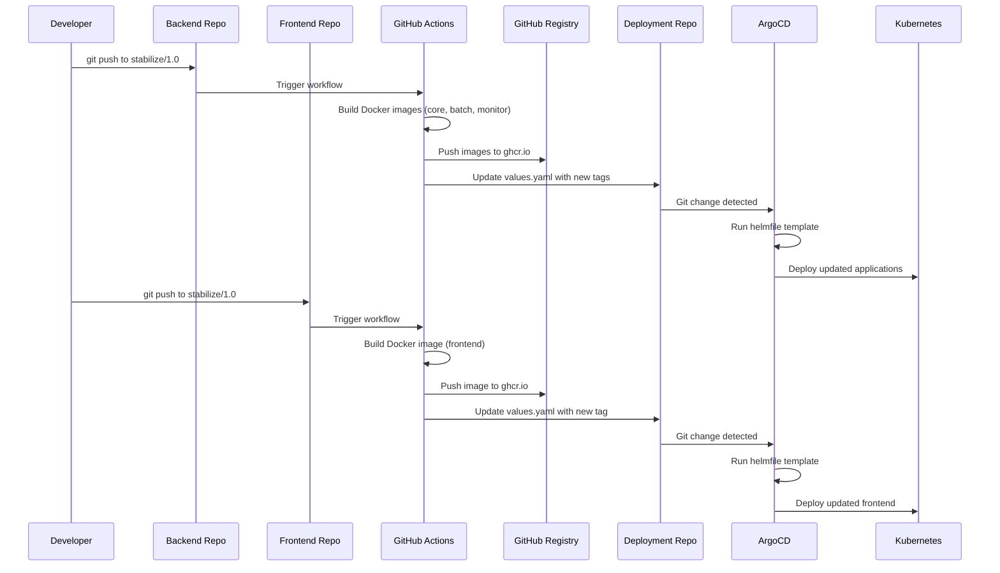

# Astrago CI/CD 파이프라인 설계

## 📋 개요

Astrago 프로젝트의 Backend와 Frontend 저장소에서 GitHub Actions를 통한 자동화된 CI/CD 파이프라인을 구축하여, 코드 변경 시 자동으로 컨테이너 이미지를 빌드하고 ArgoCD를 통해 Kubernetes에 배포하는 시스템을 설계합니다.

## 🏗️ 아키텍처 다이어그램

```
┌─────────────────┐    ┌─────────────────┐
│ astrago-backend │    │astrago-frontend │
│  (stabilize/1.0)│    │  (stabilize/1.0)│
└─────────┬───────┘    └─────────┬───────┘
          │ git push             │ git push
          ▼                      ▼
    ┌──────────────┐       ┌──────────────┐
    │GitHub Actions│       │GitHub Actions│
    │   Workflow   │       │   Workflow   │
    └──────┬───────┘       └──────┬───────┘
           │ build & push          │ build & push
           ▼                       ▼
    ┌──────────────────────────────────────┐
    │    GitHub Package Registry           │
    │  ghcr.io/xiilab/astrago-*          │
    └──────────────┬───────────────────────┘
                   │ update deployment tags
                   ▼
            ┌──────────────────┐
            │astrago-deployment│
            │   values.yaml    │
            └─────────┬────────┘
                      │ git push → auto-sync
                      ▼
               ┌─────────────┐
               │   ArgoCD    │
               │ Kubernetes  │
               └─────────────┘
```

## 🔧 핵심 컴포넌트 설계

### 1. GitHub Actions 워크플로우

#### Backend 저장소 (astrago-backend)
- **트리거**: `stabilize/1.0` 브랜치 push
- **빌드 대상**: core, batch, monitor 컴포넌트
- **이미지 태그**: `{component}-stage-{git-sha:8}`

#### Frontend 저장소 (astrago-frontend)
- **트리거**: `stabilize/1.0` 브랜치 push
- **빌드 대상**: frontend 컴포넌트
- **이미지 태그**: `frontend-stage-{git-sha:8}`

### 2. 이미지 태그 전략

```yaml
# 기존 (수동 관리)
imageTag: "core-stage-ba01"

# 새로운 (자동 생성)
imageTag: "core-stage-a1b2c3d4"  # git commit SHA 기반
```

**장점:**
- 각 커밋마다 고유한 이미지 태그
- ArgoCD가 변경 사항을 확실히 감지
- 롤백 시 명확한 버전 추적

### 3. GitHub Package Registry 통합

**이미지 저장 위치:**
- Backend: `ghcr.io/xiilab/astrago-backend:{tag}`
- Frontend: `ghcr.io/xiilab/astrago-frontend:{tag}`

**기존 repository 설정 유지:**
```yaml
# values.yaml - 기존 구조 그대로 유지
astrago:
  core:
    repository: "xiilab/astrago-posco"  # 변경 없음
    imageTag: "core-stage-a1b2c3d4"    # 자동 업데이트
```

### 4. Cross-Repository 연동

**Deployment 저장소 업데이트 프로세스:**
1. GitHub API로 현재 values.yaml 읽기
2. 해당 컴포넌트의 imageTag만 새 값으로 교체
3. 변경된 내용으로 새 커밋 생성
4. ArgoCD가 변경 감지 후 자동 배포

## 🔐 보안 및 권한 설정

### GitHub Secrets 설정

#### Backend/Frontend 저장소 필요 Secrets:
```
GHCR_TOKEN        # GitHub Package Registry 접근 토큰
DEPLOY_TOKEN      # astrago-deployment 저장소 업데이트용 토큰
```

#### 권한 요구사항:
- GitHub Package Registry `write` 권한
- astrago-deployment 저장소 `write` 권한

### 토큰 생성 방법:
1. **GHCR_TOKEN**: GitHub Settings > Developer settings > Personal access tokens > Fine-grained tokens
   - Repository access: xiilab organization repositories
   - Permissions: `packages:write`

2. **DEPLOY_TOKEN**: astrago-deployment 저장소용 토큰
   - Repository access: astrago-deployment
   - Permissions: `contents:write`

## 🚀 구현 단계별 가이드

### Phase 1: Backend CI/CD 구현
1. Backend 저장소에 GitHub Actions 워크플로우 추가
2. Docker 이미지 빌드 및 ghcr.io 푸시 설정
3. Deployment 저장소 자동 업데이트 로직 구현

### Phase 2: Frontend CI/CD 구현
1. Frontend 저장소에 GitHub Actions 워크플로우 추가
2. Frontend 이미지 빌드 및 푸시 설정
3. Deployment 저장소 연동

### Phase 3: 통합 테스트 및 최적화
1. 전체 파이프라인 통합 테스트
2. ArgoCD 동기화 확인
3. 성능 최적화 및 오류 처리 강화

## 📊 워크플로우 상세 흐름



## ⚙️ 설정 파일 예시

### GitHub Actions Workflow (Backend)
```yaml
name: CI/CD Pipeline
on:
  push:
    branches: [stabilize/1.0]

jobs:
  build-and-deploy:
    runs-on: ubuntu-latest
    steps:
      - name: Checkout
        uses: actions/checkout@v4

      - name: Set up Docker Buildx
        uses: docker/setup-buildx-action@v3

      - name: Login to GitHub Container Registry
        uses: docker/login-action@v3
        with:
          registry: ghcr.io
          username: ${{ github.actor }}
          password: ${{ secrets.GHCR_TOKEN }}

      - name: Build and push images
        run: |
          SHORT_SHA=${GITHUB_SHA:0:8}

          # Build core
          docker build -t ghcr.io/xiilab/astrago-backend:core-stage-$SHORT_SHA -f docker/core/Dockerfile .
          docker push ghcr.io/xiilab/astrago-backend:core-stage-$SHORT_SHA

          # Build batch
          docker build -t ghcr.io/xiilab/astrago-backend:batch-stage-$SHORT_SHA -f docker/batch/Dockerfile .
          docker push ghcr.io/xiilab/astrago-backend:batch-stage-$SHORT_SHA

          # Build monitor
          docker build -t ghcr.io/xiilab/astrago-backend:monitor-stage-$SHORT_SHA -f docker/monitor/Dockerfile .
          docker push ghcr.io/xiilab/astrago-backend:monitor-stage-$SHORT_SHA

      - name: Update deployment repository
        run: |
          # Deployment 저장소 업데이트 스크립트 실행
          curl -X POST \
            -H "Authorization: token ${{ secrets.DEPLOY_TOKEN }}" \
            -H "Content-Type: application/json" \
            -d '{
              "message": "Update backend images to '$SHORT_SHA'",
              "content": "'$(base64 -w 0 updated-values.yaml)'",
              "sha": "'$CURRENT_FILE_SHA'"
            }' \
            https://api.github.com/repos/xiilab/astrago-deployment/contents/helmfile/environments/customers/xiilab/values.yaml
```

## 🎯 기대 효과

### 개발 생산성 향상
- **수동 배포 작업 제거**: 개발자는 코드만 커밋하면 자동 배포
- **빠른 피드백 루프**: 변경사항이 즉시 스테이징 환경에 반영
- **일관된 배포 프로세스**: 인적 오류 최소화

### 운영 안정성 개선
- **추적 가능한 배포**: Git SHA 기반 명확한 버전 관리
- **쉬운 롤백**: 문제 발생 시 이전 커밋으로 빠른 복구
- **자동화된 품질 관리**: CI/CD 파이프라인을 통한 일관된 빌드

### 확장성 확보
- **다중 환경 지원**: dev, stage, prod 환경별 자동 배포
- **마이크로서비스 확장**: 새로운 서비스 추가 시 동일한 패턴 적용
- **팀 확장성**: 새로운 개발자도 쉽게 배포 프로세스 사용

## 🚨 주의사항 및 제한사항

### 보안 고려사항
- GitHub Secrets 관리 필요
- ghcr.io 접근 권한 제어
- Cross-repository 업데이트 시 권한 검증

### 성능 고려사항
- Docker 이미지 빌드 시간 최적화 필요
- 동시 배포 시 리소스 경합 가능성
- ArgoCD 동기화 주기 최적화

### 운영 고려사항
- 빌드 실패 시 알림 메커니즘 필요
- 로그 모니터링 및 디버깅 체계 구축
- Helm 차트 업데이트 시 호환성 확인

---

이 설계를 바탕으로 단계별 구현을 진행하면, 안정적이고 효율적인 Astrago CI/CD 파이프라인을 구축할 수 있습니다.