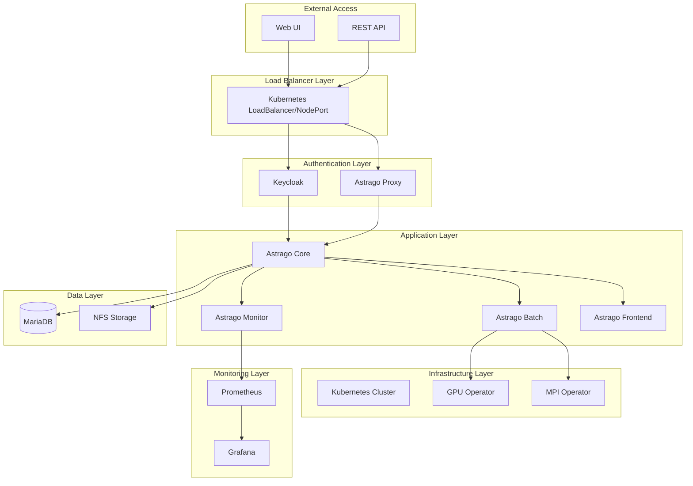
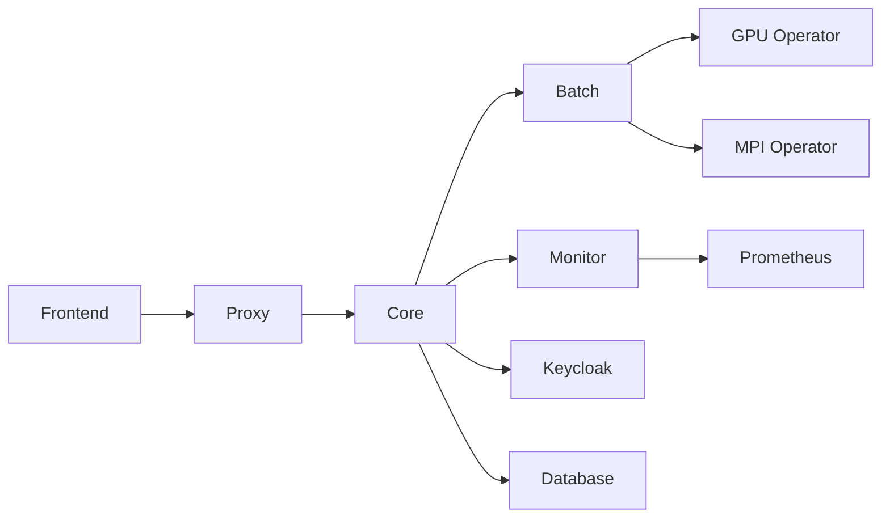

# 🏗️ Astrago 아키텍처 가이드

## 📋 개요

Astrago 배포 시스템은 **마이크로서비스 아키텍처**를 기반으로 설계된 엔터프라이즈급 AI/ML 플랫폼입니다. Kubernetes 네이티브 환경에서 확장 가능하고 안정적인 서비스를 제공합니다.

## 🏛️ 전체 아키텍처



## 🔧 핵심 구성요소

### 1. **인증 및 보안 계층**

#### 🔐 Keycloak
- **역할**: 통합 인증 및 인가 서비스
- **기능**: 
  - SSO (Single Sign-On)
  - OAuth 2.0 / OIDC 지원
  - 사용자 관리 및 역할 기반 접근 제어
- **포트**: 30001
- **연동**: Astrago Core와 OAuth 연동

#### 🛡️ Astrago Proxy
- **역할**: API 게이트웨이 및 프록시
- **기능**:
  - 요청 라우팅
  - 인증 토큰 검증
  - 로드 밸런싱

### 2. **애플리케이션 계층**

#### 🎯 Astrago Core
- **역할**: 메인 비즈니스 로직 처리
- **기능**:
  - 프로젝트 관리
  - 작업 스케줄링
  - 리소스 관리
- **포트**: 30080
- **데이터베이스**: MariaDB

#### ⚡ Astrago Batch
- **역할**: 배치 작업 처리
- **기능**:
  - 대용량 데이터 처리
  - 분산 컴퓨팅 관리
  - GPU 리소스 활용

#### 📊 Astrago Monitor
- **역할**: 시스템 모니터링
- **기능**:
  - 리소스 사용량 추적
  - 성능 메트릭 수집
  - 알림 처리

#### 🎨 Astrago Frontend
- **역할**: 웹 사용자 인터페이스
- **기능**:
  - 대시보드 제공
  - 사용자 상호작용
  - 실시간 상태 표시

### 3. **데이터 계층**

#### 🗄️ MariaDB
- **역할**: 주 데이터베이스
- **저장 데이터**:
  - 사용자 정보
  - 프로젝트 메타데이터
  - 작업 이력
- **고가용성**: Master-Slave 구성 지원

#### 💾 NFS Storage
- **역할**: 파일 시스템 스토리지
- **저장 데이터**:
  - 사용자 파일
  - 모델 아티팩트
  - 로그 파일
- **확장성**: 동적 볼륨 프로비저닝

### 4. **인프라 계층**

#### ☸️ Kubernetes
- **역할**: 컨테이너 오케스트레이션
- **구성**:
  - Master 노드: 제어 평면
  - Worker 노드: 워크로드 실행
  - etcd: 클러스터 상태 저장

#### 🖥️ GPU Operator
- **역할**: GPU 리소스 관리
- **기능**:
  - GPU 드라이버 자동 설치
  - GPU 리소스 스케줄링
  - 워크로드 분산

#### ⚡ MPI Operator
- **역할**: 분산 컴퓨팅 지원
- **기능**:
  - MPI 작업 스케줄링
  - 노드 간 통신 관리
  - 병렬 처리 최적화

### 5. **모니터링 계층**

#### 📈 Prometheus
- **역할**: 메트릭 수집 및 저장
- **기능**:
  - 시계열 데이터베이스
  - 알림 규칙 관리
  - 서비스 디스커버리

#### 📊 Grafana
- **역할**: 데이터 시각화
- **기능**:
  - 대시보드 생성
  - 실시간 모니터링
  - 알림 대시보드

## 🌐 네트워크 아키텍처

### 포트 구성
| 서비스 | 내부 포트 | 외부 포트 | 프로토콜 |
|--------|----------|----------|---------|
| Astrago Core | 8080 | 30080 | HTTP |
| Keycloak | 8080 | 30001 | HTTP |
| MariaDB | 3306 | - | MySQL |
| Prometheus | 9090 | - | HTTP |
| Grafana | 3000 | - | HTTP |

### 서비스 메시 통신


## 💾 데이터 플로우

### 1. **사용자 요청 플로우**
```
User → Load Balancer → Keycloak (Auth) → Proxy → Core → Database/Storage
```

### 2. **배치 작업 플로우**
```
Core → Batch → Kubernetes Job → GPU/MPI Operator → Worker Nodes
```

### 3. **모니터링 플로우**
```
All Services → Prometheus → Grafana → User Dashboard
```

## 🔄 배포 모델

### 온라인 배포
- 인터넷 연결 필요
- Docker Hub에서 이미지 직접 다운로드
- 실시간 업데이트 가능

### 오프라인 배포
- 에어갭 환경 지원
- 프라이빗 레지스트리 사용
- HTTP 서버를 통한 패키지 배포

## 🔧 확장성 고려사항

### 수평적 확장
- **애플리케이션**: Kubernetes HPA를 통한 자동 스케일링
- **데이터베이스**: Read Replica를 통한 읽기 성능 향상
- **스토리지**: NFS 클러스터를 통한 용량 확장

### 수직적 확장
- **리소스 할당**: CPU/Memory 요구사항에 따른 자동 조정
- **GPU 스케일링**: GPU Operator를 통한 동적 GPU 할당

## 🛡️ 보안 아키텍처

### 인증/인가
- **Keycloak**: OpenID Connect 기반 통합 인증
- **RBAC**: Kubernetes 네이티브 역할 기반 접근 제어
- **mTLS**: 서비스 간 통신 암호화

### 네트워크 보안
- **Network Policies**: 서비스 간 통신 제한
- **Ingress Controller**: 외부 접근 제어
- **Service Mesh**: 마이크로서비스 간 보안 통신

### 데이터 보안
- **암호화**: 데이터 전송 및 저장 시 암호화
- **백업**: 정기적인 데이터 백업
- **접근 로그**: 모든 데이터 접근 로깅

## 📊 성능 최적화

### 캐싱 전략
- **Redis**: 세션 및 임시 데이터 캐싱
- **CDN**: 정적 자원 배포 최적화
- **Database Caching**: 쿼리 결과 캐싱

### 리소스 최적화
- **Resource Limits**: 컨테이너별 리소스 제한
- **Node Affinity**: 워크로드 배치 최적화
- **Storage Classes**: 성능별 스토리지 분류 