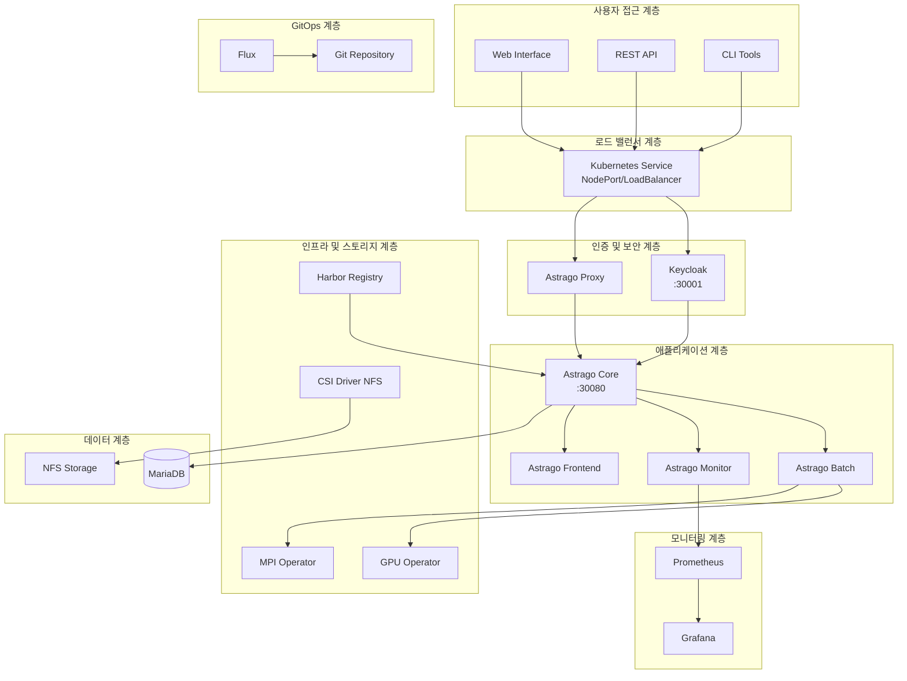

# 📚 Astrago 완전 설치 및 관리 가이드

## 📋 개요

이 문서는 Astrago AI/ML 플랫폼의 설치부터 운영까지 모든 과정을 상세하게 안내하는 완전한 가이드입니다. 온라인/오프라인 환경, GUI/CLI 설치 방법을 모두 포함하여 다양한 환경에서 Astrago를 성공적으로 배포할 수 있도록 도와드립니다.

## 🎯 목표 독자

- **시스템 관리자**: Kubernetes 환경에서 Astrago 플랫폼을 배포하고 관리하는 담당자
- **DevOps 엔지니어**: CI/CD 파이프라인과 함께 Astrago를 운영하려는 담당자
- **AI/ML 엔지니어**: Astrago 플랫폼을 활용하여 AI/ML 워크로드를 실행하려는 담당자

## 🏗️ 전체 아키텍처



## 🔧 시스템 요구사항

### 최소 시스템 사양

| 구성요소 | 최소 사양 | 권장 사양 |
|---------|----------|----------|
| **CPU** | 4 cores | 8+ cores |
| **메모리** | 8GB RAM | 16+ GB RAM |
| **스토리지** | 100GB | 500+ GB SSD |
| **네트워크** | 1Gbps | 10+ Gbps |

### 소프트웨어 요구사항

- **OS**: CentOS 7/8, Ubuntu 18.04/20.04/22.04, RHEL 7/8
- **Kubernetes**: v1.21 이상
- **Container Runtime**: Docker v20.10+ 또는 containerd v1.4+
- **Helm**: v3.7 이상
- **Python**: v3.8 이상 (GUI 인스톨러용)

## 📦 애플리케이션 구성요소

| 애플리케이션 | 역할 | 포트 | 우선순위 | 의존성 |
|-------------|------|------|----------|--------|
| **CSI Driver NFS** | 스토리지 프로비저닝 | - | 1 | NFS 서버 |
| **GPU Operator** | GPU 리소스 관리 | - | 2 | NVIDIA 드라이버 |
| **Prometheus** | 메트릭 수집/모니터링 | 9090 | 3 | - |
| **Keycloak** | 인증/인가 서비스 | 30001 | 4 | 데이터베이스 |
| **MPI Operator** | 분산 컴퓨팅 관리 | - | 5 | - |
| **Flux** | GitOps 지속적 배포 | - | 6 | Git 저장소 |
| **Harbor** | 컨테이너 레지스트리 | 443 | 7 | - |
| **Astrago** | 메인 AI/ML 플랫폼 | 30080 | 8 | 모든 인프라 |

## 🚀 설치 방법 선택 가이드

### 방법별 비교

| 방법 | 난이도 | 제어 수준 | 적합한 환경 | 시간 |
|------|--------|----------|------------|------|
| **GUI 인스톨러** | ⭐⭐ | 보통 | 초보자, 테스트 환경 | 30분 |
| **스크립트 자동화** | ⭐⭐⭐ | 높음 | 프로덕션 환경 | 20분 |
| **수동 설치** | ⭐⭐⭐⭐⭐ | 최고 | 커스터마이징 필요시 | 60분+ |

## 🖥️ 방법 1: GUI 인스톨러 (권장 - 초보자)

### 실행

```bash
# GUI 인스톨러 실행
python3 astrago_gui_installer.py

# 또는
./run_gui_installer.sh
```

### 주요 특징

- 🖱️ 직관적인 터미널 UI
- 🔄 실시간 설치 진행 상황 표시
- ✅ 자동 검증 및 오류 처리
- 📊 설치 후 상태 확인

### 사용법

1. **노드 설정**: Kubernetes 클러스터 노드 정보 입력
2. **NFS 설정**: 스토리지 서버 정보 구성
3. **Kubernetes 설치**: 클러스터 자동 설치
4. **Astrago 배포**: 전체 애플리케이션 스택 배포

## ⚡ 방법 2: 스크립트 자동화 (권장 - 프로덕션)

### 온라인 환경 설치

#### 1단계: 환경 설정

```bash
# 환경 설정 파일 생성
./deploy_astrago.sh env
```

**입력 정보:**

```
Enter the connection URL (e.g. 10.61.3.12): 192.168.1.100
Enter the NFS server IP address: 192.168.1.50
Enter the base path of NFS: /nfs-data/astrago
```

#### 2단계: 애플리케이션 배포

```bash
# 전체 애플리케이션 배포
./deploy_astrago.sh sync

# 특정 애플리케이션만 배포
./deploy_astrago.sh sync keycloak
```

### 오프라인 환경 설치

#### 1단계: 환경 설정

```bash
# 오프라인 환경 설정
./offline_deploy_astrago.sh env
```

**입력 정보:**

```
Enter the connection URL (e.g. 10.61.3.12): 192.168.1.100
Enter the NFS server IP address: 192.168.1.50
Enter the base path of NFS: /nfs-data/astrago
Enter the offline registry (e.g. 10.61.3.8:35000): 192.168.1.100:5000
Enter the HTTP server (e.g. http://10.61.3.8): http://192.168.1.100
```

#### 2단계: 오프라인 배포

```bash
# 오프라인 배포 실행
./offline_deploy_astrago.sh sync
```

## 🔧 방법 3: 수동 설치 (고급 사용자)

### 1단계: 필수 도구 설치

```bash
# Helm 설치
curl https://raw.githubusercontent.com/helm/helm/main/scripts/get-helm-3 | bash

# Helmfile 설치
wget https://github.com/roboll/helmfile/releases/download/v0.144.0/helmfile_linux_amd64
chmod +x helmfile_linux_amd64
sudo mv helmfile_linux_amd64 /usr/local/bin/helmfile

# yq 설치
sudo snap install yq
```

### 2단계: 환경 설정

```bash
# 환경 디렉토리 생성
mkdir -p environments/astrago
cp -r environments/prod/* environments/astrago/

# 설정 파일 편집
vi environments/astrago/values.yaml
```

### 3단계: 개별 애플리케이션 배포

```bash
# 순서대로 배포
helmfile -e astrago -l app=csi-driver-nfs sync
helmfile -e astrago -l app=gpu-operator sync
helmfile -e astrago -l app=prometheus sync
helmfile -e astrago -l app=keycloak sync
helmfile -e astrago -l app=mpi-operator sync
helmfile -e astrago -l app=flux sync
helmfile -e astrago -l app=harbor sync
helmfile -e astrago -l app=astrago sync
```

## 📊 설치 후 확인 및 검증

### 애플리케이션 상태 확인

```bash
# 모든 Pod 상태 확인
kubectl get pods -A

# 서비스 포트 확인
kubectl get svc -A | grep -E "(NodePort|LoadBalancer)"

# 스토리지 클래스 확인
kubectl get storageclass
```

### 접속 확인

```bash
# Astrago 메인 서비스
curl -I http://<EXTERNAL-IP>:30080

# Keycloak 인증 서비스
curl -I http://<EXTERNAL-IP>:30001
```

### 로그 확인

```bash
# Astrago 코어 로그
kubectl logs -n astrago deployment/astrago-core

# Keycloak 로그
kubectl logs -n astrago deployment/keycloak
```

## 🛠️ 운영 및 관리

### 애플리케이션 업데이트

```bash
# 전체 업데이트
./deploy_astrago.sh sync

# 특정 애플리케이션 업데이트
./deploy_astrago.sh sync astrago
```

### 백업 및 복구

```bash
# 설정 백업
cp -r environments/astrago/ environments/astrago-backup-$(date +%Y%m%d)

# 데이터베이스 백업
kubectl exec -n astrago deployment/mariadb -- mysqldump -u root -p astrago > astrago-db-backup.sql
```

### 모니터링

```bash
# 리소스 사용량 확인
kubectl top nodes
kubectl top pods -A

# Prometheus 메트릭 확인
kubectl port-forward -n astrago svc/prometheus 9090:9090
# 브라우저에서 http://localhost:9090 접속
```

## 🚨 문제 해결

### 일반적인 문제들

#### 1. NFS 연결 실패

```bash
# NFS 서버 연결 테스트
showmount -e <NFS-SERVER-IP>

# CSI 드라이버 로그 확인
kubectl logs -n kube-system -l app=csi-nfs-controller
```

#### 2. 인증 문제

```bash
# Keycloak 상태 확인
kubectl get pods -n astrago | grep keycloak

# Keycloak 관리자 콘솔 접속
echo "URL: http://<EXTERNAL-IP>:30001"
echo "Admin: admin / xiirocks"
```

#### 3. GPU 인식 안됨

```bash
# GPU Operator 상태 확인
kubectl get pods -n gpu-operator

# NVIDIA 드라이버 확인
nvidia-smi
```

### 로그 수집

```bash
# 전체 시스템 상태 수집
kubectl get all -A > system-status.txt
kubectl describe nodes > nodes-status.txt
kubectl logs -n astrago --all-containers=true --tail=100 > astrago-logs.txt
```

## 📈 성능 최적화

### 리소스 할당 최적화

```yaml
# environments/astrago/values.yaml
astrago:
  resources:
    core:
      cpu: "2"
      memory: "4Gi"
    batch:
      cpu: "4"
      memory: "8Gi"
```

### 스토리지 최적화

```yaml
# NFS 성능 튜닝
nfs:
  mountOptions:
    - nfsvers=4.1
    - rsize=1048576
    - wsize=1048576
    - hard
    - intr
```

## 🔒 보안 설정

### 네트워크 정책

```yaml
apiVersion: networking.k8s.io/v1
kind: NetworkPolicy
metadata:
  name: astrago-network-policy
  namespace: astrago
spec:
  podSelector: {}
  policyTypes:
  - Ingress
  - Egress
```

### RBAC 설정

```bash
# 사용자별 권한 설정
kubectl create rolebinding astrago-user \
  --clusterrole=view \
  --user=astrago-user \
  --namespace=astrago
```

## 📞 지원 및 문의

### 문서 위치

- **아키텍처**: `docs/architecture.md`
- **설치 가이드**: `docs/installation-guide.md`  
- **오프라인 배포**: `docs/offline-deployment.md`
- **애플리케이션 구성**: `docs/applications.md`
- **GUI 인스톨러**: `docs/gui-installer.md`
- **문제 해결**: `docs/troubleshooting.md`

### 추가 리소스

- **GitHub 저장소**: [astrago-deployment](https://github.com/your-org/astrago-deployment)
- **이슈 트래킹**: GitHub Issues
- **기술 지원**: <technical-support@your-company.com>

---

*이 문서는 Astrago v1.0.80 기준으로 작성되었습니다. 최신 버전 정보는 릴리스 노트를 확인하세요.*
