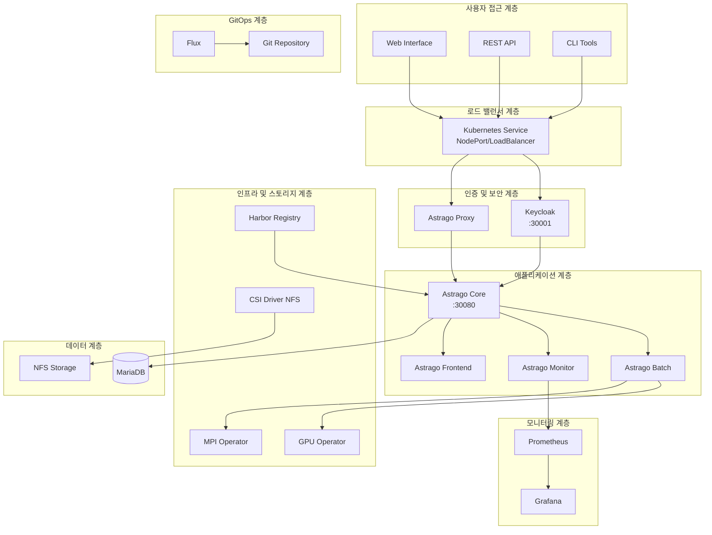

# AstraGo 인프라 온보딩 자료

## 📋 목차

1. [솔루션 개요](#솔루션-개요)
2. [전체 시스템 구성도](#전체-시스템-구성도)
3. [하드웨어 구성](#하드웨어-구성)
4. [미들웨어 구성](#미들웨어-구성)
5. [소프트웨어(애플리케이션) 구성](#소프트웨어애플리케이션-구성)
6. [CI/CD 파이프라인](#cicd-파이프라인)
7. [AstraGo 온/오프라인 설치 방법](#astrago-온오프라인-설치-방법)

---

## 솔루션 개요

### AstraGo 솔루션 정의

**AstraGo**는 GPU 기반 인프라를 효율적이고 안정적으로 운영하기 위한 **AI 개발 조직(ML 지원) 전용 플랫폼**입니다. 한정된 AI 자원을 효율적으로 활용할 수 있도록 관리하고 모니터링하며, ML 개발자들에게는 협업과 개발에 유용한 툴과 기능을 제공합니다.

#### 주요 특징
- **온프레미스 특화**: 클라우드 종속성 없는 완전한 온프레미스 솔루션
- **스케줄링 최적화**: AI/ML 워크로드에 특화된 스케줄링
- **GPU 활용 극대화**: MIG, MPS 등 GPU 활용을 극대화하기 위한 분할 기능 제공
- **모듈러 설계**: 필요한 기능만 선택적 활성화 가능하도록 모듈 설계
- **엔터프라이즈 인증**: Keycloak 기반 SSO 및 RBAC
- **대용량 데이터**: TUS 프로토콜 기반 안정적 대용량 파일 전송
- **실시간 상호작용**: WebSocket 기반 터미널 및 로그 스트리밍

---

## 전체 시스템 구성도

```
┌─────────────────────────────────────────────────────────────────────────────────────┐
│                              AstraGo Infrastructure Platform                        │
├─────────────────────────────────────────────────────────────────────────────────────┤
│                                    🌐 Presentation Layer                           │
├─────────────────────────────────────────────────────────────────────────────────────┤
│  Web UI (React)  │  REST API (OpenAPI)  │  CLI Tool  │  WebSocket (Real-time)     │
├─────────────────────────────────────────────────────────────────────────────────────┤
│                                   🔒 Security Layer                                │
├─────────────────────────────────────────────────────────────────────────────────────┤
│  Keycloak SSO  │  JWT Auth  │  RBAC  │  Network Policies  │  TLS 1.3  │  Audit    │
├─────────────────────────────────────────────────────────────────────────────────────┤
│                                  ⚙️ Software Layer                                 │
├─────────────────────────────────────────────────────────────────────────────────────┤
│  📊 Core Server (8080)     │  📈 Monitor Server (8081)     │  🔄 Batch Server (8082) │
│  • User Management         │  • Metrics Collection         │  • Resource Optimization │
│  • Workspace Management    │  • Health Monitoring          │  • Background Jobs      │
│  • Workload Orchestration  │  • Performance Analytics      │  • Scheduled Tasks      │
│  • Resource Management     │  • Alert Management           │  • Data Synchronization │
│  • Service Deployment      │  • Log Analysis               │  • Framework Management │
│  • Security & Governance   │  • Prometheus Endpoint        │  • TUS File Cleanup     │
├─────────────────────────────────────────────────────────────────────────────────────┤
│                                  📦 Domain Modules                                 │
├─────────────────────────────────────────────────────────────────────────────────────┤
│ module-user │ module-k8s │ module-k8s-db │ module-monitor │ module-mongo │ module-alert │
│ module-common (Shared Utilities, DTOs, Exceptions, GitHub API Integration)         │
├─────────────────────────────────────────────────────────────────────────────────────┤
│                                  💾 Data Layer                                     │
├─────────────────────────────────────────────────────────────────────────────────────┤
│  MariaDB (Primary)  │  MongoDB (Logs/Events)  │  File Storage (Artifacts)          │
├─────────────────────────────────────────────────────────────────────────────────────┤
│                                🔧 Middleware Layer                                 │
├─────────────────────────────────────────────────────────────────────────────────────┤
│  Kubernetes Cluster (1.25+)  │  Keycloak (23.0.1)  │  Prometheus  │  Grafana      │
├─────────────────────────────────────────────────────────────────────────────────────┤
│                                  🖥️ Hardware Layer                                 │
├─────────────────────────────────────────────────────────────────────────────────────┤
│  GPU Nodes (NVIDIA)  │  CPU Nodes  │  Storage Nodes  │  Control Plane  │  Edge Nodes │
│  • A100-40GB/80GB    │  • Compute  │  • Ceph/NFS     │  • K8s Masters  │  • Optional │
│  • A30               │  • Memory   │  • SSD/NVMe     │  • etcd         │  • IoT      │
│  • H100              │  • Network  │  • Backup       │  • API Server   │  • Sensors  │
└─────────────────────────────────────────────────────────────────────────────────────┘
```

## 🏗️ 전체 아키텍처



---

## 하드웨어 구성

### 최소 시스템 사양

| 구성요소 | 최소 사양 | 권장 사양 |
|---------|----------|----------|
| **CPU** | 4 cores | 8+ cores |
| **메모리** | 8GB RAM | 16+ GB RAM |
| **스토리지** | 100GB | 500+ GB SSD |
| **네트워크** | 1Gbps | 10+ Gbps |

#### 1. **GPU 노드 (AI/ML 워크로드 전용)**
```yaml
GPU Types:
  - NVIDIA A100-40GB: 고성능 AI 학습
  - NVIDIA A100-80GB: 대용량 모델 학습
  - NVIDIA A30: 추론 및 개발 환경
  - NVIDIA H100 이상: 최신 AI 모델 학습

Specifications:
  CPU: 64-128 cores (AMD EPYC / Intel Xeon)
  Memory: 256GB-1TB DDR4/DDR5
  Storage: 2-4TB NVMe SSD
  Network: 100Gbps InfiniBand / 25Gbps Ethernet
  Power: 1000W+ PSU
```

#### 2. **CPU 노드 (일반 컴퓨팅)**
```yaml
Specifications:
  CPU: 32-64 cores (AMD EPYC / Intel Xeon)
  Memory: 128-512GB DDR4/DDR5
  Storage: 1-2TB NVMe SSD
  Network: 25Gbps Ethernet
  Role: API 서버, 데이터베이스, 모니터링
```

#### 3. **스토리지 노드 (데이터 저장)**
```yaml
Storage Types:
  - 분산 스토리지(파일, 블록, 오브젝트): Ceph, NFS, Backup Storage

Specifications:
  CPU: 16-32 cores
  Memory: 64-256GB
  Storage: 10-100TB (SSD + HDD)
  Network: 25Gbps Ethernet
```

---

## 미들웨어 구성

### 1. **Kubernetes 클러스터 (v1.25+)**

#### 클러스터 구성
```yaml
Cluster Architecture:
  - Multi-Zone Deployment
  - High Availability (HA)
  - Auto-scaling Support
  - Resource Quotas & Limits

Components:
  - kube-apiserver: API 서버
  - etcd: 분산 데이터 저장소
  - kube-controller-manager: 컨트롤러 관리
  - kube-scheduler: 스케줄러
  - kubelet: 노드 에이전트
  - kube-proxy: 네트워크 프록시
  - Container Runtime: CRI-O (쿠버네티스용 OCI(Open Container Initiative) 컨테이너 런타임)
```

#### 네트워킹
```yaml
Network Plugin: Calico / Flannel
Service Mesh: Istio (선택적)
Load Balancer: MetalLB / Cloud Provider LB
Ingress Controller: NGINX Ingress Controller
```

### 2. **Keycloak (v23.0.1) - 인증/인가**

#### 구성 요소
```yaml
Components:
  - Keycloak Server: 인증 서버
  - PostgreSQL: 사용자 데이터베이스
  - Redis: 세션 캐시 (선택적)

Features:
  - Single Sign-On (SSO)
  - OAuth2 / OpenID Connect
  - LDAP / Active Directory 연동
  - Multi-factor Authentication (MFA)
  - Role-Based Access Control (RBAC)
```

### 3. **데이터베이스**

#### MariaDB (Primary Database)
```yaml
Configuration:
  - Master-Slave Replication
  - Connection Pooling (HikariCP)
  - Backup & Recovery
  - Performance Tuning

Data Types:
  - 사용자 정보
  - 워크스페이스 메타데이터
  - 리소스 쿼터 설정
  - 워크로드 히스토리
```

#### MongoDB (Document Database)
```yaml
Configuration:
  - Replica Set
  - Sharding (선택적)
  - Authentication & Authorization
  - Backup & Recovery

Data Types:
  - 로그 데이터
  - 이벤트 스트림
  - 비정형 데이터
  - 대용량 메트릭
```

---

## 소프트웨어(애플리케이션) 구성

### 📊 애플리케이션 목록

| 애플리케이션 | 타입 | 역할 | 우선순위 | 의존성 |
|-------------|------|------|----------|--------|
| CSI Driver NFS | 인프라 | 스토리지 프로비저닝 | 1 | NFS 서버 |
| GPU Operator | 인프라 | GPU 리소스 관리 | 2 | NVIDIA 드라이버 |
| Prometheus | 모니터링 | 메트릭 수집 | 3 | - |
| Loki Stack | 로깅 | 로그 수집/분석 | 4 | NFS 스토리지 |
| Keycloak | 인증 | 사용자 인증/인가 | 5 | 데이터베이스 |
| MPI Operator | 인프라 | 분산 컴퓨팅 | 6 | - |
| Flux | GitOps | 지속적 배포 | 7 | Git 저장소 |
| Harbor | 레지스트리 | 컨테이너 이미지 저장 | 8 | - |
| AstraGo | 애플리케이션 | 메인 플랫폼 | 9 | 모든 인프라 |

### AstraGo 애플리케이션 구조

#### 🎯 AstraGo Core 서버
- **역할**: 메인 비즈니스 로직 처리
- **기능**:
  - 프로젝트 관리
  - 작업 스케줄링
  - 리소스 관리
- **포트**: 30080
- **데이터베이스**: MariaDB

#### ⚡ AstraGo Batch 서버
- **역할**: 배치 작업 처리
- **기능**:
  - 대용량 데이터 처리
  - 분산 컴퓨팅 관리
  - GPU 리소스 활용

#### 📊 AstraGo Monitor 서버
- **역할**: 시스템 모니터링
- **기능**:
  - 리소스 사용량 추적
  - 성능 메트릭 수집
  - 알림 처리

#### Core Modules (공통 모듈)

- **module-common**: 공통 기능, DTO, 예외 처리, GitHub API 연동
- **module-user**: 사용자 관리 및 Keycloak 23.0.1 기반 인증/인가
- **module-k8s**: Fabric8 6.9.2 기반 Kubernetes 클러스터 연동
- **module-k8s-db**: Kubernetes 관련 데이터 영속성 (MariaDB + QueryDSL)
- **module-monitor**: 모니터링 데이터 수집/처리 (Fabric8 + WebFlux)
- **module-mongo**: MongoDB 연동 (로그, 대용량 데이터)
- **module-alert**: 알림 및 경고 시스템

#### 🎨 AstraGo Frontend
- **역할**: 웹 사용자 인터페이스
- **기능**:
  - 대시보드 제공
  - 사용자 상호작용
  - 실시간 상태 표시

### 💾 데이터 플로우

#### 1. **사용자 요청 플로우**
```
User → Load Balancer → Keycloak (Auth) → Proxy → Core → Database/Storage
```

#### 2. **배치 작업 플로우**
```
Core → Batch → Kubernetes Job → GPU/MPI Operator → Worker Nodes
```

#### 3. **모니터링 플로우**
```
All Services → Prometheus → Grafana → User Dashboard
```


### 백앤드 / 프론트앤드 기술 스택

### 백앤드
```yaml
Java: 17 (LTS)
Spring Boot: 3.2.2
Spring Cloud: 2023.0.2
Spring Security: OAuth2 Resource Server (JWT)
Spring Data JPA: 데이터 액세스 + QueryDSL 5.0.0
Spring Data MongoDB: 문서 데이터베이스
Spring WebFlux: 비동기 처리 (WebClient)
Spring WebSocket: 실시간 터미널 액세스
Gradle: 8.x (빌드 도구)
Lombok: 1.18.30 (코드 생성)
```

### 프론트 앤드
```yaml
프레임워크 & 런타임
Next.js 14.2.28: React 기반 풀스택 프레임워크
React 18.2.0: UI 라이브러리
TypeScript 5: 정적 타입 검사
Node.js: >=18.17.0

상태 관리
Jotai 2.5.1: 원자 기반 상태 관리
TanStack Query 5.8.4: 서버 상태 관리 및 캐싱
React Hook Form 7.49.0: 폼 상태 관리
UI/UX 라이브러리
Ant Design 5.12.2: 메인 UI 컴포넌트 라이브러리
Material-UI 5.14.20: 보조 UI 컴포넌트
Emotion: CSS-in-JS 스타일링
Tailwind CSS 3.3.0: 유틸리티 CSS 프레임워크
Framer Motion 10.18.0: 애니메이션 라이브러리

차트 & 시각화
Ant Design Charts 2.0.3: 차트 라이브러리
Recharts 2.12.7: React 차트 라이브러리
ApexCharts 3.44.2: 고급 차트 라이브러리
React Gauge Component 1.2.0: 게이지 차트
```
---

## CI/CD 파이프라인

### 파이프라인 구성 방식

### Push-based 방식
Push-based 방식은 먼저 개발자가 코드 변경사항을 Git에 푸시한 다음, 빌드 파이프라인을 실행하면 변경된 코드를 빌드하고 이미지를 생성하여 이미지 레지스트리에 푸시합니다. 그 다음, 관련 매니페스트 파일의 이미지 태그를 변경하여 매니페스트 파일이 저장된 레포지토리에 변경사항을 푸시합니다. 그 다음 Git push webhook 등을 이용하여 푸시가 발생했을 때 배포 파이프라인을 실행시킨 다음 배포 파이프라인에서 변경된 매니페스트를 쿠버네티스 클러스터에 반영합니다. 매니페스트 파일이 변경되어 Git에 푸시하자마자 배포 파이프라인이 실행되기 때문에 Push-based 전략이라고 불립니다.

### Pull-based 방식
Pull-based는 쿠버네티스 클러스터에 있는 GitOps agent가 주기적으로 매니페스트가 저장된 Git에 변경사항이 있는지 확인합니다. 만약 변경사항이 발생했다면 Git에 저장된 상태와 현재 클러스터의 상태를 비교한 후 차이가 있다면 Git에 저장된 상태로 클러스터 상태를 변경합니다. GitOps agent가 주기적으로 매니페스트 레포지토리를 pull하기 때문에 Pull-based 전략이라고 불립니다. Pull-based를 지원하는 파이프라인을 구성하려면 GitOps agent로는 ArgoCD나 Flux 등을 사용하면 됩니다.

### AstraGo CI/CD 구성 방식

### 전체 흐름
1. **Git Action 등록** (CI를 위한 YAML 파일 등록)
2. **astrago-deployment master branch의 push | pull request**
3. **ArgoCD pull-based GitOps 수행**

### 상세 과정

#### 1) Git Action 등록
- `.github/workflows/deploy-{환경명}.yaml`
  - 백엔드, 프론트엔드의 특정 브랜치의 소스코드가 PR이 닫힌 경우에만 동작
  - `(astrago-deployment)environments/{환경명}/values.yaml`의 각 core, batch, monitor, frontend의 tag 변경 (push)
  - `DOCKER_REPOSITORY | HARBOR_REPOSITORY`에 변경된 이미지 태그로 push

#### 2) astrago-deployment master branch의 push 발생
- `astrago-deployment/.github/workflows/{환경명}-deploy.yml` Git Action 수행
- `monochart/{환경별}/astrago/astrago.yaml`
- `monochart/{환경별}/prometheus/prometheus.yaml`
- `monochart/{환경별}/nfs-provisioner/nfs-provisioner.yaml`
- `monochart/{환경별}/gpu-operator/gpu-operator.yaml`
- `monochart/{환경별}/mpi-operator/mpi-operator.yaml`

#### 3) ArgoCD GitOps 수행
- `astrago-deployment`의 각 YAML별 App 등록
- App 등록 시 `monochart/../*.yaml` 파일을 지속적으로 pull해서 변경점이 있을 경우 등록된 서버상 `*.yaml` 파일 실행
- 완료

---

## AstraGo 온/오프라인 설치 방법

### 1. 오프라인(airgap) 설치 전체 플로우

1. **오프라인 패키지 준비**
   - 인터넷이 연결된 환경에서 AstraGo 및 Kubernetes 설치에 필요한 모든 컨테이너 이미지, OS 패키지, PyPI 패키지, Helm 차트 등을 다운로드하여 airgap 패키지로 생성
2. **오프라인 패키지 이관**
   - 생성된 airgap 패키지를 USB, 외장 HDD 등으로 실제 설치 대상 서버(내부망)로 복사
3. **로컬 레지스트리/저장소 구성**
   - 오프라인 서버에서 Nginx(HTTP), Private Registry, PyPI Mirror, OS 패키지 저장소를 로컬에 구성
4. **컨테이너 이미지 로드 및 푸시**
   - airgap 패키지 내 이미지들을 로컬 private registry에 로드 및 푸시
5. **로컬 저장소 기반 환경설정**
   - OS 패키지, PyPI, Helm 등 모든 설치 경로를 로컬 저장소로 변경
6. **Kubernetes 및 AstraGo 설치**
   - Kubespray(offline 모드)로 Kubernetes 클러스터 설치
   - Helmfile/스크립트로 AstraGo 및 부가 서비스 설치

---

### 2. 단계별 상세 설명

#### 1) 오프라인 패키지 다운로드 및 준비 (온라인 환경)

```bash
cd astrago-deployment/airgap/kubespray-offline
./download-all.sh
```
- 설치할 OS와 동일한 환경에서 실행해야 함
- 모든 컨테이너 이미지, 패키지, PyPI, Helm 차트가 outputs/에 저장됨

#### 2) 오프라인 환경 준비 및 레지스트리/저장소 구성

```bash
./setup-all.sh
```
- outputs/ 디렉터리에서 실행 (nginx, registry, containerd 등 자동 구성)
- 실행 후 `nerdctl ps`로 nginx, registry 컨테이너가 정상 실행 중인지 확인

#### 3) Kubernetes 인벤토리 파일 수정

```bash
vi astrago-deployment/kubespray/inventory/offline/astrago.yaml
```
- 마스터/워커 노드의 IP, 사용자 계정 등 환경에 맞게 수정
- 예시:
  ```
  [all]
  master-1 ansible_host=192.168.1.100 ansible_user=astrago
  worker-1 ansible_host=192.168.1.101 ansible_user=astrago
  worker-2 ansible_host=192.168.1.102 ansible_user=astrago
  ...
  ```

#### 4) Kubernetes 클러스터 배포

```bash
cd astrago-deployment/airgap
./deploy_kubernetes.sh
```
- 배포 중 패스워드 입력 필요 (모든 노드 동일 계정/비밀번호 권장)
- 에러 발생 시 로그 및 group_vars/all/all.yaml의 cert 옵션 등 확인

#### 5) NFS 서버 설정

```bash
# NFS 유틸리티 설치
sudo yum install -y nfs-utils    # CentOS/RHEL
sudo apt install -y nfs-utils    # Ubuntu

# NFS 서비스 시작
sudo systemctl enable nfs-server
sudo systemctl start nfs-server

# 공유 디렉토리 생성
sudo mkdir -p /nfs-data/astrago
sudo chown -R nobody:nobody /nfs-data
sudo chmod -R 755 /nfs-data

# /etc/exports 파일에 추가
sudo vi /etc/exports
/nfs-data 10.1.61.0/24(no_root_squash,rw,no_subtree_check,insecure)

# 적용
sudo exportfs -a
sudo systemctl reload nfs-server
```

#### 6) Astrago 환경 설정 (오프라인 환경)

```bash
cd astrago-deployment/airgap
./offline_deploy_astrago.sh env
```
- 프롬프트에 따라 아래 정보 입력:
  - Enter the connection URL (e.g. 10.61.3.12): <프론트엔드 접근 서버 주소>
  - Enter the NFS server IP address: <NFS 서버 주소>
  - Enter the base path of NFS: /nfs-data/astrago
  - Enter the offline registry (e.g. 10.61.3.8:35000): <로컬 레지스트리 주소>
  - Enter the HTTP server (e.g. http://10.61.3.8): <로컬 HTTP 서버>

- 설정 파일 확인:
```bash
cat astrago-deployment/environments/astrago/values.yaml
```

#### 7) Astrago 애플리케이션 배포

```bash
./offline_deploy_astrago.sh sync
```
- Astrago 및 부가 서비스가 values.yaml 기반으로 배포됨

#### 8) 설치 후 검증

```bash
kubectl get pod -A
kubectl describe pod -n <namespace> <pod명>
kubectl logs -n <namespace> <pod명>
```
- Astrago, Keycloak, NFS 등 주요 서비스가 정상적으로 Running 상태인지 확인
- 서비스 접속 테스트:
  ```bash
  curl -I http://<EXTERNAL-IP>:30080   # Astrago
  curl -I http://<EXTERNAL-IP>:30001   # Keycloak
  ```

---

- 각 단계별 상세 이슈 및 추가 팁은 `docs/offline-deployment.md`를 참고하세요.

---

### 3. 트러블슈팅 (2025년 7월 14일 이후 suhyun-kim415 커밋 기준)

#### 주요 트러블슈팅 포인트

- **MPI Operator 이미지 Pull 오류**
  - 오프라인 레지스트리에 0.5.0 버전이 없고 0.4.0만 존재할 경우, values.yaml에서 0.4.0으로 버전을 맞춰야 함
  - 에러 메시지: "failed to pull image"
  - 해결: `applications/mpi-operator/values.yaml.gotmpl`에서 `mpioperator/mpi-operator:0.4.0`으로 명시

- **Loki/Promtail 이미지 Pull 오류**
  - 오프라인 레지스트리에 2.9.6 버전이 없고 2.9.2만 존재할 경우, values.yaml에서 2.9.2로 버전을 맞춰야 함
  - 에러 메시지: "failed to pull image"
  - 해결: `applications/loki-stack/values.yaml.gotmpl`에서 `grafana/loki:2.9.2`, `grafana/promtail:2.9.2`로 명시

- **nginx 버전 호환성**
  - AstraGo 일부 서비스에서 nginx 1.27.0-alpine3.19 버전이 필요할 수 있음
  - 해결: `applications/astrago/astrago/values.yaml` 등에서 nginx 버전이 올바르게 지정되어 있는지 확인

- **오프라인 환경에서 이미지 Pull 실패**
  - values.yaml, offline.yml 등에서 registry 주소와 이미지 태그가 실제 오프라인 레지스트리와 일치하는지 반드시 확인
  - 오프라인 레지스트리에 없는 버전은 배포 시도 시 pull error 발생

- **기타**
  - 오프라인 환경에 맞는 버전만 패키징/등록되어야 하며, 신규 버전 추가 시 반드시 오프라인 레지스트리에 push 필요

---

> **참고:**  
> 오프라인 설치 관련 모든 스크립트 파일은 `astrago-deployment/airgap/` 하위에 위치합니다.  
> 실제 설치 환경에 맞게 config.sh, values.yaml, offline.yml 등을 반드시 수정 후 진행하세요.

---

