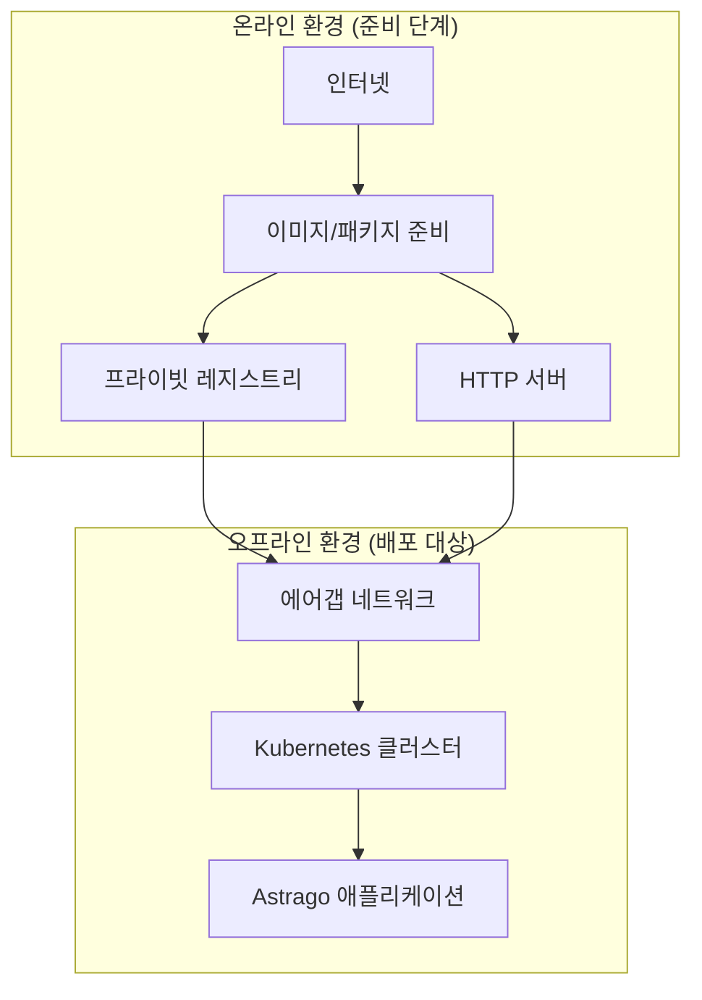

# 🔒 Astrago 오프라인 배포 가이드

## 📋 개요

이 문서는 인터넷 연결이 제한된 **에어갭(Air-Gap) 환경**에서 Astrago 플랫폼을 배포하는 방법을 안내합니다. 보안이 중요한 환경에서 완전히 격리된 상태로 Astrago를 설치할 수 있습니다.

## 🏗️ 오프라인 배포 아키텍처



## 🛠️ 준비해야 할 것들

### OS별 Repository 준비

- **Kubernetes 패키지 저장소**
- **Docker/Containerd 패키지 저장소**
- **각 OS에 맞는 패키지 매니저** (apt, yum)

## 📦 준비 과정 (온라인 환경)

### 1단계: Kubespray Offline 환경 구축

```bash
# 오프라인 도구 디렉토리로 이동
cd astrago-deployment/airgap/kubespray-offline
```

### 2단계: Astrago 이미지 버전 확인

```bash
# Astrago 이미지 태그 최신 버전 확인
vi astrago-deployment/airgap/kubespray-offline/imagelist/astrago.txt

# 다음 이미지들의 태그가 최신인지 확인:
# - xiilab/astrago:core-v1.0.80
# - xiilab/astrago:batch-v1.0.80  
# - xiilab/astrago:monitor-v1.0.80
# - xiilab/astrago:frontend-v1.0.50
```

### 3단계: 오프라인 패키지 다운로드

```bash
# 설치할 OS에서 실행 (매우 중요!)
cd astrago-deployment/airgap/kubespray-offline
./download-all.sh
```

**⚠️ 다운로드 중 발생할 수 있는 이슈들과 해결방법:**

#### 이슈 1: 이미지를 찾을 수 없다는 에러

**원인**: Repository name 구분자 문제

```bash
# 해결방법: 구분자 변경
vi astrago-deployment/airgap/kubespray-offline/scripts/image.sh
# 구분자를 '_'에서 '$'로 변경
```

#### 이슈 2: kube-api-server 다운로드 에러

```bash
# 해결방법 A: 모든 이미지 삭제 후 재시도
nerdctl rmi $(nerdctl images -q)
./download-all.sh

# 해결방법 B (A가 안될 경우): 시스템 정리
nerdctl system prune --all --force
./download-all.sh

# 해결방법 C (B가 안될 경우): containerd 삭제 후 재설치
sudo systemctl stop containerd
sudo apt remove containerd.io  # Ubuntu
# 또는
sudo yum remove containerd.io  # CentOS/RHEL
# containerd 재설치 후 다시 시도
```

#### 이슈 3: OS 버전별 패키지 불일치 에러

```bash
# 패키지 정의 파일 확인
ls airgap/kubespray-offline/pkglist/

# OS별 패키지 리스트 확인 및 수정
vi airgap/kubespray-offline/pkglist/ubuntu/20.04/    # Ubuntu 20.04
vi airgap/kubespray-offline/pkglist/ubuntu/22.04/    # Ubuntu 22.04
vi airgap/kubespray-offline/pkglist/rhel/8/          # RHEL/CentOS 8
vi airgap/kubespray-offline/pkglist/rhel/9/          # RHEL/CentOS 9
```

### 4단계: 패키지 전송

```bash
# astrago-deployment 폴더 압축
cd ..
tar -czf astrago-deployment.tar.gz astrago-deployment/

# 외장하드 마운트 (권장 방법)
# scp보다 외장하드 사용이 속도면에서 유리

# 외장하드 인식 확인
df -h

# 외장하드가 인식되지 않을 경우
fdisk -l  # 외장하드 디바이스 찾기 (예: /dev/sdc)

# 파티션 확인 후 용량이 큰 것 마운트
mount /dev/sdc1 /mnt/astrago
cp astrago-deployment.tar.gz /mnt/astrago/

# 마운트 해제
umount /mnt/astrago
# 사용 중일 경우 강제 해제
umount -l /mnt/astrago
```

## 🚀 설치 순서 (오프라인 환경)

### 📋 설치 순서 개요

1. **Kubernetes 클러스터 설치**
2. **Astrago 애플리케이션 배포**

### ⚠️ 폐쇄망 설치 시 주의사항

> **중요**: Kubernetes 설치 시 모든 노드가 **동일한 user ID/PW**를 가지고 있어야 합니다.

**어려운 경우 해결방법:**

```bash
# 각 노드에 동일한 사용자 생성
sudo useradd -m -s /bin/bash astrago
sudo passwd astrago

# SSH 키 기반 인증 설정
ssh-keygen -t rsa -b 4096
ssh-copy-id astrago@<각-노드-IP>

# 설치 시 패스워드 없이 엔터로 진행
```

## 🔧 상세 설치 과정

### 1단계: 압축파일 복사 및 해제

```bash
# 오프라인 서버에서 압축파일 해제
tar -xzf astrago-deployment.tar.gz
cd astrago-deployment
```

### 2단계: 기본 환경 설정

```bash
# 오프라인 패키지 설치 (nginx, containerd, nerdctl)
cd airgap/kubespray-offline/outputs
./setup-all.sh

# 설치 확인: nginx, registry 컨테이너가 정상 실행되는지 확인
nerdctl ps
```

**확인 사항:**

- ✅ nginx 컨테이너 실행 중
- ✅ registry 컨테이너 실행 중

### 3단계: Kubernetes 노드 정보 설정

```bash
# 인벤토리 파일 수정
vi astrago-deployment/kubespray/inventory/offline/astrago.yaml

# 예시 설정:
[all]
master-1 ansible_host=192.168.1.100 ansible_user=astrago
worker-1 ansible_host=192.168.1.101 ansible_user=astrago  
worker-2 ansible_host=192.168.1.102 ansible_user=astrago

[kube_control_plane]
master-1

[etcd]
master-1

[kube_node]
worker-1
worker-2

[calico_rr]

[k8s_cluster:children]
kube_control_plane
kube_node
calico_rr
```

### 4단계: Kubernetes 클러스터 배포

```bash
# Kubernetes 배포 실행
cd astrago-deployment/airgap
./deploy_kubernetes.sh
```

**🚨 validate mirror 에러 발생 시:**

```bash
# SSL 인증서 검증 비활성화
vi kubespray/inventory/offline/group_vars/all/all.yaml
# download_validate_certs: false 로 설정
```

### 5단계: NodeLocalDNS 설정 수정

```bash
# NodeLocalDNS ConfigMap 수정 (서버 재부팅 시 죽는 이슈 해결)
kubectl edit configmap nodelocaldns -n kube-system

# .:53 forward 라인을 주석 처리
# forward . /etc/resolv.conf  # <- 이 라인을 주석 처리
```

### 6단계: NFS 서버 설정

```bash
# NFS 유틸리티 설치
sudo yum install -y nfs-utils    # CentOS/RHEL
sudo apt install -y nfs-utils    # Ubuntu

# NFS 서비스 시작
sudo systemctl enable nfs-server
sudo systemctl start nfs-server

# 공유 디렉토리 생성
sudo mkdir -p /nfs-data/astrago
sudo chown -R nobody:nobody /nfs-data
sudo chmod -R 755 /nfs-data

# exports 파일 설정
sudo vi /etc/exports
# 다음 라인 추가:
/nfs-data 10.1.61.0/24(no_root_squash,rw,no_subtree_check,insecure)

# exports 적용
sudo exportfs -a
sudo systemctl reload nfs-server
```

### 7단계: Astrago 환경 설정

```bash
# 오프라인 환경 설정
cd astrago-deployment/airgap
./offline_deploy_astrago.sh env
```

**설정 입력 정보:**

```
Enter the connection URL (e.g. 10.61.3.12): <프론트엔드 접근 서버 주소>
Enter the NFS server IP address: <NFS 서버 주소>
Enter the base path of NFS: /nfs-data/astrago
Enter the offline registry (e.g. 10.61.3.8:35000): <로컬 레지스트리 주소>
Enter the HTTP server (e.g. http://10.61.3.8): <로컬 HTTP 서버>
```

**설정 파일 확인:**

```bash
# 생성된 설정 파일 확인
cat astrago-deployment/environments/astrago/values.yaml
```

### 8단계: Astrago 애플리케이션 배포

```bash
# Astrago 배포 실행
./offline_deploy_astrago.sh sync
```

## 🔄 폐쇄망 업데이트 방법

### 새로운 Astrago 이미지 업데이트

```bash
# 1. 온라인 환경에서 새 이미지를 tar로 생성
docker save xiilab/astrago:core-v1.0.81 -o astrago-core-v1.0.81.tar
docker save xiilab/astrago:batch-v1.0.81 -o astrago-batch-v1.0.81.tar
docker save xiilab/astrago:monitor-v1.0.81 -o astrago-monitor-v1.0.81.tar
docker save xiilab/astrago:frontend-v1.0.51 -o astrago-frontend-v1.0.51.tar

# 2. 외장하드로 오프라인 환경에 전송

# 3. 오프라인 환경에서 이미지 로드 및 레지스트리에 푸시
nerdctl load -i astrago-core-v1.0.81.tar
nerdctl tag xiilab/astrago:core-v1.0.81 localhost:5000/xiilab/astrago:core-v1.0.81
nerdctl push localhost:5000/xiilab/astrago:core-v1.0.81

# 4. values.yaml에서 이미지 태그 변경
vi environments/astrago/values.yaml
# image.tag를 새 버전으로 변경

# 5. Astrago만 다시 배포
./offline_deploy_astrago.sh sync astrago
```

## 📁 Astrago 이미지 버전 관리

```bash
# ~/applications/prod 폴더에서 이미지 버전 확인
# 해당 폴더를 astrago로 복사하여 버전 정보 확인
cp -r ~/applications/prod ~/applications/astrago
cd ~/applications/astrago

# 각 애플리케이션의 values.yaml에서 이미지 태그 확인
find . -name "values.yaml" -exec grep -l "tag\|version" {} \;
```

## 🔍 설치 후 검증

### 기본 상태 확인

```bash
# 클러스터 상태 확인
kubectl cluster-info
kubectl get nodes

# Astrago 애플리케이션 상태 확인
kubectl get pods -n astrago
kubectl get svc -n astrago

# 스토리지 클래스 확인
kubectl get storageclass | grep nfs
```

### 서비스 접속 확인

```bash
# Astrago 메인 서비스 접속 테스트
curl -I http://<EXTERNAL-IP>:30080

# Keycloak 서비스 접속 테스트  
curl -I http://<EXTERNAL-IP>:30001
```

## 🚨 일반적인 문제 해결

### 컨테이너 레지스트리 문제

```bash
# 레지스트리 상태 확인
nerdctl ps | grep registry

# 레지스트리 재시작
nerdctl restart registry
```

### NFS 마운트 문제

```bash
# NFS 서버 연결 테스트
showmount -e <NFS-SERVER-IP>

# NFS 서비스 상태 확인
sudo systemctl status nfs-server
```

### Kubernetes 노드 문제

```bash
# 노드 상태 확인
kubectl get nodes -o wide
kubectl describe node <NODE-NAME>

# kubelet 로그 확인
sudo journalctl -u kubelet -f
```

## 💡 실무 팁

### 설치 시간 단축

- 외장하드 사용으로 파일 전송 시간 최소화
- 동일한 사용자 계정으로 SSH 키 기반 인증 설정
- 필요한 패키지만 선별적으로 다운로드

### 안정성 향상

- 각 단계별 검증 포인트 확인
- 로그 파일 정기적 모니터링  
- 백업 및 복구 계획 수립

### 보안 강화

- 불필요한 포트 차단
- 네트워크 정책 적용
- 정기적인 보안 업데이트

## 📞 지원 및 문의

### 긴급 상황 대응

1. **로그 수집**: `kubectl logs`, `journalctl` 명령으로 상세 로그 확인
2. **네트워크 테스트**: 레지스트리 및 HTTP 서버 연결 확인  
3. **설정 검증**: values.yaml 파일의 오프라인 설정 확인
4. **문의**: GitHub Issues 또는 기술 지원팀 연락

---

*이 가이드는 실제 폐쇄망 환경에서의 설치 경험을 바탕으로 작성되었습니다. 환경에 따라 일부 과정이 다를 수 있으니 상황에 맞게 조정하시기 바랍니다.*
