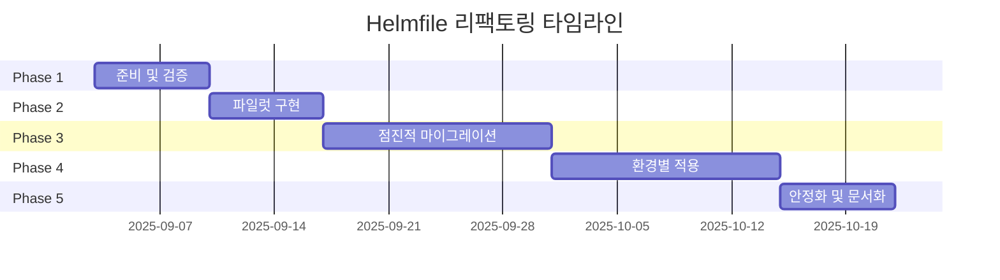

# Astrago Deployment Helmfile 리팩토링 분석 문서

## 목차
1. [개요](#개요)
2. [현재 상태 분석](#현재-상태-분석)
3. [문제점 및 개선 필요사항](#문제점-및-개선-필요사항)
4. [제안하는 솔루션](#제안하는-솔루션)
5. [구현 전략](#구현-전략)
6. [마이그레이션 계획](#마이그레이션-계획)
7. [리스크 및 대응방안](#리스크-및-대응방안)
8. [기대 효과](#기대-효과)

---

## 개요

### 프로젝트 배경
- **프로젝트명**: Astrago Deployment
- **현재 이슈**: Linear BE-384
- **대상 범위**: Helmfile 기반 애플리케이션 배포 구조
- **문서 작성일**: 2025-09-03
- **작성 목적**: Helmfile 구조 리팩토링을 위한 현황 분석 및 개선 방안 수립

### 프로젝트 구성
Astrago Deployment는 3가지 주요 컴포넌트로 구성:
1. **Kubespray**: Kubernetes 클러스터 설치
2. **Airgap**: 오프라인 환경에서의 Kubernetes 준비 및 설치
3. **Helmfile**: Astrago 및 관련 플랫폼 설치 (**현재 리팩토링 대상**)

### 주요 요구사항
- **오프라인 환경 지원 필수** (Airgap 환경에서도 동작)
- 설치형 솔루션으로서 고객 커스터마이징 요청 대응 필요
- 차트 버전 업그레이드 용이성 확보
- 헬름차트 커스터마이징 및 독립적 관리 체계 구축

---

## 현재 상태 분석

### 디렉토리 구조

```
astrago-deployment/
├── helmfile.yaml                    # 메인 Helmfile (루트)
├── applications/                    # 애플리케이션별 차트 및 설정
│   ├── astrago/
│   │   ├── helmfile.yaml           # 개별 helmfile
│   │   ├── astrago/                # 로컬 차트
│   │   └── values.yaml.gotmpl
│   ├── gpu-operator/
│   │   ├── helmfile.yaml
│   │   ├── custom-gpu-operator/    # 커스텀 차트
│   │   └── values.yaml.gotmpl
│   ├── csi-driver-nfs/
│   ├── flux/
│   ├── harbor/
│   ├── keycloak/
│   ├── loki-stack/
│   ├── mpi-operator/
│   └── prometheus/
├── environments/                    # 환경별 설정
│   ├── common/
│   ├── dev/
│   ├── dev2/
│   ├── stage/
│   ├── prod/
│   └── astrago/
├── monochart/                       # 모노차트 설정
│   ├── develop/
│   ├── develop2/
│   └── stage/
├── tools/
├── scripts/
└── docs/
```

### 현재 Helmfile 구성

#### 메인 helmfile.yaml
```yaml
environments:
  prod:
    values:
    - environments/common/values.yaml
    - environments/prod/values.yaml
  dev:
    values:
    - environments/common/values.yaml
    - environments/dev/values.yaml
  # ... 기타 환경

helmDefaults:
  wait: true
  waitForJobs: true
  timeout: 600

helmfiles:
- path: applications/csi-driver-nfs/helmfile.yaml
- path: applications/gpu-operator/helmfile.yaml
- path: applications/loki-stack/helmfile.yaml
# ... 기타 애플리케이션
```

#### 개별 애플리케이션 helmfile 예시
```yaml
# applications/gpu-operator/helmfile.yaml
releases:
  - name: gpu-operator
    namespace: gpu-operator
    chart: custom-gpu-operator  # 또는 nvidia/gpu-operator
    wait: true
    labels:
      app: gpu-operator
      type: infra
    values:
    - values.yaml.gotmpl
```

### 현재 관리 중인 애플리케이션 목록

| 애플리케이션 | 타입 | 차트 소스 | 네임스페이스 |
|-------------|------|-----------|--------------|
| Astrago | Core | Local | astrago |
| GPU Operator | Infrastructure | Custom/External | gpu-operator |
| CSI Driver NFS | Infrastructure | Local | kube-system |
| Prometheus | Monitoring | External | monitoring |
| Loki Stack | Monitoring | External | monitoring |
| Keycloak | Security | External | keycloak |
| Harbor | Registry | External | harbor |
| Flux | GitOps | Local | flux-system |
| MPI Operator | Compute | External | mpi-operator |
| GPU Process Exporter | Monitoring | Local | monitoring |

---

## 문제점 및 개선 필요사항

### 1. 구조적 문제점

#### 1.1 폴더 구조의 복잡성
- **현황**
  - Helmfile 관련 파일들이 프로젝트 전체에 분산
  - 루트와 applications 하위에 중복된 helmfile.yaml 존재
  - 관련 없는 디렉토리들이 같은 레벨에 혼재

- **영향**
  - 새로운 팀원의 프로젝트 이해도 저하
  - 파일 찾기 및 관리의 어려움
  - 실수로 인한 잘못된 파일 수정 위험

#### 1.2 차트 관리의 비일관성
- **현황**
  - 일부는 외부 차트 직접 사용 (예: `nvidia/gpu-operator`)
  - 일부는 커스텀 차트 사용 (예: `custom-gpu-operator`)
  - 로컬 차트가 `applications/[app]/[chart]/` 구조로 깊게 중첩

- **영향**
  - 차트 소스 파악의 어려움
  - 버전 관리 체계 부재
  - 커스터마이징 범위 파악 불가

### 2. 운영상 문제점

#### 2.1 업그레이드의 어려움
- **현황**
  - 외부 차트 버전이 명시적으로 관리되지 않음
  - 커스터마이징된 부분과 원본 차트의 분리 불명확
  - 의존성 관계 파악 어려움

- **영향**
  - 보안 패치 적용 지연
  - 새 기능 도입의 어려움
  - 업그레이드 시 장애 위험 증가

#### 2.2 환경별 설정 관리
- **현황**
  - environments 폴더가 있지만 활용도 낮음
  - 각 애플리케이션이 독립적으로 values 관리
  - 공통 설정의 중복 존재

- **영향**
  - 설정 변경 시 여러 파일 수정 필요
  - 환경 간 일관성 유지 어려움
  - 설정 오류 발생 가능성 증가

### 3. 확장성 문제

#### 3.1 고객 커스터마이징 대응
- **현황**
  - 고객별 요구사항 반영 체계 부재
  - 커스터마이징과 기본 설정의 분리 불명확

- **영향**
  - 고객별 브랜치 관리 복잡
  - 업스트림 변경사항 병합 어려움
  - 유지보수 비용 증가

---

## 제안하는 솔루션

### 1. 새로운 디렉토리 구조

```
helmfile/                              # Helmfile 관련 모든 파일 중앙화
├── helmfile.yaml                      # 메인 진입점
├── .helmfile/                         # Helmfile 플러그인 및 설정
│   └── environments.yaml              # 환경 정의
├── environments/                      # 환경별 설정
│   ├── base/                         # 공통 기본 설정
│   │   ├── values.yaml               # 기본 값
│   │   └── secrets.yaml              # 기본 시크릿 (암호화)
│   ├── dev/
│   │   ├── values.yaml               # 개발 환경 오버라이드
│   │   └── secrets.yaml              # 개발 환경 시크릿
│   ├── stage/
│   │   ├── values.yaml
│   │   └── secrets.yaml
│   └── prod/
│       ├── values.yaml
│       └── secrets.yaml
├── releases/                          # 릴리즈 정의 (목적별 그룹화)
│   ├── infrastructure/               # 인프라 관련 릴리즈
│   │   ├── _base.yaml               # 인프라 공통 설정
│   │   ├── csi-driver-nfs.yaml
│   │   ├── gpu-operator.yaml
│   │   └── flux.yaml
│   ├── monitoring/                   # 모니터링 스택
│   │   ├── _base.yaml
│   │   ├── prometheus.yaml
│   │   ├── loki-stack.yaml
│   │   └── gpu-process-exporter.yaml
│   ├── security/                     # 보안 관련
│   │   ├── _base.yaml
│   │   └── keycloak.yaml
│   ├── registry/                     # 레지스트리
│   │   └── harbor.yaml
│   └── applications/                 # 애플리케이션
│       ├── _base.yaml
│       ├── astrago.yaml
│       └── mpi-operator.yaml
├── charts/                           # 차트 관리
│   ├── external/                    # 외부 차트 관리
│   │   ├── repositories.yaml       # Helm 저장소 정의
│   │   └── requirements.yaml       # 버전 고정
│   ├── custom/                     # 커스텀 차트
│   │   ├── astrago/
│   │   │   ├── Chart.yaml
│   │   │   ├── values.yaml
│   │   │   └── templates/
│   │   └── gpu-process-exporter/
│   └── patches/                    # 외부 차트 패치
│       ├── gpu-operator/
│       │   ├── kustomization.yaml
│       │   └── custom-images.yaml
│       └── prometheus/
│           └── additional-scrape-configs.yaml
├── values/                          # 재사용 가능한 값 템플릿
│   ├── templates/                  # Go 템플릿
│   │   ├── common.yaml.gotmpl
│   │   └── monitoring.yaml.gotmpl
│   └── schemas/                    # JSON Schema for validation
│       └── astrago.schema.json
└── scripts/                         # 유틸리티 스크립트
    ├── validate.sh                  # 설정 검증
    ├── diff-env.sh                  # 환경 간 차이 비교
    └── upgrade-charts.sh            # 차트 업그레이드 도우미
```

### 2. 차트 관리 전략 (오프라인 환경 지원)

#### 2.1 차트 로컬 관리 (Airgap 환경 대응)

**중요**: 오프라인 환경 지원을 위해 모든 외부 차트를 로컬에 저장

**charts/external/ 구조**
```
charts/
├── external/                       # 외부 차트 로컬 저장소
│   ├── gpu-operator-v25.3.2/      # 버전명 포함 디렉토리
│   │   ├── Chart.yaml
│   │   ├── values.yaml
│   │   └── templates/
│   ├── kube-prometheus-stack-45.7.1/
│   ├── loki-stack-2.9.10/
│   ├── keycloak-18.4.0/
│   └── versions.lock              # 버전 관리 파일
```

**charts/external/versions.lock**
```yaml
# 외부 차트 버전 관리 및 출처 기록
charts:
  - name: gpu-operator
    version: v25.3.2
    source: https://helm.ngc.nvidia.com/nvidia
    downloaded: 2025-09-03
    checksum: sha256:abc123...
  - name: kube-prometheus-stack
    version: 45.7.1
    source: https://prometheus-community.github.io/helm-charts
    downloaded: 2025-09-03
    checksum: sha256:def456...
```

**차트 다운로드 스크립트 (온라인 환경에서 실행)**
```bash
#!/bin/bash
# scripts/download-charts.sh

CHARTS_DIR="helmfile/charts/external"
VERSIONS_FILE="$CHARTS_DIR/versions.lock"

# GPU Operator 다운로드
helm pull nvidia/gpu-operator --version v25.3.2 --untar --untardir $CHARTS_DIR
mv $CHARTS_DIR/gpu-operator $CHARTS_DIR/gpu-operator-v25.3.2

# Prometheus Stack 다운로드
helm pull prometheus-community/kube-prometheus-stack --version 45.7.1 --untar --untardir $CHARTS_DIR
mv $CHARTS_DIR/kube-prometheus-stack $CHARTS_DIR/kube-prometheus-stack-45.7.1

# 체크섬 생성
find $CHARTS_DIR -type d -name "*-*" -exec sh -c 'tar cf - {} | sha256sum' \;
```

#### 2.2 오프라인 환경을 위한 차트 사용 방식

```yaml
# releases/infrastructure/gpu-operator.yaml
releases:
  - name: gpu-operator
    namespace: gpu-operator
    chart: ../../charts/external/gpu-operator-v25.3.2  # 로컬 차트 경로
    values:
      - ../../values/templates/gpu-operator.yaml.gotmpl
    # Kustomize 패치 적용 (필요시)
    postrenderer:
      - exec:
          command: sh
          args:
            - -c
            - |
              kubectl kustomize ../../charts/patches/gpu-operator
```

#### 2.3 커스터마이징 전략

**옵션 A: 로컬 차트 + Kustomize 패치 (추천)**

**charts/patches/gpu-operator/kustomization.yaml**
```yaml
apiVersion: kustomize.config.k8s.io/v1beta1
kind: Kustomization

patches:
  - path: custom-images.yaml
    target:
      kind: DaemonSet
      name: nvidia-device-plugin-daemonset
  - path: resource-limits.yaml
    target:
      kind: Deployment
      name: gpu-operator
```

**옵션 B: Wrapper Chart 방식**

```yaml
# charts/custom/gpu-operator-wrapper/Chart.yaml
apiVersion: v2
name: gpu-operator-wrapper
version: 1.0.0
dependencies:
  - name: gpu-operator
    version: "v25.3.2"
    repository: "https://helm.ngc.nvidia.com/nvidia"

# charts/custom/gpu-operator-wrapper/values.yaml
gpu-operator:
  # 원본 차트 값 오버라이드
  driver:
    enabled: true
    version: "525.125.06"
  
# 추가 커스텀 리소스
customResources:
  enabled: true
```

**옵션 C: GitOps with Flux (이미 Flux 사용 중이므로 고려)**

```yaml
# flux/helmrelease/gpu-operator.yaml
apiVersion: helm.toolkit.fluxcd.io/v2beta1
kind: HelmRelease
metadata:
  name: gpu-operator
  namespace: flux-system
spec:
  releaseName: gpu-operator
  targetNamespace: gpu-operator
  chart:
    spec:
      chart: gpu-operator
      version: "v25.3.2"
      sourceRef:
        kind: HelmRepository
        name: nvidia
  values:
    # 커스텀 값
  postRenderers:
    - kustomize:
        patches:
          - patch: |
              # 커스텀 패치
```

### 3. 환경별 설정 관리

#### 3.1 계층적 값 관리

```yaml
# environments/base/values.yaml
global:
  domain: astrago.local
  storageClass: nfs-client
  monitoring:
    enabled: true
  security:
    enabled: true

# environments/dev/values.yaml
global:
  domain: dev.astrago.local
  monitoring:
    retention: 7d
  resources:
    limits:
      cpu: 2
      memory: 4Gi

# environments/prod/values.yaml
global:
  domain: astrago.io
  monitoring:
    retention: 30d
  resources:
    limits:
      cpu: 8
      memory: 16Gi
  highAvailability:
    enabled: true
```

#### 3.2 시크릿 관리

```bash
# Helm Secrets 플러그인 사용
helm plugin install https://github.com/jkroepke/helm-secrets

# 시크릿 암호화
helm secrets enc environments/prod/secrets.yaml

# 사용 시
helmfile -e prod apply
```

### 4. 릴리즈 그룹화 및 의존성 관리

```yaml
# releases/infrastructure/_base.yaml
bases:
  - ../../environments/{{ .Environment.Name }}/values.yaml

commonLabels:
  tier: infrastructure
  managed-by: helmfile

# releases/infrastructure/gpu-operator.yaml
bases:
  - ./_base.yaml

releases:
  - name: gpu-operator
    namespace: gpu-operator
    chart: ../../charts/external/gpu-operator
    needs:
      - kube-system/csi-driver-nfs  # 의존성 명시
    values:
      - ../../values/templates/gpu-operator.yaml.gotmpl
    hooks:
      - events: ["presync"]
        command: "scripts/check-gpu-nodes.sh"
```

---

## 구현 전략

### 1. 단계별 접근

#### Phase 1: 준비 및 검증 (1주차)
- [ ] 새로운 디렉토리 구조 생성
- [ ] 기존 차트 및 설정 인벤토리 작성
- [ ] **온라인 환경에서 외부 차트 다운로드 및 로컬 저장**
- [ ] 자동화 스크립트 개발 (sync-charts.sh)
- [ ] 오프라인 환경 테스트 구축

#### Phase 2: 파일럿 구현 (2주차)
- [ ] 1-2개 간단한 애플리케이션으로 시작 (예: CSI Driver)
- [ ] 개발 환경에서 테스트
- [ ] 문제점 파악 및 수정

#### Phase 3: 점진적 마이그레이션 (3-4주차)
- [ ] 인프라 컴포넌트 이전
- [ ] 모니터링 스택 이전
- [ ] 애플리케이션 이전
- [ ] 각 단계별 검증

#### Phase 4: 환경별 적용 (5-6주차)
- [ ] 개발 환경 전체 전환
- [ ] 스테이징 환경 적용
- [ ] 프로덕션 준비

### 2. 자동화 도구

#### 2.1 차트 다운로드 및 버전 관리 스크립트
```bash
#!/bin/bash
# scripts/sync-charts.sh
# 온라인 환경에서 실행하여 오프라인용 차트 준비

set -e

CHARTS_DIR="helmfile/charts/external"
VERSIONS_LOCK="$CHARTS_DIR/versions.lock"

# 차트 정보 배열
declare -A CHARTS
CHARTS[gpu-operator]="nvidia/gpu-operator:v25.3.2"
CHARTS[kube-prometheus-stack]="prometheus-community/kube-prometheus-stack:45.7.1"
CHARTS[loki-stack]="grafana/loki-stack:2.9.10"
CHARTS[keycloak]="bitnami/keycloak:18.4.0"
CHARTS[harbor]="harbor/harbor:1.13.1"

# Helm 저장소 추가
helm repo add nvidia https://helm.ngc.nvidia.com/nvidia
helm repo add prometheus-community https://prometheus-community.github.io/helm-charts
helm repo add grafana https://grafana.github.io/helm-charts
helm repo add bitnami https://charts.bitnami.com/bitnami
helm repo add harbor https://helm.goharbor.io
helm repo update

# 차트 다운로드
for CHART_NAME in "${!CHARTS[@]}"; do
    IFS=':' read -r CHART VERSION <<< "${CHARTS[$CHART_NAME]}"
    echo "Downloading $CHART_NAME version $VERSION..."
    
    # 다운로드 및 압축 해제
    helm pull $CHART --version $VERSION --untar --untardir $CHARTS_DIR
    
    # 버전명 포함한 디렉토리로 이름 변경
    mv "$CHARTS_DIR/${CHART_NAME}" "$CHARTS_DIR/${CHART_NAME}-${VERSION}"
    
    # 체크섬 생성
    CHECKSUM=$(tar cf - "$CHARTS_DIR/${CHART_NAME}-${VERSION}" | sha256sum | cut -d' ' -f1)
    
    # versions.lock 업데이트
    cat >> $VERSIONS_LOCK <<EOF
- name: $CHART_NAME
  version: $VERSION
  source: $CHART
  downloaded: $(date -u +"%Y-%m-%dT%H:%M:%SZ")
  checksum: sha256:$CHECKSUM
EOF
done

echo "All charts downloaded successfully!"
```

#### 2.2 마이그레이션 스크립트
```bash
#!/bin/bash
# scripts/migrate-chart.sh

CHART_NAME=$1
OLD_PATH="applications/${CHART_NAME}"
NEW_PATH="helmfile/charts/custom/${CHART_NAME}"

# 차트 복사
cp -r ${OLD_PATH}/${CHART_NAME} ${NEW_PATH}

# helmfile 생성
cat > helmfile/releases/applications/${CHART_NAME}.yaml <<EOF
releases:
  - name: ${CHART_NAME}
    namespace: ${CHART_NAME}
    chart: ../../charts/custom/${CHART_NAME}
    values:
      - ../../environments/{{ .Environment.Name }}/${CHART_NAME}.yaml
EOF

echo "Migrated ${CHART_NAME}"
```

#### 2.3 검증 스크립트
```bash
#!/bin/bash
# scripts/validate.sh

# Helmfile lint
helmfile -e ${ENV} lint

# Dry-run
helmfile -e ${ENV} diff

# Schema validation
for VALUES in helmfile/environments/${ENV}/*.yaml; do
  yq eval-all '. as $item ireduce ({}; . * $item)' ${VALUES} | \
    ajv validate -s helmfile/values/schemas/$(basename ${VALUES%.yaml}).schema.json
done
```

### 3. CI/CD 통합

```yaml
# .github/workflows/helmfile-validation.yml
name: Helmfile Validation

on:
  pull_request:
    paths:
      - 'helmfile/**'

jobs:
  validate:
    runs-on: ubuntu-latest
    steps:
      - uses: actions/checkout@v3
      
      - name: Install tools
        run: |
          curl -L https://github.com/helmfile/helmfile/releases/download/v0.150.0/helmfile_linux_amd64 -o helmfile
          chmod +x helmfile
          sudo mv helmfile /usr/local/bin/
          
      - name: Validate structure
        run: |
          ./scripts/validate.sh
          
      - name: Diff changes
        run: |
          helmfile -e dev diff
```

---

## 마이그레이션 계획

### 타임라인



### 체크리스트

#### 사전 준비
- [ ] 현재 상태 백업
- [ ] 롤백 계획 수립
- [ ] 팀 교육 자료 준비
- [ ] 테스트 시나리오 작성

#### 구현
- [ ] 새 구조 생성
- [ ] 마이그레이션 스크립트 개발
- [ ] 단위 테스트
- [ ] 통합 테스트

#### 검증
- [ ] 기능 테스트
- [ ] 성능 테스트
- [ ] 보안 검증
- [ ] 문서 업데이트

#### 배포
- [ ] 개발 환경 적용
- [ ] 스테이징 환경 적용
- [ ] 프로덕션 준비
- [ ] 프로덕션 적용

---

## 리스크 및 대응방안

### 리스크 매트릭스

| 리스크 | 발생 가능성 | 영향도 | 대응 방안 |
|--------|------------|--------|-----------|
| 기존 배포 중단 | 중 | 높음 | 병렬 운영 기간 확보, 즉시 롤백 가능한 구조 |
| 설정 누락/오류 | 높음 | 중 | 자동 검증 도구, 체크리스트 |
| 팀 적응 어려움 | 중 | 낮음 | 사전 교육, 상세 문서화 |
| 성능 저하 | 낮음 | 중 | 성능 테스트, 최적화 |
| 호환성 문제 | 중 | 높음 | 단계별 마이그레이션, 충분한 테스트 |

### 롤백 계획

1. **즉시 롤백 (< 1시간)**
   - 기존 구조로 즉시 전환
   - Git revert 활용

2. **단계적 롤백 (1-4시간)**
   - 문제 컴포넌트만 이전 버전으로
   - 나머지는 새 구조 유지

3. **전체 롤백 (> 4시간)**
   - 전체 시스템을 이전 상태로
   - 백업에서 복구

---

## 기대 효과

### 정량적 효과

| 지표 | 현재 | 목표 | 개선율 |
|------|------|------|--------|
| 차트 업그레이드 소요 시간 | 4시간 | 1시간 | 75% 감소 |
| 새 환경 구축 시간 | 2일 | 4시간 | 87.5% 감소 |
| **오프라인 배포 준비 시간** | **1일** | **30분** | **97% 감소** |
| 설정 오류 발생률 | 월 5건 | 월 1건 | 80% 감소 |
| 코드 중복률 | 40% | 10% | 75% 감소 |

### 정성적 효과

1. **개발 효율성 향상**
   - 명확한 구조로 인한 개발 속도 향상
   - 신규 팀원 온보딩 시간 단축

2. **운영 안정성 증대**
   - 체계적인 버전 관리
   - 검증된 업그레이드 프로세스

3. **오프라인 환경 지원 강화**
   - Airgap 환경에서도 완전한 배포 가능
   - 외부 의존성 없는 독립적 운영
   - 보안이 중요한 환경에서 안전한 배포

4. **확장성 개선**
   - 새로운 애플리케이션 추가 용이
   - 고객 커스터마이징 대응력 향상

5. **유지보수성 향상**
   - 중앙화된 관리
   - 명확한 책임 분리

---

## 부록

### A. 참고 자료
- [Helmfile Best Practices](https://github.com/helmfile/helmfile/blob/main/docs/best-practices.md)
- [Helm Post Rendering](https://helm.sh/docs/topics/advanced/#post-rendering)
- [Kustomize Documentation](https://kustomize.io/)
- [GitOps with Flux](https://fluxcd.io/docs/)

### B. 용어 정리
- **Helmfile**: Helm 차트를 선언적으로 관리하는 도구
- **Post-rendering**: Helm이 생성한 매니페스트를 수정하는 기법
- **Kustomize**: Kubernetes 매니페스트 커스터마이징 도구
- **GitOps**: Git을 통한 선언적 인프라 관리 방법론

### C. 연락처
- 프로젝트 리드: [담당자명]
- 기술 문의: [이메일/슬랙]
- 이슈 트래커: Linear BE-384

---

*이 문서는 지속적으로 업데이트됩니다. 최종 수정일: 2025-09-03*